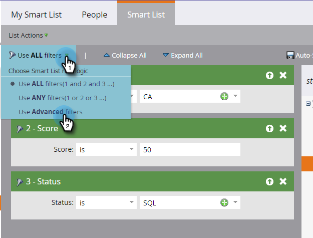
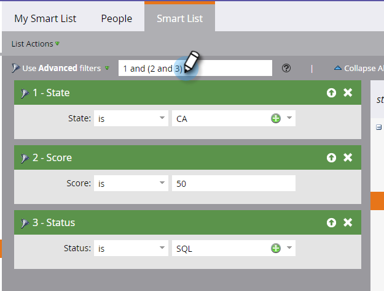
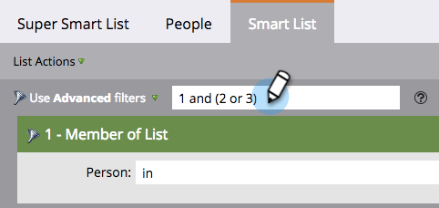
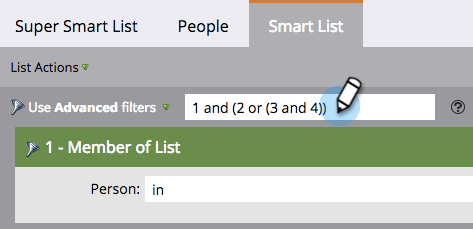

# Using Advanced Smart List Rule Logic {#using-advanced-smart-list-rule-logic}

You can find the exact people you need by applying smart list rule logic to multiple filters within a smart list. Here's how.

>[!PREREQUISITES]
>
>* [Find and Add Filters to a Smart List](/help/marketo/product-docs/core-marketo-concepts/smart-lists-and-static-lists/creating-a-smart-list/find-and-add-filters-to-a-smart-list.md)
>* [Define Smart List Filters](/help/marketo/product-docs/core-marketo-concepts/smart-lists-and-static-lists/creating-a-smart-list/define-smart-list-filters.md)

>[!NOTE]
>
>Advanced filter logic is only available if there are three or more filters in your smart list.

## Add Logic to a Smart List {#add-logic-to-a-smart-list}

By default, your smart list will find the people that match **ALL** filters (filters 1 _and_ 2 _and_ 3). You can change the rule logic to find people that match **ANY** of the defined filters (filters 1 _or_ 2 _or_ 3), or use advanced filters (filters 1 _and_ 2 _or_ 3).

In this example, let's say you want to find people in California _and_ with a score of at least 50 points _or_ with a status of "Sales Qualified."

1. Select **Use Advanced filters** from the drop-down.

   

   >[!NOTE]
   >
   >Using **Advanced** filters reduces the need to create smart lists with the Member of Smart List filter. This helps optimize performance.

1. The **Advanced filters** text box will display "and" as the default value between all your filters.

   

1. Type a pair of parentheses around "2 and 3."

   

   >[!CAUTION]
   >
   >You must use "and" before "or" when entering rule logic.

1. Change the "and" between "2 and 3" to "or."

   

## Use Parentheses When Mixing "And" and "Or {#use-parentheses-when-mixing-and-and-or}

Mixing "and" and "or" logic requires parentheses to make your intention clear.

## Use Nested Parentheses for Four or More Filters if Needed {#use-nested-parentheses-for-four-or-more-filters-if-needed}

Depending on your intention, you may need to add nested parentheses when using four or more filters.

>[!TIP]
>
>If you enter an invalid rule, you'll see a red line displayed under the rule. Scroll over the text to see the related error message.
