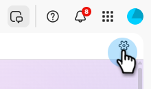
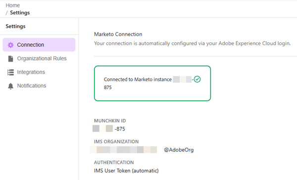

# Settings and setup {#settings-setup}

Learn how to enable permissions and use the Settings area to view connection details, define organizational rules, and set up integrations and notifications.

>[!AVAILABILITY]
>
>This feature is available to all subscriptions. If you do not see the Coworker for Marketo Engage tile on your My Marketo screen, contact your account manager. You must also agree to the [Core Gen-AI terms and the supplemental terms](https://www.adobe.com/legal/terms/enterprise-licensing/genai-ww.html){target="_blank"}.

## Permissions and roles {#permission-and-role}

There is an _Access Coworker for Marketo Engage_ permission and a _Coworker for Marketo Engage User_ role, giving administrators greater control over which users can access the **Coworker for Marketo Engage** feature. The permission is assigned at the role level. The _Coworker for Marketo Engage User_ role comes with the _Access Coworker for Marketo Engage_ permission enabled by default.

>[!NOTE]
>
>The _Access Coworker for Marketo Engage_ permission is not enabled by default for all roles. See the table below for details.

| Role | Default status |
| --- | --- |
| Admin | Enabled |
| Adobe Product Admin | Enabled |
| Marketing User | Disabled |
| Standard User | Not available |
| Coworker for Marketo Engage User | Enabled |
| Custom roles | Disabled |

### Access Coworker for Marketo Engage permission {#access-coworker-marketo-permission}

Follow the steps below to enable _Access Coworker for Marketo Engage_ for qualifying roles that do not already have it enabled.

1. In your My Marketo, click **Admin**, then **Users & Roles**.

   

1. In the _Roles_ tab, select the desired role and click **Edit Role**.

   

1. Scroll down and check the _Access Coworker for Marketo Engage_ checkbox and click **Save**.

   

   >[!NOTE]
   >
   >You can use these same steps to remove the permission by **un**checking the _Access Coworker for Marketo Engage_ checkbox.

### Coworker for Marketo Engage User role {#coworker-marketo-user-role}

Follow these steps to assign a specific user to the _Coworker for Marketo Engage User_ role.

>[!NOTE]
>
>This role **only** contains the _Access Coworker for Marketo Engage_ permission.

1. In your My Marketo, click **Admin**, then **Users & Roles**.

   

1. Select the desired user and click **Edit User**.

   

1. In _Roles and Workspaces_, select the _Coworker for Marketo Engage User_ checkbox. If you have more than one workspace, you can specify which ones get access in the **+** sign drop-down. Click **Save** when done.

   

### Custom role {#custom-role}

You also have the option to [create a new role](https://experienceleague.adobe.com/en/docs/marketo/using/product-docs/administration/users-and-roles/create-delete-edit-and-change-a-user-role#create-a-role){target="_blank"} and customize its permissions, adding _Access Coworker for Marketo Engage_, along with anything else you want, and [assigning that role](https://experienceleague.adobe.com/en/docs/marketo/using/product-docs/administration/users-and-roles/managing-user-roles-and-permissions#assign-roles-to-a-user){target="_blank"} to specific users.

## Settings {#settings}

1. In your My Marketo, click the **[!UICONTROL Coworker for Marketo Engage]** tile.

   

1. Click the gear icon.

   

### Connection {#connection}

This tab does not contain editable fields. It shows account information like your Munchkin ID and IMS Organization.

   

### Organizational rules {#organizational-rules}

Define organizational guidelines and constraints that the Coworker for Marketo Engage follows when creating or modifying Marketo Engage assets.

   {width="800" zoomable="yes"}

>[!NOTE]
>
>Rules use Markdown format with YAML frontmatter. Global rules apply to all workspaces. Workspace rules override global settings.

### Integrations (Coming soon) {#integrations}

Configure connections to external services and APIs.

_This tab may appear in the UI, but it is not yet available for use. Please check back for updates_.

### Notifications (Coming soon) {#notifications}

Manage alert preferences and notification channels.

_This tab may appear in the UI, but it is not yet available for use. Please check this article for updates_.
