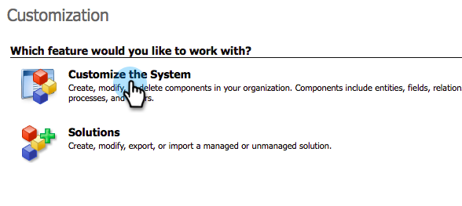
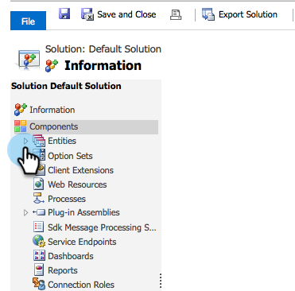
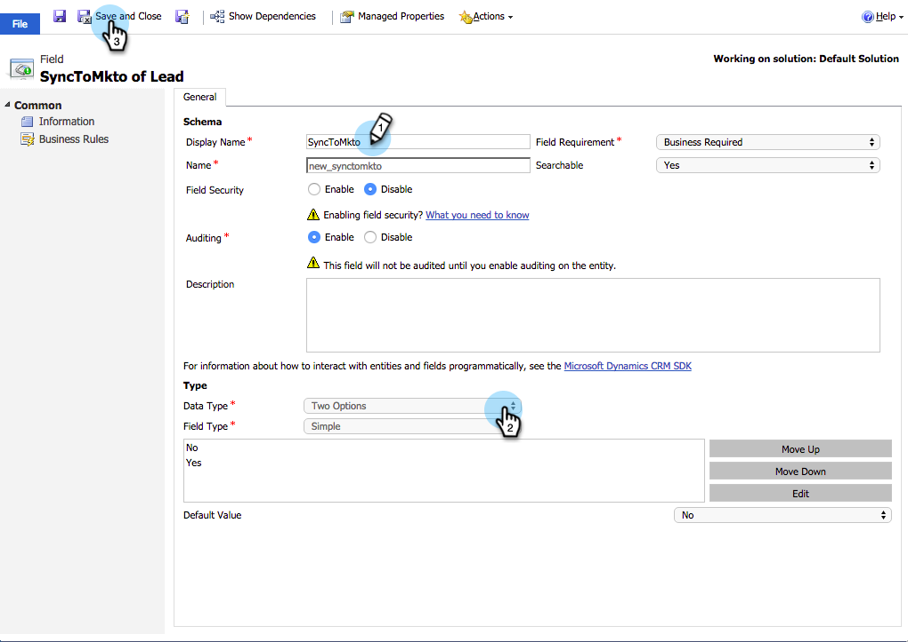
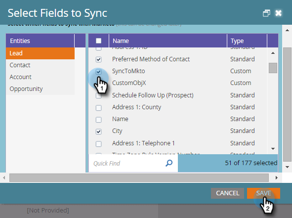
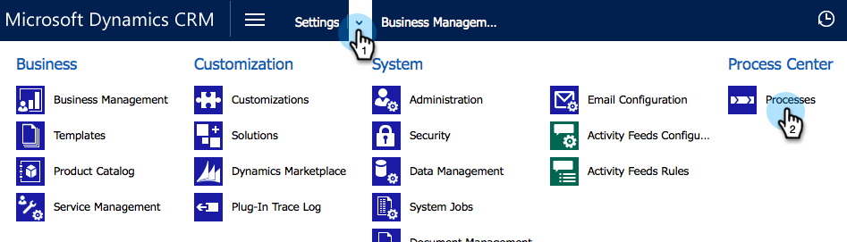
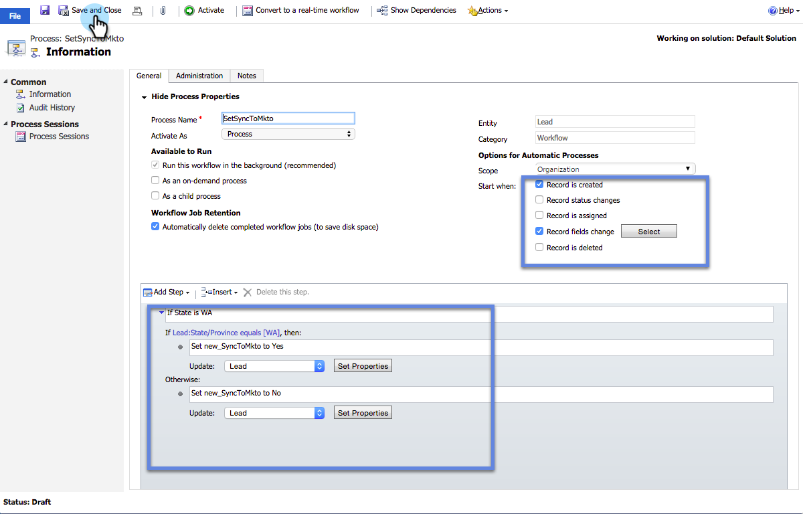
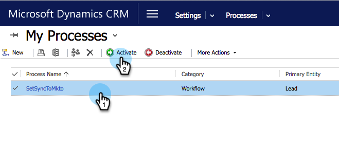

# Create a Custom Dynamics Sync Filter {#create-a-custom-dynamics-sync-filter}

Don't want to sync everything in your Dynamics CRM into Marketo Engage? Don't worry! Marketo allows you to set up a sync filter and sync only part of your records.

## Overview {#overview}

To set up a Dynamics sync filter:

1. Create a custom Two Options (boolean) field named new_synctomkto in your Dynamics CRM for any object (lead, contact, account, opportunity and other custom entities).
1. Assign this field a Yes/No value.

You must make these changes in Dynamics CRM, not your database or Marketo.

>[!CAUTION]
>
>If you don't assign the field and leave it blank/NULL, it will sync down but not update. Records with a field value of blank/NULL in Dynamics CRM will show this field value in Marketo as "false".

Marketo looks for this field during the automatic background sync and determines which records to sync over based on this logic:

| Field Value |Sync to Marketo? |
|---|---|
| Field doesn't exist |Yes |
| Field is empty |Yes |
| Field has value Yes |Yes |
| Field has value No |No |

>[!CAUTION]
>
>The only way to tell Marketo to skip a record is to set the field value explicitly to be **No**. Marketo still syncs records over even if the field values are empty.

>[!PREREQUISITES]
>
>Install the latest version of the Marketo Plug-in (3.0.0.1 or later). Go to Marketo > Admin > Microsoft Dynamics > Download Marketo Solution.

## Create SyncToMkto Field {#create-synctomkto-field}

1. Log into your Dynamics CRM. Click **Settings**, then click **Customizations**.

   

1. Click **Customize the System**.

   

1. Click  next to **Entities**.

   

1. Click  next to **Lead** and select **Fields**. Then click **New**.

   

1. Enter **SyncToMkto** in the **Display Name** field and select **Two options** as the **Data Type**. Then click **Save and Close**.

   

   >[!NOTE]
   >
   >Choose any display name for this field, but the Name field must be exactly **new_synctomkto**. You must use **new** as the default prefix. If you've changed the default, go here to [reset the default prefix for the custom field names](/help/marketo/product-docs/crm-sync/microsoft-dynamics-sync/create-a-custom-dynamics-sync-filter/set-a-default-custom-field-prefix.md){target="_blank"}. You can change it back after you've created the new fields.

   >[!NOTE]
   >
   >If you have asynchronous workflow set up, the record gets the default SyncToMkto value you set up in the field, and gets the correct value a few seconds later when the workflow finishes running. If the default value is set to Yes, those records will be created in Marketo and then become stale. Use **No** as the default value to avoid this.

1. Repeat this process and create the **SyncToMkto** field for any other entities you wish to limit the sync on, such as contact, account, opportunity and custom entities.

## Select the Filter in Marketo {#select-the-filter-in-marketo}

Even if you've already done your initial sync, go in and select the fields to be synced with Marketo.

1. Go to Admin and select **[!UICONTROL Microsoft Dynamics]**.

   

1. Click **[!UICONTROL Edit]** on Field Sync Details.

   

1. Scroll down to the field and check it. The actual name must be new_synctomkto but the Display Name can be anything. Click **[!UICONTROL Save]**.

   

Great, Now you've enabled the sync filter for Marketo.

## Create a Dynamics Workflow to Assign Sync Filter Values Automatically {#create-a-dynamics-workflow-to-assign-sync-filter-values-automatically}

You can always manually assign a value to the SyncToMkto fields for your records. But why not take advantage of the power of a Dynamics Workflow and auto-assign a value to the SyncToMkto field when a record is created or updated?

>[!NOTE]
>
>You can't do this on the database level. It must be done in the CRM manually or using a workflow.
>
>A Dynamics workflow works only on new records created going forward, not on historical data. Use a batch update to move over existing records.

1. Go to your Dynamics CRM. Click **Settings**, then **Processes**.

   

1. Click **New**.

   

1. Enter a name for the workflow, and select **Workflow** as the category and **Lead** as the Entity. Then click **OK**.

   

1. Create rules to assign a true or false value to the **SyncToMkto** field based on your organization's preference. Click **Save and Close**.

   

   >[!NOTE]
   >
   >Define a Default Action after you click **Add Step** to add a Check Condition. This sets the records that you don't want to sync to **No**. Otherwise, they will sync.

1. Select the workflow and click **Activate**.

   

   >[!TIP]
   >
   >See [Custom Sync Filter Rules for an Email Address](/help/marketo/product-docs/crm-sync/microsoft-dynamics-sync/create-a-custom-dynamics-sync-filter/custom-sync-filter-rules-for-an-email-address.md){target="_blank"} to set up rules to sync only records for people with email addresses.

## Sync Filter Details {#sync-filter-details}

Here are some implementation details we thought you should know:

* Start a Sync Operation

   When the **SyncToMkto** value changes from **No** to **Yes**, Dynamics notifies Marketo immediately to start syncing this record. If the record already exists, Marketo updates it. Otherwise, Marketo creates the record.

   >[!TIP]
   >
   >A `Create [StartSync]` operation is added to the Marketo Log when this happens.

* Stop a Sync Operation

   When a record changes its SyncToMkto value from Yes to No, Marketo is notified to stop syncing this record. However the record is not deleted, instead, it stops getting updates and becomes stale.

>[!MORELIKETHIS]
>
>* [Microsoft Dynamics Sync Filter: Qualify](/help/marketo/product-docs/crm-sync/microsoft-dynamics-sync/create-a-custom-dynamics-sync-filter/microsoft-dynamics-sync-filter-qualify.md){target="_blank"}
>* [Microsoft Dynamics Sync Filter: Merge](/help/marketo/product-docs/crm-sync/microsoft-dynamics-sync/create-a-custom-dynamics-sync-filter/microsoft-dynamics-sync-filter-merge.md){target="_blank"}
>* [Custom Sync Filter Rules for an Email Address](/help/marketo/product-docs/crm-sync/microsoft-dynamics-sync/create-a-custom-dynamics-sync-filter/custom-sync-filter-rules-for-an-email-address.md){target="_blank"}
