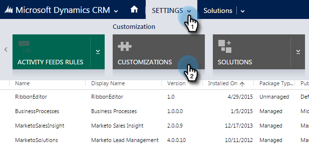
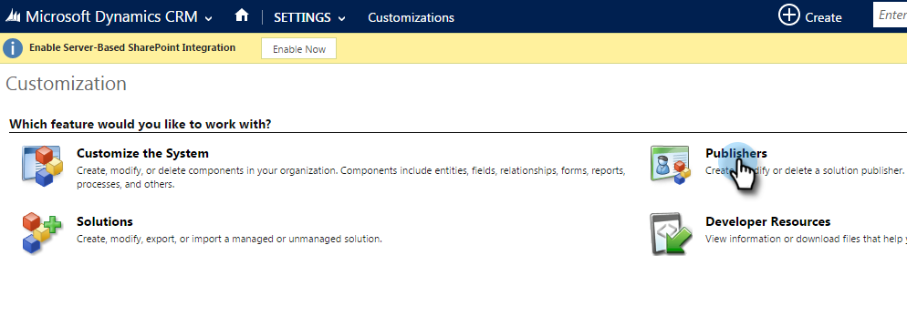
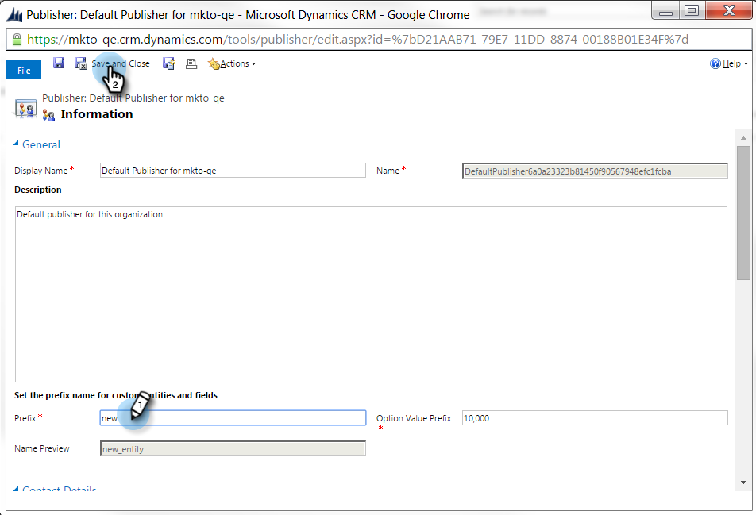
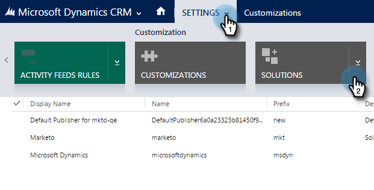
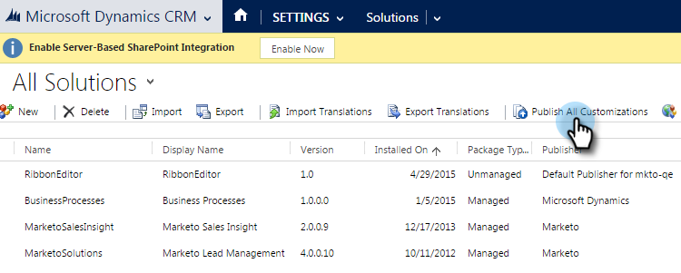

# Set a Default Custom Field Prefix {#set-a-default-custom-field-prefix}

Your default [!DNL Microsoft Dynamics] prefix for custom fields must be **new** in order for Marketo proprietary fields to sync correctly. Here's how to change the default prefix.

1. Go to [!UICONTROL Settings] and select **[!UICONTROL Customizations].**

   

1. Click **[!UICONTROL Publishers]**.

   

1. Select the default publisher from the list.

   

1. Change the prefix to **new**. Click **[!UICONTROL Save and Close]**.

   

1. Go to [!UICONTROL Settings] > [!UICONTROL Solutions] to publish the customizations.

   

1. Click **[!UICONTROL Publish All Customizations]**.

   

1. Now, create your custom fields. After you complete them, revert the prefix to the original one.
