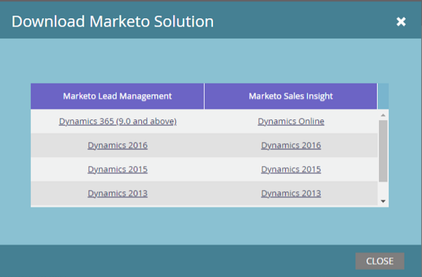

# Marketo Plugin Releases for Microsoft Dynamics {#marketo-plugin-releases-for-microsoft-dynamics}

When you first sync to Microsoft Dynamics, you download the latest version of the the plugins for Marketo. Periodically, Marketo updates these plugins, so you can return to the same place to download the new version.

[Download the latest plugin](/help/marketo/product-docs/crm-sync/microsoft-dynamics-sync/sync-setup/download-the-marketo-lead-management-solution.md){target="_blank"} corresponding to your Dynamics release.

## Updating your Dynamics Solution {#updating-your-dynamics-solution}

1. Import the latest version of the solution over the existing version of your Dynamics CRM (ex: if your Dynamics CRM has version 1.4 and the latest version is 1.5, you would import _over_ version 1.4).

1. You will see the following pop-up. Select **Update** and **Maintain customizations**, then click **Import**.

## Latest Versions {#latest-versions}

>[!NOTE]
>
>These versions work for both on-premise and online versions of Dynamics.

<table> 
 <tbody> 
  <tr> 
   <th colspan="1">Version</th> 
   <th colspan="1">Release Date</th> 
   <th>Notes</th> 
  </tr>
  <tr> 
   <td colspan="1">5.0.2.1</td> 
   <td colspan="1">10/13/23</td> 
   <td colspan="1">Bug fix: Fixed bugs related to the custom entity sync.</td> 
  </tr> 
  <tr> 
   <td colspan="1">5.0.2.0</td> 
   <td colspan="1">03/24/23</td> 
   <td colspan="1">Bug fix: Fixed bugs that prevented merging contacts on MS Dynamics.</td> 
  </tr> 
  <tr> 
   <td colspan="1">5.0.1.8</td> 
   <td colspan="1">03/27/23</td> 
   <td colspan="1">Bug fix: Prevents plugin overwriting other customizations on the UI elements in MS Dynamics.</td> 
  </tr> 
  <tr> 
   <td colspan="1">5.0.1.1</td> 
   <td colspan="1">02/04/21</td> 
   <td colspan="1">Support for Multiselect Optionset fields sync (this feature is available for V9.X and above only).</td> 
  </tr> 
  <tr> 
   <td colspan="1">4.2.0.0</td> 
   <td colspan="1">10/16/20</td> 
   <td colspan="1">Added Support for Campaign Sync with MS Dynamics.</td> 
  </tr> 
  <tr> 
   <td colspan="1">4.0.0.24</td> 
   <td colspan="1">8/22/18</td> 
   <td colspan="1">Added support for out-of-box qualify lead to contact process for Microsoft Dynamics Version 9.x.</td> 
  </tr> 
  <tr> 
   <td colspan="1">4.0.0.23</td> 
   <td colspan="1">6/27/18</td> 
   <td colspan="1">Bug fix: Business Process Error while trying to install the Marketo Solutions for Dynamics 2013.</td> 
  </tr> 
  <tr> 
   <td colspan="1">4.0.0.22</td> 
   <td colspan="1">9/29/17</td> 
   <td colspan="1">Bug fix: Internal revision.</td> 
  </tr> 
  <tr> 
   <td colspan="1">
4.0.0.21
</td> 
   <td colspan="1">11/9/16</td> 
   <td colspan="1">Bug fix: The plugin did not subscribe to events that capture the state change of the custom object. This fix is specific to Dynamics CRM On Premise 2011.</td> 
  </tr> 
  <tr> 
   <td colspan="1">4.0.0.20</td> 
   <td colspan="1">7/22/16</td> 
   <td colspan="1">Bug fix: Updates of opportunity contact role weren't being captured completely.</td> 
  </tr> 
  <tr> 
   <td colspan="1">4.0.0.19</td> 
   <td colspan="1">6/28/16</td> 
   <td colspan="1">Bug fix: An unnecessary update transaction on the customeropportunityrole in the marketo log was noted when the opportunity was created.
Bug fix: An extra delete transaction was logged when deleting the customeropportunityrole entity.</td> 
  </tr> 
  <tr> 
   <td colspan="1">4.0.0.18</td> 
   <td colspan="1">5/31/16</td> 
   <td colspan="1">Bug fix:  Made the update and delete of custom objects asynchronous.</td> 
  </tr> 
  <tr> 
   <td colspan="1">4.0.0.17</td> 
   <td colspan="1">4/8/16</td> 
   <td colspan="1">Bug fix: When the lead had a sync filter set to NO, and the opportunity and contact didn't have a sync filter, the Create Log wasn't generated for the contact and opportunity when the lead was qualified.</td> 
  </tr> 
  <tr> 
   <td colspan="1">4.0.0.16</td> 
   <td colspan="1">3/29/16</td> 
   <td>Bug fix: An Assign Event was logged when the sync filter was turned off.</td> 
  </tr> 
  <tr> 
   <td colspan="1">4.0.0.15</td> 
   <td colspan="1">3/3/16</td> 
   <td colspan="1">Bug fix: Customer couldn't create a lead in CRM because the login user didn't have Marketo Config permission.</td> 
  </tr> 
  <tr> 
   <td colspan="1">4.0.0.14</td> 
   <td colspan="1">1/18/16</td> 
   <td colspan="1">Bug fix: Created access limits for normal Dynamics users to address security concerns.</td> 
  </tr> 
  <tr> 
   <td colspan="1">4.0.0.13</td> 
   <td colspan="1">12/30/15</td> 
   <td>Bug fix: Updates in Dynamics were not syncing to Marketo for steps and images.</td> 
  </tr> 
  <tr> 
   <td colspan="1">4.0.0.12</td> 
   <td colspan="1">11/12/15</td> 
   <td colspan="1">Bug fix: Lead records were syncing to Marketo when sync filter was set to false.</td> 
  </tr> 
 </tbody> 
</table>

>[!MORELIKETHIS]
>
>[Download the Marketo Lead Management Solution](/help/marketo/product-docs/crm-sync/microsoft-dynamics-sync/sync-setup/download-the-marketo-lead-management-solution.md){target="_blank"}
