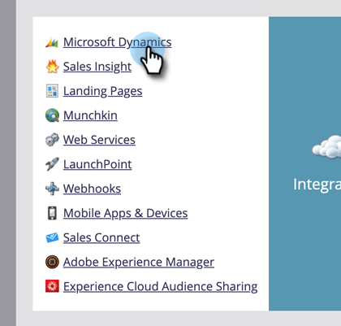
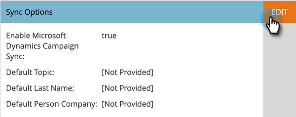
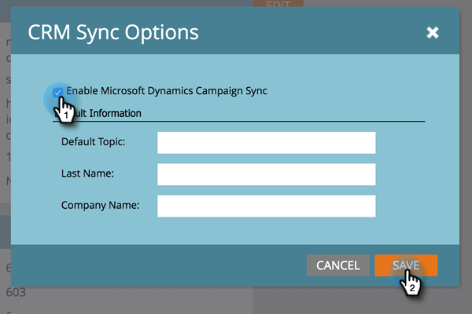

# Enable Campaign Sync {#enable-campaign-sync}

This option allows Marketo Engage to add and remove members from MS Dynamics Campaign.

>[!PREREQUISITES]
>
>Update to the latest version of the Dynamics plug-in for Marketo.

>[!NOTE]
>
>**Admin Permissions Required**

1. In your My Marketo, click **[!UICONTROL Admin]**.

   

1. Click **[!UICONTROL Microsoft Dynamics]**.

   

1. Under Sync Options, click **[!UICONTROL Edit]**.

   

1. Select the **[!UICONTROL Enable Microsoft Dynamics Campaign Sync]** checkbox and click **[!UICONTROL Save]**.

   

There you have it. Just give the sync some time to pull the data from Microsoft Dynamics and you are good to go.

>[!NOTE]
>
>Resetting the Dynamics Campaign Sync checkbox will refresh all the previously synced Campaign data and the associations with the Marketing Lists in Dynamics.
