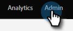

# Enable Sync for a Custom Entity {#enable-sync-for-a-custom-entity}

If you need custom entity data from Dynamics to be available in Marketo Engage, here's how to enable the sync for it. **Admin permissions are required**.

>[!PREREQUISITES]
>
>To use a custom object, it must be associated to a [lead](/help/marketo/product-docs/crm-sync/microsoft-dynamics-sync/microsoft-dynamics-sync-details/microsoft-dynamics-sync-lead-sync.md){target="_blank"}, [contact](/help/marketo/product-docs/crm-sync/microsoft-dynamics-sync/microsoft-dynamics-sync-details/microsoft-dynamics-sync-contact-sync.md){target="_blank"}, or [account](/help/marketo/product-docs/crm-sync/microsoft-dynamics-sync/microsoft-dynamics-sync-details/microsoft-dynamics-sync-account-sync.md){target="_blank"} object in Microsoft Dynamics.

>[!NOTE]
>
>* When you enable the sync for a custom entity, Marketo performs an initial sync to bring in all the data for the Custom Object.
>* Marketing List and Marketing List Members are _not supported_ at this time.

>[!IMPORTANT]
>
>The Marketo Sync User needs read access to the custom object to list it and perform a sync on it.

1. Go to the **[!UICONTROL Admin]** section.

   

1. Select **[!UICONTROL Microsoft Dynamics]** and click **[!UICONTROL Disable Sync]**.

   

   >[!NOTE]
   >
   >You must disable the global sync temporarily to enable or disable a custom entity.

1. Under Database Management, click **[!UICONTROL Dynamics Entities Sync]**.

   

1. Click **[!UICONTROL Sync schema]**.

   

1. Select the entity you want to sync and click **[!UICONTROL Enable Sync]**.

   

1. Select the fields you want to sync or use as [constraints](/help/marketo/product-docs/core-marketo-concepts/smart-lists-and-static-lists/using-smart-lists/add-a-constraint-to-a-smart-list-filter.md){target="_blank"} and/or triggers (for records added, _not_ updated) in Smart Lists. When done, click **[!UICONTROL Enable Sync]**.

   

   >[!NOTE]
   >
   >During the sync process, you may notice that the "[!UICONTROL Dynamic Entities Sync]" item disappears from the navigational tree. This is expected behavior, and it will reappear after the sync is complete.

1. The entity now has a green checkmark.

   

1. Don't forget to re-enable the global sync!

   

   >[!NOTE]
   >
   >* Marketo only supports custom entities that are linked to standard entities one or two levels deep.
   >
   >* The custom object tree may show the same object more than once, because of its direct connections with one of the main objects (e.g., leads, contacts, or accounts or indirect connections through an intermediary objects). In such cases, choose the object that is nearest to the main object and choose only one. Choosing the same object multiple times may hamper the sync of that custom object.
