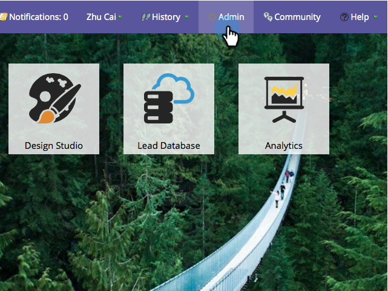

# Microsoft Dynamics Sync: Custom Entity Sync {#microsoft-dynamics-sync-custom-entity-sync}

If you need to enable the initial custom entity sync to make data from Dynamics available in Marketo, here's how to do it.

>[!NOTE]
>
>**Admin Permissions Required**

>[!PREREQUISITES]
>
>To use a custom object, it must be associated to a [lead](/help/marketo/product-docs/crm-sync/microsoft-dynamics-sync/microsoft-dynamics-sync-details/microsoft-dynamics-sync-lead-sync.md), [contact](/help/marketo/product-docs/crm-sync/microsoft-dynamics-sync/microsoft-dynamics-sync-details/microsoft-dynamics-sync-contact-sync.md), or [account](/help/marketo/product-docs/crm-sync/microsoft-dynamics-sync/microsoft-dynamics-sync-details/microsoft-dynamics-sync-account-sync.md)object in Dynamics.

>[!CAUTION]
>
>Make sure the initial sync is completed (you will be notified via email) before beginning the sync for custom entities.

1. Go to the Admin section.

   

1. Click **Disable Sync** to temporarily disable the standard global sync.

   

1. Install a version of Microsoft Dynamics that supports custom entity sync (after 2_0_0_2). See [Marketo Plugin Releases for MIcrosoft Dynamics](/help/marketo/product-docs/crm-sync/microsoft-dynamics-sync/marketo-plugin-releases-for-microsoft-dynamics.md).

1. Give the Marketo Sync User read access to any entities you plan to sync.

1. Under Database Management, click the **Dynamics Entities Sync** link.

   

1. Click the **Sync schema** link to bring over the list of available custom entities.

   

1. After the list syncs, select the fields you want to sync and ones you want to use as [constraints](/help/marketo/product-docs/core-marketo-concepts/smart-lists-and-static-lists/using-smart-lists/add-a-constraint-to-a-smart-list-filter.md) and/or triggers in smart lists. When done, click **Enable Sync**.

   

1. Re-enable the global sync.

   

   >[!NOTE]
   >
   >Marketo only supports custom entities that are linked to standard entities one or two levels deep.

   >[!NOTE]
   >
   >Entity names can have a maximum of **33 characters**.

You're good!
