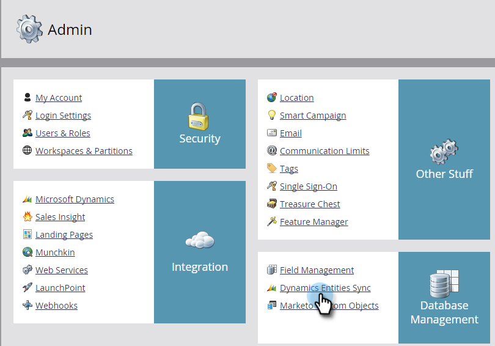
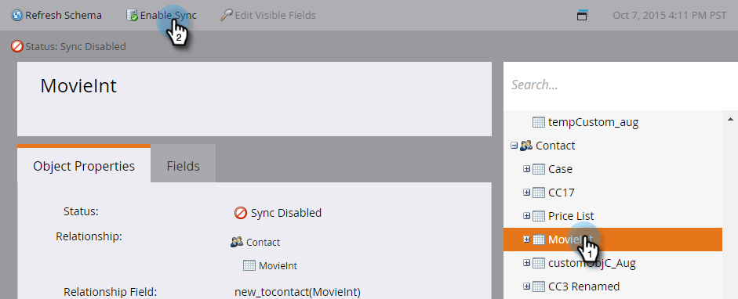
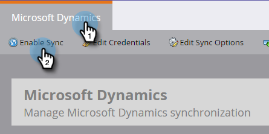

# Enable Sync for a Custom Entity {#enable-sync-for-a-custom-entity}

If you need custom entity data from Dynamics to be available in Marketo, here's how to enable the sync for it:

>[!NOTE]
>
>**Admin Permissions Required**

1. Go to the **Admin** section.

   

1. Select **Microsoft Dynamics** and click **Disable Sync**.

   You must disable the global sync temporarily in order to enable or disable a custom entity.

   

1. Under Database Management, click the **Dynamics Entities Sync** link.

   

1. Click the **Sync schema** link.

   

1. Select the entity you want to sync and click **Enable Sync**.

   

1. Select the fields you want to sync or use as [constraints](/help/marketo/product-docs/core-marketo-concepts/smart-lists-and-static-lists/using-smart-lists/add-a-constraint-to-a-smart-list-filter.md) and/or triggers in smart lists. When done, click **Enable Sync**.

   

   >[!NOTE]
   >
   >During the sync process, you may notice that the "Dynamic Entities Sync" item disappears from the navigational tree. This is expected behavior, and it will reappear after the sync is complete.

1. The entity now has a green checkmark on it.

   

1. Don't forget to re-enable the global sync!

   

Oh yeah! Powerful stuff.
