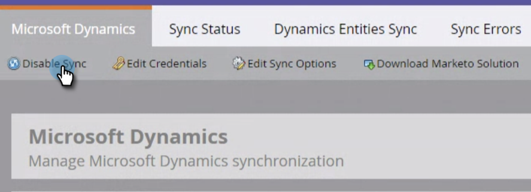
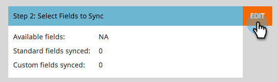
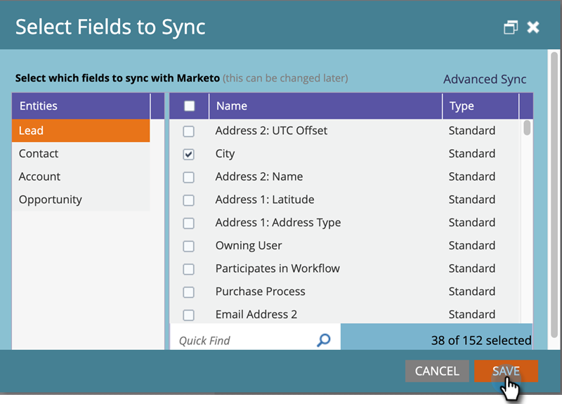

# Editing Fields to Sync Before Deleting Them in [!DNL Dynamics] {#editing-fields-to-sync-before-deleting-them-in-dynamics}

Sometimes you may want to delete fields in [!DNL Dynamics]. Marketo keeps the field list as a reference to base the sync on. If a field is deleted in [!DNL Dynamics] while the sync is on, the sync might encounter errors. Before deleting any fields, follow the steps below.

1. In Marketo, click **[!UICONTROL Admin]**.

   

1. Under [!UICONTROL Integration], click **[!UICONTROL Microsoft Dynamics]**.

   

1. Click **[!UICONTROL Disable Sync]**.

   

1. In a new tab in your browser, log in to [!DNL Dynamics] and delete your desired fields.

1. Back in Marketo, under [!DNL Microsoft Dynamics], click **[!UICONTROL Edit]** next to "[!UICONTROL Step 2: Select Fields to Sync]."

   

1. Review the fields and click **[!UICONTROL Save]**.

   

>[!CAUTION]
>
>Clicking **[!UICONTROL Save]** is required to save the updated schema for the sync, even if no changes were made.

>[!NOTE]
>
>If the Sync is not stopped before deleting a field in [!DNL Dynamics], the sync may encounter errors. If it does, the sync will stop. Before resuming, the Marketo Admin would need to review “[!UICONTROL Select Fields to Sync]” (discussed above) and click **[!UICONTROL Save]** in order for the sync to accept the schema changes.

Remember to enable the sync after the changes are saved!
