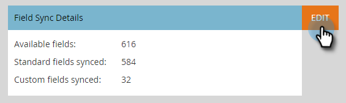
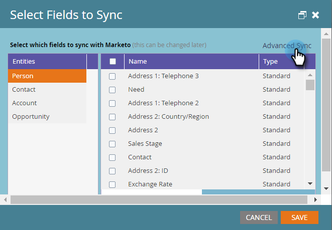
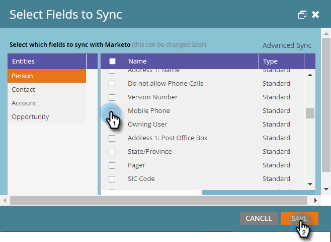

# Use Quick Sync with Microsoft Dynamics for a New Custom Field {#use-quick-sync-with-microsoft-dynamics-for-a-new-custom-field}

Marketing or Sales wants a new field. Or, maybe you forgot one in your initial field selection. Or, your needs changed. In any case, you can use Quick Sync to resync specific fields.

Normally, you’ll use Quick Sync to add a new field and have values refreshed. However, there are cases where you might want to sync an existing field. You can restrict the field sync based on an updated or created date range.&nbsp;See [Advanced Sync Options](#Advanced_Sync_Options) below for details.

Quick Sync can sync null values. For example, if you are using values A and B, and change a B value in Dynamics to null, it will sync the null value to Marketo.

### What's in this article? {#whats-in-this-article}

[Quick Sync for All Records](#quick-sync-for-all-records)  
[Advanced Sync Options](#advanced-sync-options)  
[Fixing Out of Sync Fields](#fixing-out-of-sync-fields)

#### Quick Sync for All Records {#quick-sync-for-all-records}

Here's how to use Quick Sync to resync for new fields.

1. In Marketo, click **Admin**.

   

1. Click** Microsoft Dynamics**.

   

1. On Field Sync Details, click **Edit**.

   

1. Select the fields to quick sync and click **Save**.

   

   >[!NOTE]
   >
   >You can select fields from multiple entities.

1. You'll receive a notification when the sync is complete.

   

   >[!CAUTION]
   >
   >The sync runs side-by-side with other syncs, and depending on the size of the database, can take a long time to complete. When a field is in a queue for syncing, you can't deselect it.

####  Advanced Sync Options {#advanced-sync-options}

What if you want to sync an existing field, but only do so for a limited set of data? Here's how.

1. Clear the checkbox for an existing field. Click **Save**.

   

1. Open the pop-up again and reselect the field.

   

1. Click **Advanced Sync**.

   

1. Choose **Updated **and select a date range using the date pickers. Click **Save**.

   

   Only records updated between 8/19/16 and 9/19/16 will be Quick Synced for the field.

#### Fixing Out of Sync Fields {#fixing-out-of-sync-fields}

In the rare case where a Dynamics and Marketo field are out of sync, there's a quick and easy way to resync them.

1. Deselect the field and click&nbsp;**Save**.

   

1. Reselect the field and click **Save**. That's all!

   

   That should fix it!

