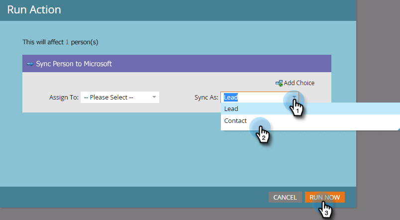

# Create a Contact in [!DNL Microsoft Dynamics] {#create-a-contact-in-microsoft-dynamics}

1. Select the Marketo only person (Microsoft Type is empty) that you want to create as a contact in [!DNL Dynamics].

   

1. Click **[!UICONTROL Person Actions]** and **Microsoft**, and select **[!UICONTROL Sync Person to Microsoft]**.

   

1. Click **[!UICONTROL Sync As]** and select **[!UICONTROL Contact]**. Click **[!UICONTROL Run Now]**.

   

   >[!NOTE]
   >
   >When using the “[!UICONTROL Sync Person to Microsoft]” flow action (in a trigger campaign only), the lead/contact will be created in real-time in [!DNL Dynamics].

1. Marketo qualifies that Lead record in [!DNL Dynamics] into a Contact that is not associated to any Account in [!DNL Dynamics].

   

1. Now, you can select **[!UICONTROL Contact]** when you use the Sync As constraint in a smart campaign filter.

   
