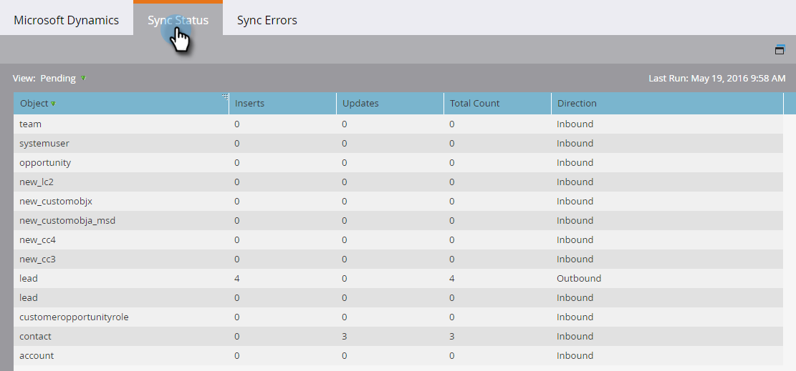
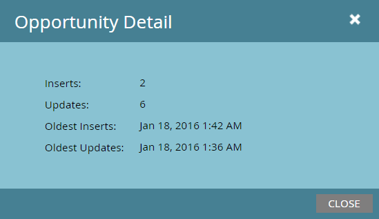
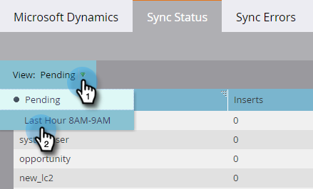

# Sync Status {#sync-status}

You can keep tabs on the current throughput and backlog of the sync process on the [!UICONTROL Sync Status] and [!UICONTROL Sync Errors] tabs.

## [!UICONTROL Sync Status] Tab {#sync-status-tab}

1. Click **[!UICONTROL Admin]** and **[!UICONTROL Microsoft Dynamics]**.

   

1. Click the **[!UICONTROL Sync Status]** tab.

   

   This table displays the backlog of inserts and updates that haven't synced yet, for each object.

1. Double-click any row to view opportunity information.

   

   Sync status details are broken down by inserts and updates, and oldest insert and update records.

   

1. Click the **View:** drop-down and select **Last Hour** to view throughput information.

   

   The display now shows the the number of records synced in the last full hour (for example, 1-2 p.m.).

   

   >[!NOTE]
   >
   >When you're looking at the [!UICONTROL Last Hour] view, the [!UICONTROL Inserts] and [!UICONTROL Updates] columns display N/A. This is expected behavior.

## [!UICONTROL Sync Errors] Tab {#sync-errors-tab}

Browse, search, or export leads (and other objects) that failed to synchronize with details such as operation, direction, error code and error message.

>[!MORELIKETHIS]
>
>[Notification Types](/help/marketo/product-docs/core-marketo-concepts/miscellaneous/understanding-notifications/notification-types.md)
