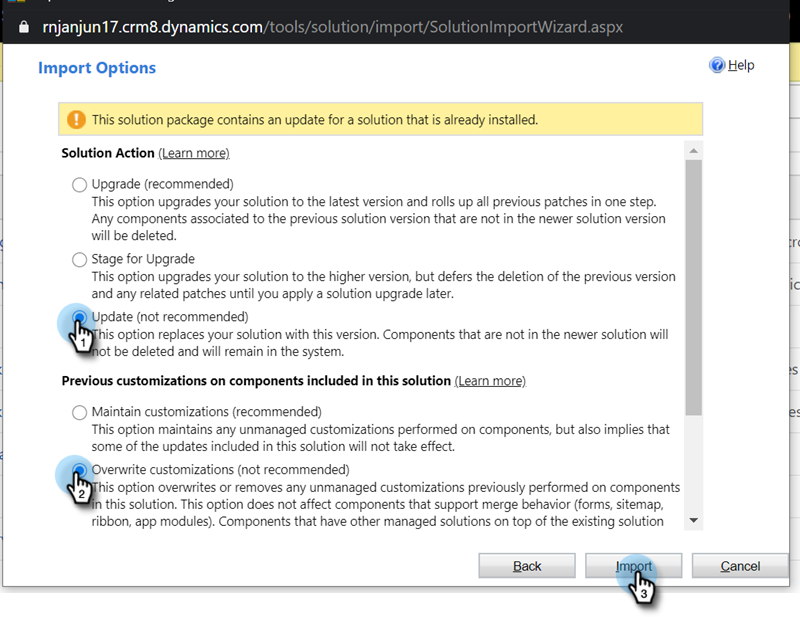

# Plug-In Releases for Microsoft Dynamics MSI {#plug-in-releases-for-microsoft-dynamics-msi}

When you first sync to Microsoft Dynamics, you download and install the latest version of the plug-ins for Marketo Sales Insight (MSI). Periodically, Marketo updates these plug-ins, so you can return to the same place to download the new version.

Please [download the latest plug-in](http://docs.marketo.com/x/LoJo) corresponding to your Dynamics release.

>[!NOTE]
>
>These versions work for both on-premise and online versions of Dynamics.

## Updating your MSI Solution {#updating-your-msi-solution}

1. Import the latest version of the solution over the existing version of your Dynamics CRM (ex: if your Dynamics CRM has version 1.4 and the latest version is 1.5, you would import *over* version 1.4).
1. You will see the following pop-up. Select the **Update** and **Overwrite customization** options, then click **Import**.

   

## Version Updates {#version-updates}

<table> 
 <colgroup> 
  <col> 
  <col> 
  <col> 
 </colgroup> 
 <tbody> 
  <tr> 
   <th colspan="1">Version</th> 
   <th colspan="1">Release Date</th> 
   <th colspan="1">Notes</th> 
  </tr> 
  <tr> 
   <td colspan="1">07/20/20</td> 
   <td colspan="1">2.0.0.20</td> 
   <td colspan="1">Bug fix: Add a validation message for non synchd records</td> 
  </tr> 
  <tr> 
   <td colspan="1">06/12/20</td> 
   <td colspan="1">2.0.0.19</td> 
   <td colspan="1">
Bug fix: To Hide MSI Secret Password on MSD API Config
</td> 
  </tr> 
  <tr> 
   <td colspan="1">05/26/20</td> 
   <td colspan="1">2.0.0.18</td> 
   <td colspan="1">
Bug fix: To change MSI role Id Validation for displaying MSI buttons
</td> 
  </tr> 
  <tr> 
   <td colspan="1">05/21/20</td> 
   <td colspan="1">2.0.0.17</td> 
   <td colspan="1">
Bug fix: Unhide owner field and making fields non mandatory
</td> 
  </tr> 
  <tr> 
   <td colspan="1">04/28/20</td> 
   <td colspan="1">2.0.0.16</td> 
   <td colspan="1">
Bug fix: Removing MSD CRM sitemap setting link dependency
</td> 
  </tr> 
 </tbody> 
</table>

