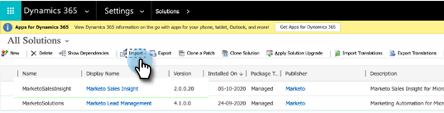
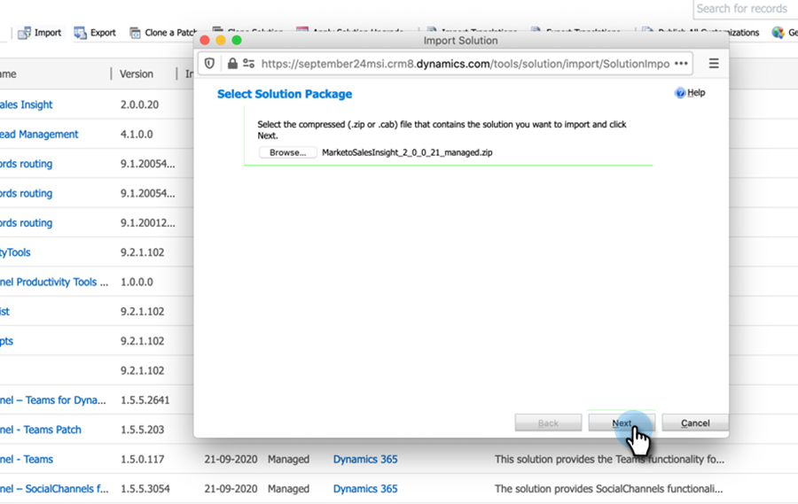
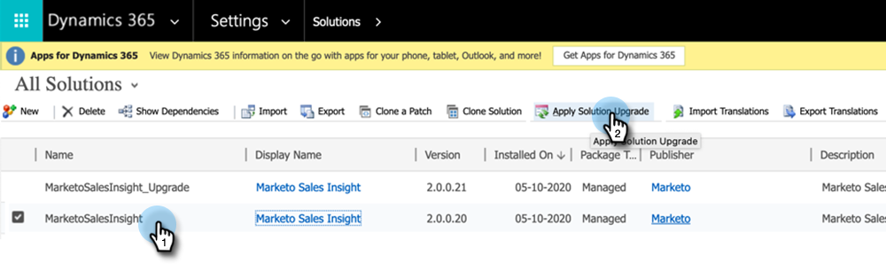
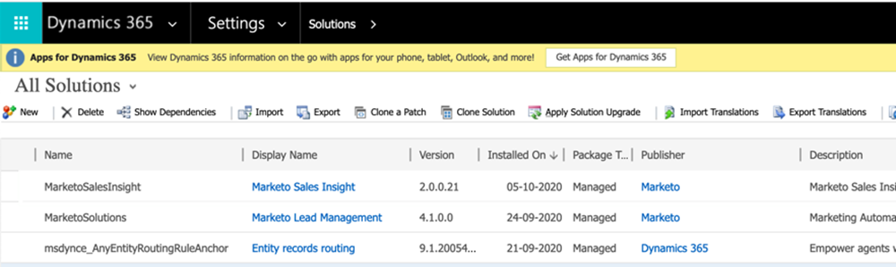

# Plug-In Releases for Microsoft Dynamics MSI {#plug-in-releases-for-microsoft-dynamics-msi}

When you first sync to Microsoft Dynamics, you download and install the latest version of the plug-ins for Marketo Sales Insight (MSI). Periodically, Marketo Engage updates these plug-ins, so you can return to the same place to download the new version.

If you're using the Marketo native CRM sync solution to Dynamics, please [download the latest plug-in](/help/marketo/product-docs/marketo-sales-insight/msi-for-microsoft-dynamics/installing/download-the-marketo-sales-insight-solution-for-microsoft-dynamics.md){target="_blank"} corresponding to your Dynamics release. For those who have a custom sync and have purchased Marketo Sales Insight, the [package is here](https://mktg-cdn.marketo.com/community/MarketoSalesInsight_NonNative.zip){target="_blank"}.

>[!NOTE]
>
>These versions work for both on-premise and online versions of Dynamics.

## Upgrading your MSI Solution {#upgrading-your-msi-solution}

1. Import the latest version of the solution _over the existing version_ of your Dynamics CRM by pressing the **[!UICONTROL Import]** button in Dynamics.

   

>[!NOTE]
>
>Example: if your Dynamics CRM has version 2.0.0.20 and the latest version is 2.0.0.21, you would import _over_ version 2.0.0.20.

1. Click **[!UICONTROL Next]**.

   

1. Select **[!UICONTROL Stage for Upgrade]** and **[!UICONTROL Maintain customizations]**, then click **[!UICONTROL Import]**.

   

1. Click **[!UICONTROL Next]**.

   

1. After a successful import you'll see two MSI solutions: MarketoSalesInsight and MarketoSalesInsight_Upgrade. Select the older solution and click Apply Solution Upgrade.

   

And that's it! After the upgrade you will only see one MSI Solution.

## Version Updates {#version-updates}

<table> 
 <tbody> 
  <tr> 
   <th>Release Date</th> 
   <th>Version</th> 
   <th>Notes</th> 
  </tr>
  <tr> 
   <td>02/14/24</td> 
   <td>2.00.31</td> 
   <td>Changes to pagination on Anonymous web activity.
   

   Encrypt Secret key info from user view. The password needs to be changed after importing the new package in order for encryption to occur.</td> 
  </tr>
  <tr> 
   <td>10/18/23</td> 
   <td>2.00.30</td> 
   <td>Consolidating MSI Error Log and removing Info notifications from showing up on the Marketo Error Entity.</td> 
  </tr>
  <tr> 
   <td>05/19/23</td> 
   <td>2.00.29</td> 
   <td>Fixed Web Activity and Interesting Moments pagination issues on the global dashboard.</td> 
  </tr>
  <tr> 
   <td>03/23/23</td> 
   <td>2.00.28</td> 
   <td>Created a <a href="https://mktg-cdn.marketo.com/community/MarketoSalesInsight_NonNative.zip">new package</a> for MSI for non-native connections to the CRM.</td> 
  </tr>
  <tr> 
   <td>02/03/22</td> 
   <td>2.0.0.27</td> 
   <td>Account Layout for Insights: Interesting Moments, Score changes, Web activities, Email activities.</td> 
  </tr>
  <tr> 
   <td>01/05/22</td> 
   <td>2.0.0.26</td> 
   <td>Program Adoption Score for Send Email.</td> 
  </tr>
  <tr> 
   <td>10/28/21</td> 
   <td>2.0.0.25</td> 
   <td>Product Adoption Score Metrics, new Global Dashboard (Web Activity, Email, Best Bets).</td> 
  </tr>
  <tr> 
   <td>02/10/21</td> 
   <td>2.0.0.22</td> 
   <td>Remove Auto audit enabled and documentation changes on MSI solution.</td> 
  </tr>
  <tr> 
   <td>10/01/20</td> 
   <td>2.0.0.21</td> 
   <td>Bug Fix: Assigning access to MSI API config fields for users with Sales Insight role.</td> 
  </tr> 
  <tr> 
   <td>07/20/20</td> 
   <td>2.0.0.20</td> 
   <td>Bug fix: Add a validation message for non-synced records.</td> 
  </tr> 
  <tr> 
   <td>06/12/20</td> 
   <td>2.0.0.19</td> 
   <td>Bug fix: To hide MSI Secret Password on MSD API Config.</td> 
  </tr> 
  <tr> 
   <td>05/26/20</td> 
   <td>2.0.0.18</td> 
   <td>Bug fix: To change MSI role ID validation for displaying MSI buttons.</td> 
  </tr> 
  <tr> 
   <td>05/21/20</td> 
   <td>2.0.0.17</td> 
   <td>Bug fix: Unhide owner field and making fields non-mandatory.</td> 
  </tr> 
  <tr> 
   <td>04/28/20</td> 
   <td>2.0.0.16</td> 
   <td>Bug fix: Removing MSD CRM sitemap setting link dependency.</td> 
  </tr> 
 </tbody> 
</table>
