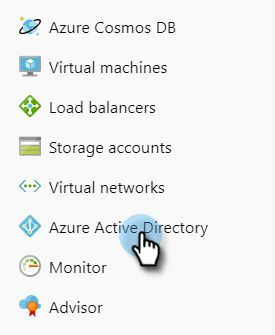
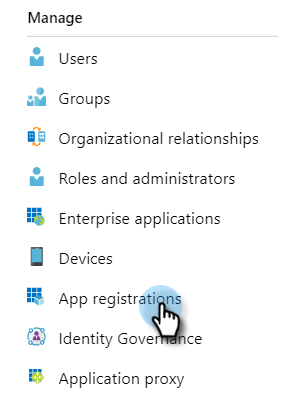
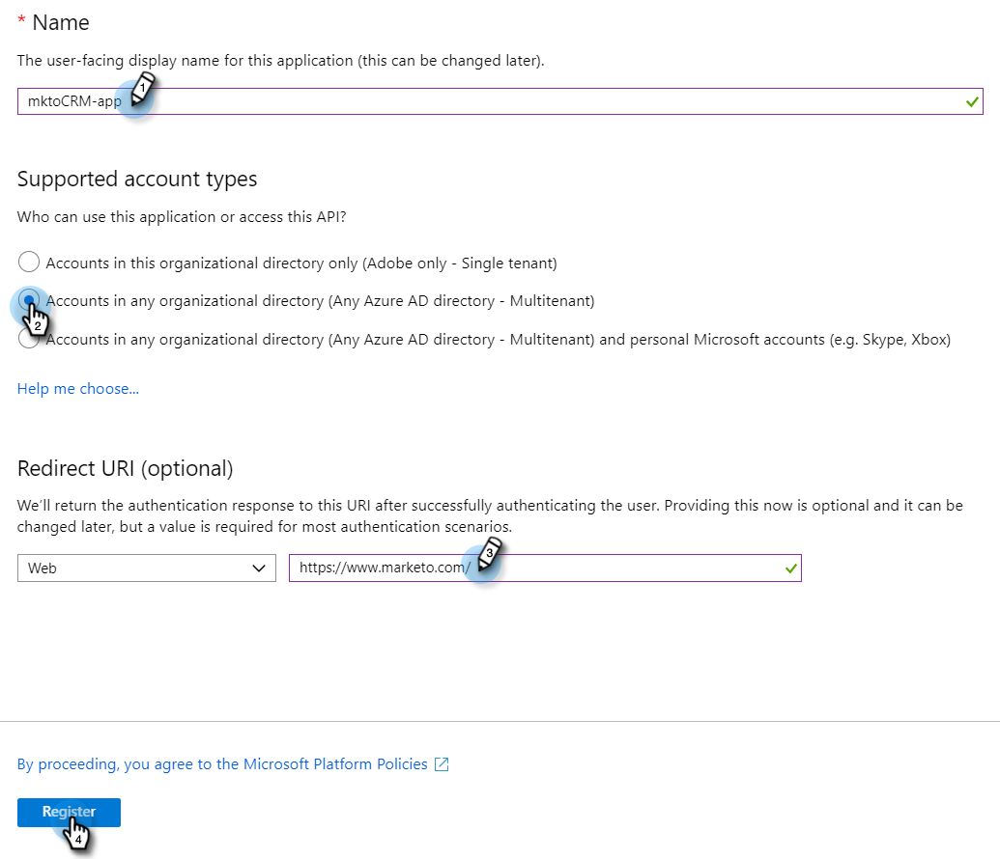
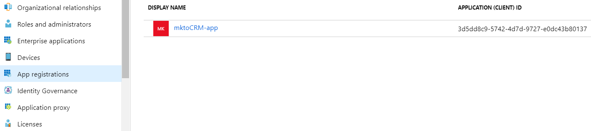
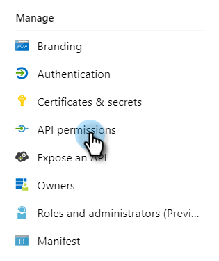
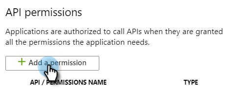
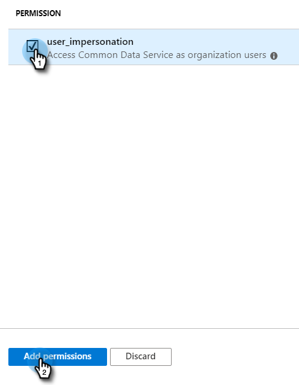
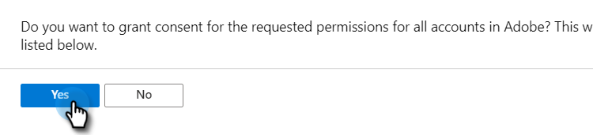

# Register an App with Azure to Acquire Your Client ID/App ID {#register-an-app-with-azure-to-acquire-your-client-id-app-id}

Azure Active Directory extends your on-premises directories into the cloud, providing support for MS Dynamics 365 CRM with on-premise ADFS authentication.

## Registering a New App {#registering-a-new-app}

1. [Log in](https://login.microsoftonline.com/){target="_blank"} to the Microsoft Azure management portal using an account with admin permissions. You can also access the Microsoft Azure portal through the Office 365 Admin Center by expanding the **Admin** item in the left navigation pane and selecting **Azure AD**.

   >[!CAUTION]
   >
   >You must use an account in the same Office 365 subscription as the one you intend to register the app with.

   >[!NOTE]
   >
   >If you don’t have an Azure account, you can [sign up](https://azure.microsoft.com/en-us/free/){target="_blank"} for one. Please refer to Microsoft's documentation or reach out to your Microsoft representative for more information. Once you've created an Azure account, you can register one or more apps using the procedure outlined below.
   >
   >
   >If you have an Azure account but your Office 365 subscription with Microsoft Dynamics 365 isn't available in your Azure subscription, follow [these instructions](https://msdn.microsoft.com/office/office365/howto/setup-development-environment#bk_CreateAzureSubscription){target="_blank"} to associate the two accounts.

1. Find and click **Azure Active Directory** in the left navigation pane.

   

1. Under Manage, click **App registrations**.

   

1. Click **New registration** at the top of the page.

   

1. Enter a name for your app, choose your applicable account type, and enter a Redirect URL. Then click **Register** at the bottom of the page.

   

1. You should now see your app in the **App registrations** tab.

   

## Configuring App Permissions {#configuring-app-permissions}

1. Under the **App registrations** tab in your Active Directory, click the app you want to configure permissions for.

   

1. Under Manage, click **API permissions**.

   

1. Click the **Add a permission** button.

   

1. Choose **Dynamics CRM**.

   

1. Check the **Access Common Data Service as organization user****s** box, then click **Add permissions.**

   

1. Once the permissions have been successfully added, wait at least 10 seconds.

   

1. Click the **Grant admin consent** button.

   

1. Click **Yes** to confirm.

   

   And you're done!

   
