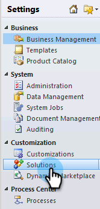
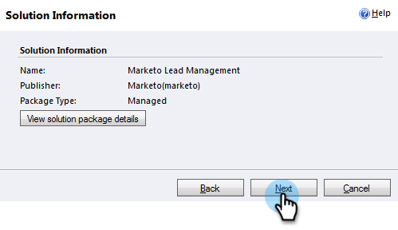
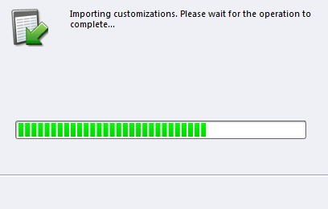
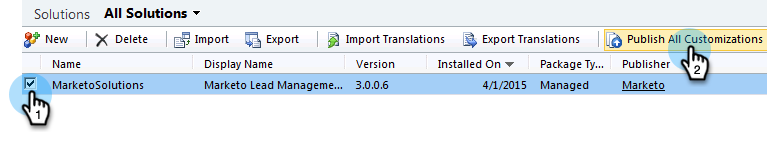

# Step 1 of 3: Install the Marketo Solution (2011 On-Premises) {#step-of-install-the-marketo-solution-on-premises}

Before you can sync Microsoft Dynamics On-Premises and Marketo Engage, you need to first install the Marketo solution in Dynamics.

>[!NOTE]
>
>After you sync Marketo to a CRM, you cannot perform a new sync without replacing the instance.

>[!PREREQUISITES]
>
>You must have [Internet Facing Deployment](https://www.microsoft.com/en-us/download/confirmation.aspx?id=41701){target="_blank"} (IFD) with [Active Directory Federation Services](https://msdn.microsoft.com/en-us/library/bb897402.aspx){target="_blank"} 2.0, 2.1 or 3.0 (ADFS) configured. **Note**: The IFD document downloads automatically when you click the link.
>
>[Download the Marketo Lead Management Solution](/help/marketo/product-docs/crm-sync/microsoft-dynamics-sync/sync-setup/download-the-marketo-lead-management-solution.md){target="_blank"} before you start.

>[!NOTE]
>
>**Dynamics Admin Permissions required**.
>
>You need CRM administrator privileges to perform this sync.

1. Log in to Dynamics and select **[!UICONTROL Settings]** in the bottom left menu.

   

1. Select **[!UICONTROL Solutions]** in the tree.

   

1. Click **[!UICONTROL Import]**.

   

1. Click **[!UICONTROL Browse]**. Select the Marketo Lead Management solution you [downloaded](/help/marketo/product-docs/crm-sync/microsoft-dynamics-sync/sync-setup/download-the-marketo-lead-management-solution.md){target="_blank"}. Click **[!UICONTROL Next]**.

   

1. View the Solution Information and click **[!UICONTROL View solution package details]**.

   

1. When you're done checking all the details, click **[!UICONTROL Close]**.

   

1. Back on the Solution Information page, click **[!UICONTROL Next]**.

   

1. Make sure the SDK message option checkbox is checked. Click **[!UICONTROL Next]**.

   

   >[!TIP]
   >
   >You will need to enable pop-ups on your browser to complete the installation process.

1. Now wait for the import to finish. Get up and do some stretches.

   

1. Click **[!UICONTROL Close]**.

   >[!NOTE]
   >
   >You may see a message saying "Marketo Lead Management completed with warning". This is fully expected.

   

1. Marketo Lead Management will now appear on the **All Solutions** page.

   

1. Select Marketo Lead Management and click **[!UICONTROL Publish All Customizations]**.

   

>[!CAUTION]
>
>Disabling any of the Marketo SDK Messaging Processes will result in a broken install!

>[!MORELIKETHIS]
>
>[Step 2 of 3: Set Up Marketo Sync User in Dynamics (2011 On-Premises)](/help/marketo/product-docs/crm-sync/microsoft-dynamics-sync/sync-setup/connecting-to-legacy-versions/step-2-of-3-set-up-2011.md){target="_blank"}
