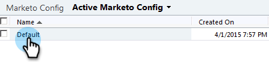

# Step 2 of 3: Set up Marketo Sync User in Dynamics (2011 On-Premises) {#step-of-set-up-marketo-sync-user-in-dynamics-on-premises}

Great job completing the previous steps, let's keep moving through this.

>[!PREREQUISITES]
>
>[Step 1 of 3: Install the Marketo Solution (2011 On-Premises)](/help/marketo/product-docs/crm-sync/microsoft-dynamics-sync/sync-setup/connecting-to-legacy-versions/step-1-of-3-install-2011.md)

## Assign Sync User Role {#assign-sync-user-role}

Assign the Marketo Sync User role only to the Marketo sync user. You don't need to assign it to any other users.

>[!NOTE]
>
>This applies to Marketo plugin version 4.0.0.14 and later. For earlier versions, all users must have the sync user role. To upgrade Marketo, see [Upgrade the Marketo Solution for Microsoft Dynamics](/help/marketo/product-docs/crm-sync/microsoft-dynamics-sync/sync-setup/update-the-marketo-solution-for-microsoft-dynamics.md).

>[!IMPORTANT]
>
>The language setting of the Sync User [should be set to English](https://portal.dynamics365support.com/knowledgebase/article/KA-01201/en-us).

1. In the bottom left menu, select **Settings**.

   

1. In the tree, select **Administration**.

   

1. Select **Users**.

   

1. You will see a list of users here. Select your dedicated Marketo sync user or contact your [Active Directory Federation Services (AFDS)](https://msdn.microsoft.com/en-us/library/bb897402.aspx) administrator to create a new user that's dedicated to Marketo. Click **Manage Roles**.

   

1. Check **Marketo Sync User** and click **OK**.

   

   >[!TIP]
   >
   >If you don't see the role, go back to [step 1 of 3](/help/marketo/product-docs/crm-sync/microsoft-dynamics-sync/sync-setup/connecting-to-legacy-versions/step-1-of-3-install-2011.md) and import the solution.

   >[!NOTE]
   >
   >Any updates made in your CRM by the Sync User will **not** be synced back to Marketo.

## Configure Marketo Solution {#configure-marketo-solution}

Almost done! We just have a few last pieces of configuration before moving onto the next article.

1. Select **Settings**. Then select **Marketo Config** in the tree.

   

   >[!NOTE]
   >
   >If Marketo Config is missing, try refreshing the page. If the issue persists, [publish the Marketo solution again](/help/marketo/product-docs/crm-sync/microsoft-dynamics-sync/sync-setup/connecting-to-legacy-versions/step-1-of-3-install-2011.md) or log out and back in.

1. Click **Default**.

   

1. Click on 

   

1. In the pop-up, select the sync user. Then click **OK**.

   

1. Click **Save** to save the changes.

   

1. Click **Publish All Customizations**.

   

## Before Proceeding to Step 3 {#before-proceeding-to-step}

    * If you want to restrict the number of records you sync, [set up a custom sync filter](/help/marketo/product-docs/crm-sync/microsoft-dynamics-sync/create-a-custom-dynamics-sync-filter.md) now.
    * Run the [Validate Microsoft Dynamics Sync](/help/marketo/product-docs/crm-sync/microsoft-dynamics-sync/sync-setup/validate-microsoft-dynamics-sync.md) process. It verifies that your initial setups were done correctly.
    * Log into the Marketo Sync User in Microsoft Dynamics CRM.

   Great job!

>[!MORELIKETHIS]
>
>[Step 3 of 3: Connect Microsoft Dynamics with Marketo (2011 On-Premises)](/help/marketo/product-docs/crm-sync/microsoft-dynamics-sync/sync-setup/connecting-to-legacy-versions/step-3-of-3-connect-2011.md)
