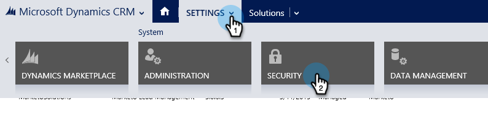
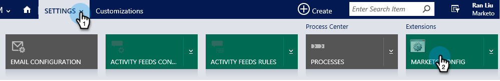

# Step 2 of 3 Set up Marketo for Dynamics (2015 On-Prem){#step-of-set-up-for-marketo-on-premises-2015}

Great job completing the previous steps. Let's keep moving through this.

>[!PREREQUISITES]
>
>[Install Marketo for Microsoft Dynamics 2015 On-Premises Step 1 of 3](/help/marketo/product-docs/crm-sync/microsoft-dynamics-sync/sync-setup/connecting-to-legacy-versions/step-1-of-3-install-2015.md){target="_blank"}

## Assign Sync User Role {#assign-sync-user-role}

Assign the Marketo Sync User role only to the Marketo sync user. You don't need to assign it to any other users.

>[!NOTE]
>
>This applies to Marketo version 4.0.0.14 and later. For earlier versions, all users must have the sync user role. To upgrade your Marketo, see [Upgrade the Marketo Solution for Microsoft Dynamics](/help/marketo/product-docs/crm-sync/microsoft-dynamics-sync/sync-setup/update-the-marketo-solution-for-microsoft-dynamics.md){target="_blank"}.

>[!IMPORTANT]
>
>The language setting of the Sync User [should be set to English](https://portal.dynamics365support.com/knowledgebase/article/KA-01201/en-us){target="_blank"}.

1. Under **[!UICONTROL Settings]**, click **[!UICONTROL Security]**.

   

1. Click **[!UICONTROL Users]**.

   

1. You will see a list of users here. Select the dedicated Marketo Sync user or contact your [Active Directory Federation Services](https://msdn.microsoft.com/en-us/library/bb897402.aspx){target="_blank"} (ADFS) administrator to create a dedicated user for Marketo.

   

1. Select the sync user. Click **[!UICONTROL Manage Roles]**.

   

1. Check Marketo Sync User and click **[!UICONTROL OK]**.

   

   >[!IMPORTANT]
   >
   >The Sync User should have read permission to the Marketo Config.

   >[!TIP]
   >
   >If you don't see the role, go back to [step 1 of 3](/help/marketo/product-docs/crm-sync/microsoft-dynamics-sync/sync-setup/connecting-to-legacy-versions/step-1-of-3-install-2015.md){target="_blank"} and import the solution.

   >[!NOTE]
   >
   >Any updates made in your CRM by the Sync User will _not_ be synced back to Marketo.

## Configure Marketo Solution {#configure-marketo-solution}

Almost done! We just have a few last pieces of configuration before moving onto the next article.

1. Under **[!UICONTROL Settings]**, click **[!UICONTROL Marketo Config]**.

   

   >[!NOTE]
   >
   >If Marketo Config is missing, try refreshing the page. If the issue persists, [publish the Marketo Solution](/help/marketo/product-docs/crm-sync/microsoft-dynamics-sync/sync-setup/connecting-to-legacy-versions/step-1-of-3-install-2015.md){target="_blank"} or try logging out and back in.

1. Click **[!UICONTROL Default]**.

   

1. Click the **[!UICONTROL Marketo User]** field and select the sync user.

   

1. Click the save icon in the bottom right corner.

   

1. Click **[!UICONTROL Publish All Customizations]**.

   

   >[!NOTE]
   >
   >The Sync User should have read permission to the Marketo Config.

## Before Proceeding to Step 3 {#before-proceeding-to-step}

* If you want to restrict the number of records you sync, [set up a custom sync filter](/help/marketo/product-docs/crm-sync/microsoft-dynamics-sync/create-a-custom-dynamics-sync-filter.md){target="_blank"} now.
* Run the [Validate Microsoft Dynamics Sync](/help/marketo/product-docs/crm-sync/microsoft-dynamics-sync/sync-setup/validate-microsoft-dynamics-sync.md){target="_blank"} process. It verifies that your initial setups were done correctly.
* Log in to the Marketo Sync User in Microsoft Dynamics CRM.

>[!MORELIKETHIS]
>
>[Install Marketo for Microsoft Dynamics 2015 On-Premises Step 3 of 3](/help/marketo/product-docs/crm-sync/microsoft-dynamics-sync/sync-setup/connecting-to-legacy-versions/step-3-of-3-connect-2015.md){target="_blank"}
