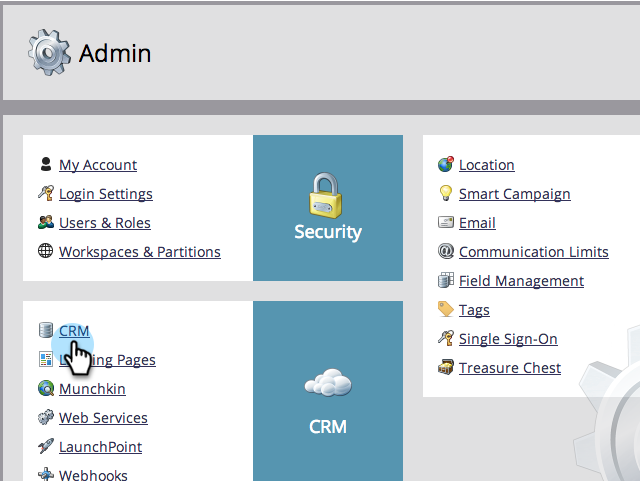
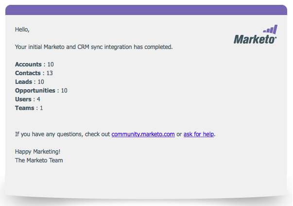

# Step 3 of 3: Connect [!DNL Microsoft Dynamics] with Marketo (2011 On-Premises) {#step-of-connect-microsoft-dynamics-with-marketo-on-premises}

Alright! We installed the solution and configured the sync user. Next, we need to connect Marketo and [!DNL Dynamics].

>[!PREREQUISITES]
>
>* [Step 1 of 3: Install the Marketo Solution (2011 On-Premises)](/help/marketo/product-docs/crm-sync/microsoft-dynamics-sync/sync-setup/connecting-to-legacy-versions/step-1-of-3-install-2011.md)
>* [Step 2 of 3: Set Up Marketo Sync User in [!DNL Dynamics] (2011 On-Premises)](/help/marketo/product-docs/crm-sync/microsoft-dynamics-sync/sync-setup/connecting-to-legacy-versions/step-2-of-3-set-up-2011.md)

>[!NOTE]
>
>**Admin Permissions Required**

## Enter [!DNL Dynamics] Sync User Information {#enter-dynamics-sync-user-information}

1. Log in to Marketo and click **[!UICONTROL Admin]**.

   

1. Click on **[!UICONTROL CRM]**.

   

1. Click **[!UICONTROL Microsoft]**.

   

1. Click **[!UICONTROL Edit]** in **[!UICONTROL Step 1: Enter credentials]**.

   

   >[!CAUTION]
   >
   >Please make sure your credentials are correct as we are unable to revert the subsequent schema changes after submission. If incorrect credentials are saved, you’ll have to obtain a new Marketo subscription.

1. Enter the **[!UICONTROL Username]**, **[!UICONTROL Password]** and CRM **[!UICONTROL URL]** then click **[!UICONTROL Save]**.

   

   >[!NOTE]
   >
   >* The [!UICONTROL Username] in Marketo must match the User Name for the sync user in CRM. The format can be `user@domain.com` or DOMAIN\user.
   >* If you don't know the URL, [learn how to find it here](/help/marketo/product-docs/crm-sync/microsoft-dynamics-sync/sync-setup/view-the-organization-service-url.md).

## Select Fields to Sync {#select-fields-to-sync}

Now we need to select the fields we want to sync over.

1. Click **[!UICONTROL Edit]** in **[!UICONTROL Step 2: Select Fields to Sync]**.

   

1. There are preselected fields that will be synced. Add more if you want, and click **[!UICONTROL Save]**.

   

   >[!NOTE]
   >
   >Marketo stores a reference to the fields to sync. If you delete a field in [!DNL Dynamics], we recommended doing so with the [sync disabled](/help/marketo/product-docs/crm-sync/salesforce-sync/enable-disable-the-salesforce-sync.md). Then refresh the schema in Marketo by editing and saving the [Select Fields to Sync](/help/marketo/product-docs/crm-sync/microsoft-dynamics-sync/microsoft-dynamics-sync-details/microsoft-dynamics-sync-field-sync/editing-fields-to-sync-before-deleting-them-in-dynamics.md).

## Sync Fields for a Custom Filter {#sync-fields-for-a-custom-filter}

If you've created a custom filter, be sure to go in and select the new fields to be synced with Marketo.

1. Go to Admin and select **[!UICONTROL Microsoft Dynamics]**.

   

1. Click **[!UICONTROL Edit]** on [!UICONTROL Field Sync Details].

   

1. Scroll down to the field and check it. The actual name must be new_synctomkto but the Display Name can be anything. Click **[!UICONTROL Save]**.

   

## Enable Sync {#enable-sync}

1. Click **[!UICONTROL Edit]** in **[!UICONTROL Step 3: Enable Sync]**.

   

   >[!CAUTION]
   >
   >Marketo will not automatically de-dupe against a [!DNL Microsoft Dynamics] sync, or when you manually enter people or leads.

1. Read everything in the pop-up, enter your email, and click **[!UICONTROL Start Sync]**.

   

1. The first sync may take a few hours. After it's done, you'll receive an email notification.

   

   Excellent work!
