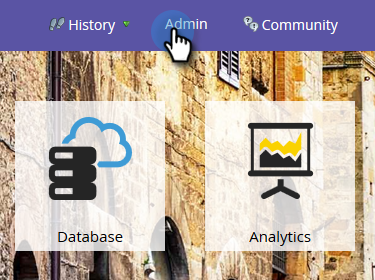
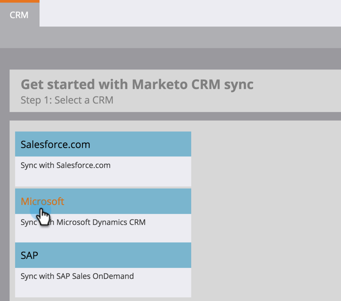

# Download the Marketo Lead Management Solution {#download-the-marketo-lead-management-solution}

>[!NOTE]
>
>**Admin Permissions Required**

You will need to download and install a Marketo Solution into your Microsoft Dynamics account to get the sync started.

>[!CAUTION]
>
>It is imperative you download the latest Marketo Solution _before_ performing any upgrade.

>[!NOTE]
>
>Marketo only supports SSL certs that are compatible with Java 7 at this time.

1. Go to the **Admin** area.

   

1. Click on **CRM**.

   

1. Select **Microsoft**.

   

1. Select **Download Marketo Solution**.

   

1. Select the appropriate solution for your Microsoft Dynamics version.

   

Awesome! A zip file of the solution will now be downloaded to your device.
