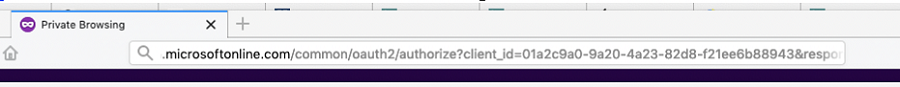
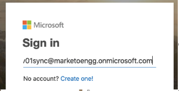
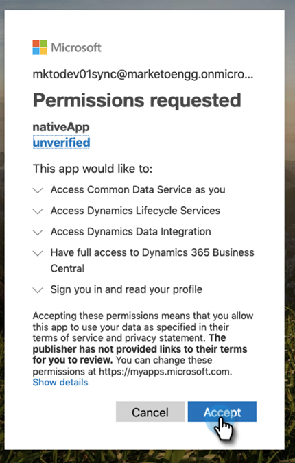
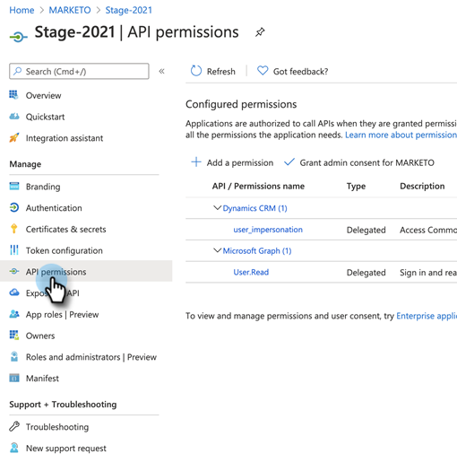
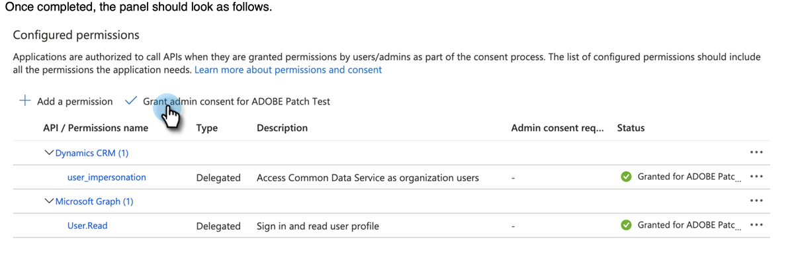
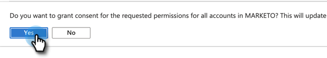

# Grant Consent for Client Id and App Registration {#grant-consent-for-client-id-and-app-registration}

## Grant Delegated User Permissions for the Sync User {#grant-delegated-user-permissions-for-the-sync-user}

1. Use a clean text program (Notepad for Windows, Text Edit for Mac) to create a Uniform Resource Identifier (URI) for authorization by pasting the below text and substituting the `client_id`, `redirect_uri`, and `state` values.

   ```
   https://login.microsoftonline.com/common/oauth2/authorize?
   client_id='xxxxxx-xxxx-xxxx-xxxx-xxxxxxxx'
   &response_type='code'
   &redirect_uri='https://www.<ourdomain>.com'
   &response_mode='query'
   &state='SOME_UNIQUE_UID'
   client_id value should be the client_id generated in App Registration process
   redirect_uri value should be same as value entered at the time of App registration-> Redirect URIs
   state value can be any ID (e.g.,12345)
   ```

   <table> 
    <colgroup> 
     <col> 
     <col> 
    </colgroup> 
    <tbody> 
     <tr> 
      <td><strong>client_id value</strong></td> 
      <td>should be the client_id generated in App Registration process</td> 
     </tr> 
     <tr> 
      <td><strong>redirect_uri value</strong></td> 
      <td>should be same as value entered at the time of App registration > Redirect URIs</td> 
     </tr> 
     <tr> 
      <td><strong>state value</strong></td> 
      <td>can be any ID (e.g.,12345)</td> 
     </tr> 
    </tbody> 
   </table>

   The final URL should look something like this: `https://login.microsoftonline.com/common/oauth2/authorize?client_id=xxxxxx-xxxx-xxxx-xxxx-xxxxxxxx&response_type=code&redirect_uri=https://www.marketo.com&response_mode=query&state=12345`

1. Open the URI you created in any browser.

   

1. Log in as the Sync User you're granting permissions for.

   

   >[!NOTE]
   >
   >If you're already logged in to Azure as an Admin in another tab, you'll need to use a different browser or Incognito mode to log in as the Sync User.

1. Click **[!UICONTROL Accept]**.

   

## Grant Consent for all Users {#grant-consent-for-all-users}

As an administrator, you can also consent to an application's delegated permissions on behalf of all the users in your tenant. Administrative consent prevents the consent dialog from appearing for every user in the tenant, and can be done in the Azure portal by users with the administrator role. Learn which administrator roles can [consent to delegated permissions here](https://docs.microsoft.com/en-us/azure/active-directory/roles/permissions-reference).

1. In your Azure portal, navigate to the application homepage.

1. Under [!UICONTROL Manage], click **[!UICONTROL API Permissions]**.

   

1. Click the **Grant admin consent** (for tenant) button.

   

1. Click **Yes** to confirm.

   

