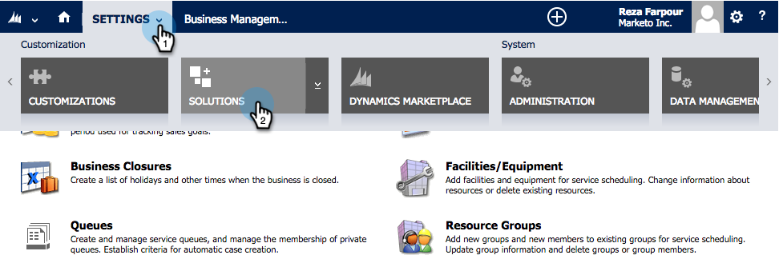

# Step 1 of 3: Install the Marketo Solution in Dynamics (2013 On-Premises) {#step-of-install-the-marketo-solution-in-dynamics-on-premises}

Before you can sync Microsoft Dynamics On-Premises and Marketo, you need to first install the Marketo solution in Dynamics.

>[!NOTE]
>
>After you sync Marketo to a CRM, you cannot perform a new sync without replacing the instance.

>[!PREREQUISITES]
>
>You must have [Internet Facing Deployment](https://www.microsoft.com/en-us/download/confirmation.aspx?id=41701) (IFD) with [Active Directory Federation Services](https://msdn.microsoft.com/en-us/library/bb897402.aspx) 2.0, 2.1 or 3.0 (ADFS) configured. Note: The IFD document downloads automatically when you click the link.
>
>[Download the Marketo Solution](/help/marketo/product-docs/crm-sync/microsoft-dynamics-sync/sync-setup/download-the-marketo-lead-management-solution.md) before you start.

>[!NOTE]
>
>**Dynamics Admin Permissions required.**
>
>You need CRM administrator privileges to perform this sync.

1. Log into **Dynamics**. Click the **Microsoft Dynamics CRM** drop-down menu and select **Settings**.

   

1. Under **Settings**, select **Solutions**.

   

1. Click **Import**.

   

1. Click **Browse** and select the [downloaded solution](/help/marketo/product-docs/crm-sync/microsoft-dynamics-sync/sync-setup/download-the-marketo-lead-management-solution.md). Click **Next**.

   

1. View the Solution Information and click **View solution package details**.

   

1. When you're done checking all the details, click **Close**.

   

1. Back on the Solution Information page, click **Next**.

   

1. Make sure the SDK option is checked. Click **Import**.

   

1. Wait for the import to finish.

   >[!TIP]
   >
   >You will need to enable pop-ups on your browser to complete the installation process.

   

1. Download a log file (if you want) and click **Close**.

   >[!NOTE]
   >
   >You may see a message saying "Marketo Lead Management completed with warning". This is fully expected.

   

1. Marketo Lead Management will now appear on the **All Solutions** page.

   

1. Select the Marketo solution and click **Publish all Customizations**.

   

Wasn't too bad right? Come on, I'll keep walking you through the rest.

>[!CAUTION]
>
>Disabling any of the Marketo SDK Messaging Processes will result in a broken install!

>[!MORELIKETHIS]
>
>[Step 2 of 3: Configure Sync User for Marketo (2013 On-Premises)](/help/marketo/product-docs/crm-sync/microsoft-dynamics-sync/sync-setup/microsoft-dynamics-2013-on-premises/step-2-of-3-configure.md)
