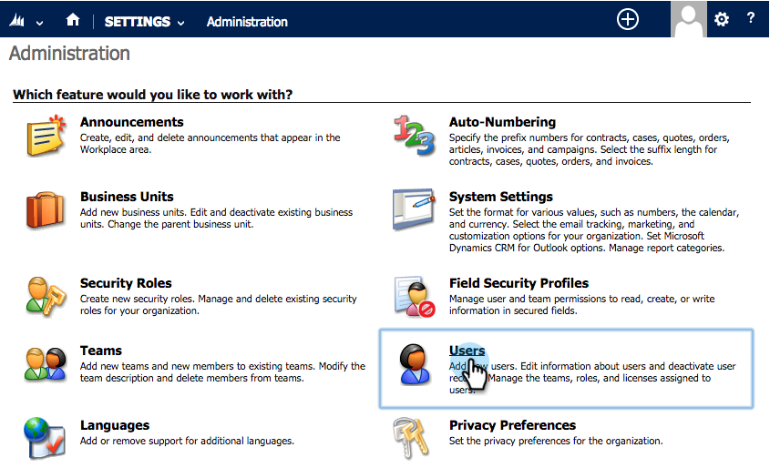
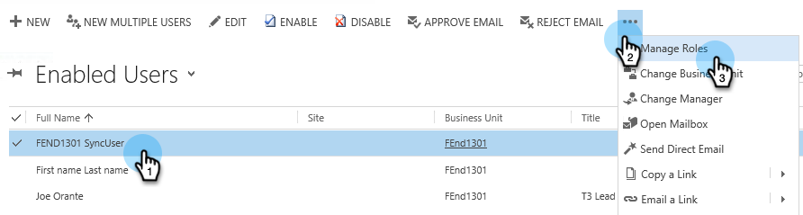
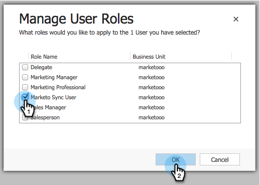
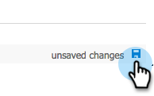

# Step 2 of 3: Configure Sync User for Marketo (2013 On-Premises) {#step-of-configure-sync-user-for-marketo-on-premises}

Great job completing the previous steps, let's keep moving through this.

>[!NOTE]
>
>**Prerequisites**
>
>* [Step 1 of 3: Install the Marketo Solution in Dynamics (2013 On-Premises)](step-1-of-3-install-the-marketo-solution-in-dynamics-2013-on-premises.md)
>

## Assign Sync User Role {#assign-sync-user-role}

Assign the Marketo Sync User role only to the Marketo sync user. You don't need to assign it to any other users.

>[!NOTE]
>
>This applies to Marketo plugin version 4.0.0.14 and later. For earlier versions, all users must have the sync user role. To upgrade Marketo, see [Upgrade the Marketo Solution for Microsoft Dynamics](../../../../../product-docs/crm-sync/microsoft-dynamics-sync/sync-setup/download-the-marketo-lead-management-solution/upgrade-the-marketo-solution-for-microsoft-dynamics.md).

1. Under **SETTINGS**, click **ADMINISTRATION**.

   

1. Select **Users**.

   

1. You will see a list of users here. Select your dedicated Marketo Sync user or contact your [Active Directory Federation Services (AFDS)](https://msdn.microsoft.com/en-us/library/bb897402.aspx) [administrator to create a new user that's dedicated to Marketo.](http://blogs.technet.com/b/askpfeplat/archive/2014/04/21/introduction-to-active-directory-federation-services-ad-fs-alternateloginid-feature.aspx)

   

1. Select the sync user. Click and select **Manage Roles**

   

1. Check **Marketo Sync User** and click **OK**.

   

   >[!TIP]
   >
   >If you don't see the role, go back to [step 1 of 3](step-1-of-3-install-the-marketo-solution-in-dynamics-2013-on-premises.md) and import the solution.

   >[!NOTE]
   >
   >Any updates made in your CRM by the Sync User will **not** be synced back to Marketo.

## Configure Marketo Solution {#configure-marketo-solution}

Almost done! We just have a few last pieces of configuration before moving onto the next article.

1. Under **Settings**, click **Marketo Config**.

   

   >[!NOTE]
   >
   >If **Marketo Config** is missing, try refreshing the page. If the issue persists, [publish the Marketo solution](https://docs.marketo.com/pages/viewpage.action?pageId=3571813#Step1of3:InstalltheMarketoSolutioninDynamics(2013On-Premises)-PublishAllCustomizations) again or try logging out and back in.

1. Click **Default**.

   

1. Click the **Marketo User** field and select the sync user.

   

1. Click in the bottom right corner to save the changes.

   

1. Click **Publish All Customizations**.

   

## Before Proceeding to Step 3 {#before-proceeding-to-step}

* If you want to restrict the number of records you sync, [set up a custom sync filter](../../../../../product-docs/crm-sync/microsoft-dynamics-sync/create-a-custom-dynamics-sync-filter.md) now.
* Run the [Validate Microsoft Dynamics Sync](../../../../../product-docs/crm-sync/microsoft-dynamics-sync/sync-setup/validate-microsoft-dynamics-sync.md) process. It verifies that your initial setups were done correctly.
* Log into the Marketo Sync User in Microsoft Dynamics CRM.

Great job!

>[!NOTE]
>
>**Related Articles**
>
>* [Step 3 of 3: Connect Marketo and Dynamics (2013 On-Premises)](step-3-of-3-connect-marketo-and-dynamics-2013-on-premises.md)
>

