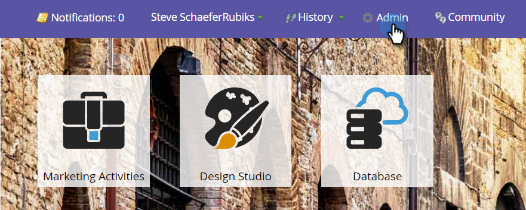
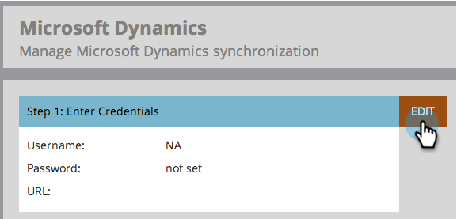
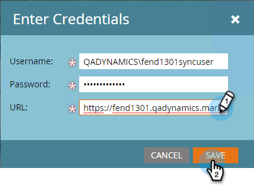
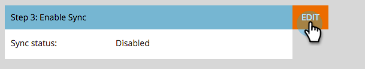

# Step 3 of 3: Connect Marketo and Dynamics (2013 On-Premises) {#step-of-connect-marketo-and-dynamics-on-premises}

>[!NOTE]
>
>**FYI**
>
>Marketo is now standardizing language across all subscriptions, so you may see lead/leads in your subscription and person/people in docs.marketo.com. These terms mean the same thing; it does not affect article instructions. There are some other changes, too. [Learn more](http://docs.marketo.com/display/DOCS/Updates+to+Marketo+Terminology).

Alright! We installed the solution and configured the sync user. Next, we need to connect Marketo and Dynamics.

>[!NOTE]
>
>**Prerequisites**
>
>* [Step 1 of 3: Install the Marketo Solution in Dynamics (2013 On-Premises)](step-1-of-3-install-the-marketo-solution-in-dynamics-2013-on-premises.md)
>* [Step 2 of 3: Configure Sync User for Marketo (2013 On-Premises)](step-2-of-3-configure-sync-user-for-marketo-2013-on-premises.md)
>

>[!NOTE]
>
>**Admin Permissions Required**

## Enter Dynamics Sync User Information {#enter-dynamics-sync-user-information}

1. Log into Marketo and click **Admin**.

   

1. Click on **CRM**.

   

1. Select **Microsoft**.

   

1. Click **EDIT** in **Step 1: Enter Credentials**.

   

   >[!CAUTION]
   >
   >Please make sure your credentials are correct as we are unable to revert the subsequent schema changes after submission. If incorrect credentials are saved, you’ll have to obtain a new Marketo subscription.

1. Enter the **Username**, **Password** and Microsoft Dynamics **URL** then click **SAVE**.

   

   >[!NOTE]
   >
   >The Username in Marketo must match the User Name for the sync user in CRM. The format can be [`[email protected]`](http://docs.marketo.com/cdn-cgi/l/email-protection#631610061123070c0e020a0d4d000c0e) or DOMAIN\user.

   >[!TIP]
   >
   >Don't know the URL? We'll show you how to find the [Dynamics Organization Service URL](../../../../../product-docs/crm-sync/microsoft-dynamics-sync/sync-setup/view-the-organization-service-url.md) here.

## Select Fields to Sync {#select-fields-to-sync}

Now we need to select the fields we want to sync over.

1. Click **EDIT **in **Step 2: Select Fields to Sync**.

   

1. Select the fields that you want to sync to Marketo, so they will be pre-selected. Click **Save**.

   

## Sync Fields for a Custom Filter {#sync-fields-for-a-custom-filter}

If you've created a custom filter, be sure to go in and select the new fields to be synced with Marketo.

1. Go to Admin and select **Microsoft Dynamics**.

   

1. Click **Edit** on Field Sync Details.

   

1. Scroll down to the field and check it. The actual name must be new_synctomkto but the Display Name can be anything. Click **Save**.

   

## Enable Sync {#enable-sync}

1. Click **EDIT **in **Step 3: Enable Sync**.

   

   >[!CAUTION]
   >
   >Marketo will not automatically de-dupe against a Microsoft Dynamics sync, or when you manually enter people or leads.

1. Read everything in the pop-up, enter your email, and click **START SYNC**.

   

1. The first sync may take a few hours. After it's done, you'll receive an email notification.

   

Excellent work! You have just unleashed the power of the bi-directional sync between Marketo and Microsoft Dynamics. If you have purchased Marketo Sales Insight, there is more fun to be had:

>[!NOTE]
>
>**Related Articles**
>
>* [Install and Configure Marketo Sales Insight in Microsoft Dynamics 2013](../../../../../product-docs/marketo-sales-insight/msi-for-microsoft-dynamics/installing/install-and-configure-marketo-sales-insight-in-microsoft-dynamics-2013.md)
>

