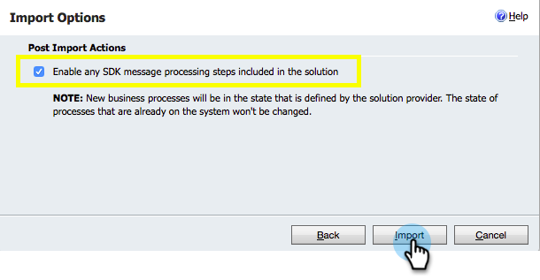

# Step 1 of 3: Install the Marketo Solution - 2015 On-Premises / 2016 Dynamics 365 On-Premises {#step-of-install-the-marketo-solution-on-premises-dynamics-on-premises}

Before you can sync Microsoft Dynamics 2015 On-Premises or 2016 (Dynamics 365) with Marketo, you need to first install the Marketo solution in Dynamics.

>[!NOTE]
>
>After you sync Marketo to a CRM, you cannot sync a new CRM to the existing Marketo instance.

>[!NOTE]
>
>**Prerequisites**
>
>If you're using Microsoft Dynamics On-Premise, you must have [Internet Facing Deployment](http://www.microsoft.com/en-us/download/confirmation.aspx?id=41701) (IFD) with [Active Directory Federation Services](https://msdn.microsoft.com/en-us/library/bb897402.aspx) 2.0+ (ADFS) configured. Note: The IFD document downloads automatically when you click the link.
>
>[Download the Marketo Lead Management Solution](../../../../../product-docs/crm-sync/microsoft-dynamics-sync/sync-setup/download-the-marketo-lead-management-solution.md) before you start.

>[!NOTE]
>
>**Dynamics Admin Permissions required.**
>
>You need CRM administrator privileges to perform this sync.

1. Login to **Dynamics. **Click the** Microsoft Dynamics CRM **drop-down menu and select ** Settings**.

   

1. Under **Settings,** select **Solutions**.

   

1. Click **Import**.

   

1. Click **Browse **and select the solution you [downloaded](../../../../../product-docs/crm-sync/microsoft-dynamics-sync/sync-setup/download-the-marketo-lead-management-solution.md). Click **Next**.

   

1. View the Solution Information and click** View solution package details**.

   

1. When you're done checking all the details, click **Close**.

   

1. Back on the Solution Information page, click **Next**.

   

1. Make sure the SDK option checkbox is selected. Click **Import**.

   

1. Wait for the import to finish.

   >[!TIP]
   >
   >You will need to enable pop-ups on your browser to complete the installation process.

   

1. Download a log file (if you want) and click **Close**.

   >[!NOTE]
   >
   >You may see a message saying "Marketo Lead Management completed with warning". This is fully expected.

   

1. Marketo Lead Management will now appear on the **All Solutions** page.

   

1. Select the Marketo solution and click **Publish All Customizations**.

   

   High five! The installation is finished.

   >[!CAUTION]
   >
   >Disabling any of the Marketo SDK Messaging Processes will result in a broken install!

   >[!NOTE]
   >
   >**Related Articles**
   >
   >
   >[Step 2 of 3: Set Up Marketo Sync User in Dynamics 2015 On-Premises / 2016 Dynamics 365 On-Premises](step-2-of-3-set-up-marketo-sync-user-in-dynamics-2015-on-premises-2016-dynamics-365-on-premises.md)

