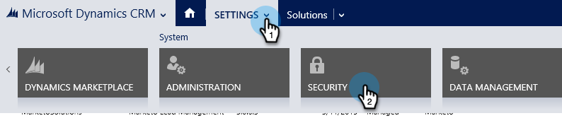
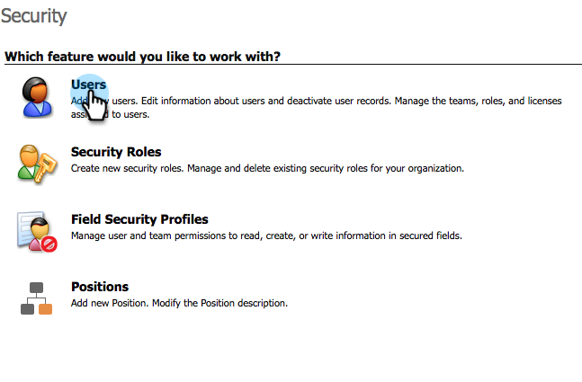
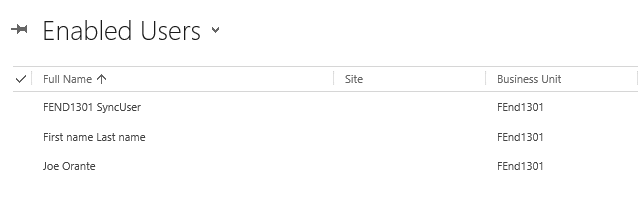
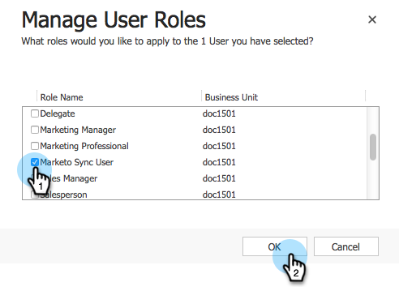
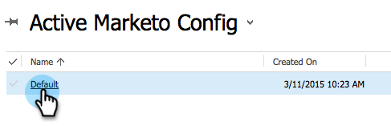

# Step 2 of 3 Set up Marketo for Dynamics (2015 On-Prem and 2016 365 On-Prem){#step-of-set-up-for-marketo-on-premises-and-365}

Great job completing the previous steps. Let's keep moving through this.

>[!PREREQUISITES]
>
>[Install Marketo for Dynamics 2015 On-Prem and 2016 365 On-Prem Step 1 of 3](/help/marketo/product-docs/crm-sync/microsoft-dynamics-sync/sync-setup/microsoft-dynamics-2015-on-premises-2016-dynamics-365-on-premises/step-1-of-3-install.md)

## Assign Sync User Role {#assign-sync-user-role}

Assign the Marketo Sync User role only to the Marketo sync user. You don't need to assign it to any other users.

>[!NOTE]
>
>This applies to Marketo version 4.0.0.14 and later. For earlier versions, all users must have the sync user role. To upgrade your Marketo, see [Upgrade the Marketo Solution for Microsoft Dynamics](/help/marketo/product-docs/crm-sync/microsoft-dynamics-sync/sync-setup/update-the-marketo-solution-for-microsoft-dynamics.md).

1. Under **Settings**, click **Security**.

   

1. Click **Users**.

   

1. You will see a list of users here. Select the dedicated Marketo Sync user or contact your [Active Directory Federation Services](https://msdn.microsoft.com/en-us/library/bb897402.aspx)(ADFS) administrator to create a dedicated user for Marketo.

   

1. Select the sync user. Click **Manage Roles**.

   

   Check Marketo Sync User and click OK.

   

   >[!TIP]
   >
   >If you don't see the role, go back to [step 1 of 3](/help/marketo/product-docs/crm-sync/microsoft-dynamics-sync/sync-setup/microsoft-dynamics-2015-on-premises-2016-dynamics-365-on-premises/step-1-of-3-install.md) and import the solution.

   >[!NOTE]
   >
   >Any updates made in your CRM by the Sync User will **not** be synced back to Marketo.

## Configure Marketo Solution {#configure-marketo-solution}

Almost done! We just have a few last pieces of configuration before moving onto the next article.

1. Under **Settings**, click **Marketo Config**.

   

   >[!NOTE]
   >
   >If Marketo Config is missing, try refreshing the page. If the issue persists, [publish the Marketo Solution](/help/marketo/product-docs/crm-sync/microsoft-dynamics-sync/sync-setup/microsoft-dynamics-2015-on-premises-2016-dynamics-365-on-premises/step-1-of-3-install.md) or try logging out and back in.

1. Click **Default**.

   

1. Click the **Marketo User** field and select the sync user.

   

1. Click the save icon in the bottom right corner.

   

1. Click **Publish All Customizations**.

   

## Before Proceeding to Step 3 {#before-proceeding-to-step}

* If you want to restrict the number of records you sync, [set up a custom sync filter](/help/marketo/product-docs/crm-sync/microsoft-dynamics-sync/create-a-custom-dynamics-sync-filter.md) now.
* Run the [Validate Microsoft Dynamics Sync](/help/marketo/product-docs/crm-sync/microsoft-dynamics-sync/sync-setup/validate-microsoft-dynamics-sync.md) process. It verifies that your initial setups were done correctly.
* Log in to the Marketo Sync User in Microsoft Dynamics CRM.

>[!MORELIKETHIS]
>
>[Install Marketo for Dynamics 2015 On-Prem and 2016 365 On-Prem Step 3 of 3](/help/marketo/product-docs/crm-sync/microsoft-dynamics-sync/sync-setup/microsoft-dynamics-2015-on-premises-2016-dynamics-365-on-premises/step-3-of-3-connect.md)
