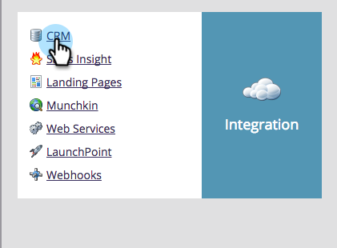
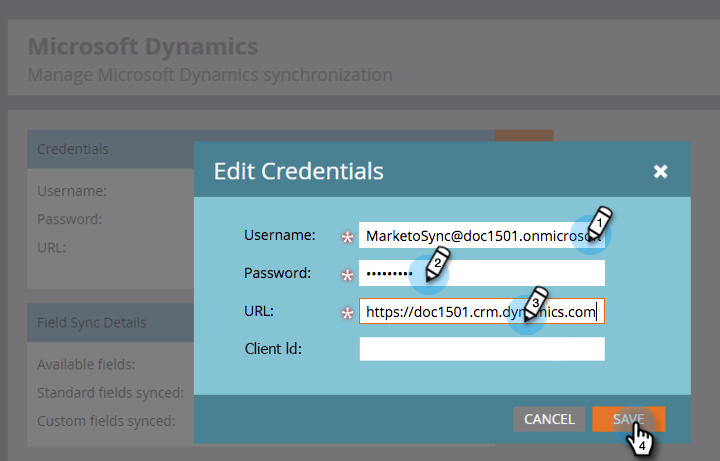

# Install Marketo for Dynamics 2015 On-Prem and 2016 365 On-Prem Step 3 of 3 {#install-marketo-for-dynamics-on-prem-and-on-prem-step-of}

>[!PREREQUISITES]
>
>* [Install Marketo for Dynamics 2015 On-Prem and 2016 365 On-Prem Step 1 of 3](step-1-of-3-install.md)
>* [Install Marketo for Dynamics 2015 On-Prem and 2016 365 On-Prem Step 2 of 3](step-2-of-3-set-up.md)
>

>[!NOTE]
>
>**Admin Permissions Required**

## Enter Dynamics Sync User information {#enter-dynamics-sync-user-information}

1. Log into Marketo and click **Admin**.

   

1. Click **CRM**.

   

1. Select **Microsoft**.

   

1. Click **Edit** in **Step 1: Enter Credentials**.

   

   >[!CAUTION]
   >
   >Please make sure your credentials are correct as we are unable to revert the subsequent schema changes after submission. If incorrect credentials are saved, you’ll have to obtain a new Marketo subscription.

1. Enter the **Username**, **Password** a Microsoft Dynamics **URL**, and an optional **Client Id**. Click **Save** when done.

   

   >[!NOTE]
   >
   >The Username in Marketo must match the User Name for the sync user in CRM. The format can be [`[email protected]`](http://docs.marketo.com/cdn-cgi/l/email-protection#8cf9ffe9fecce8e3e1ede5e2a2efe3e1) or DOMAIN\user.

   >[!TIP]
   >
   >Don't know the URL? We will show you how to find your [Dynamics Organization Service URL](../../../../../product-docs/crm-sync/microsoft-dynamics-sync/sync-setup/view-the-organization-service-url.md) here.

## Select Fields to Sync {#select-fields-to-sync}

1. Click **Edit** in **Step 2: Select Fields to Sync**.

   

1. Select the fields that you want to sync to Marketo, so they will be pre-selected. Click **Save**.

   

## Sync Fields for a Custom Filter {#sync-fields-for-a-custom-filter}

If you've created a custom filter, be sure to go in and select the new fields to be synced with Marketo.

1. Go to Admin and select **Microsoft Dynamics**.

   

1. Click **Edit** on Field Sync Details.

   

1. Scroll down to the field and check it. The actual name must be new_synctomkto but the Display Name can be anything. Click **Save**.

   

## Enable Sync {#enable-sync}

1. Click **Edit** in **Step 3: Enable Sync**.

   

   >[!CAUTION]
   >
   >Marketo will not automatically de-dupe against a Microsoft Dynamics sync, or when you manually enter people.

1. Read everything in the pop-up, enter your email, and click **Start Sync**.

   

1. The first sync may take a few hours. After it's done, you'll receive an email notification.

   

Excellent work!
