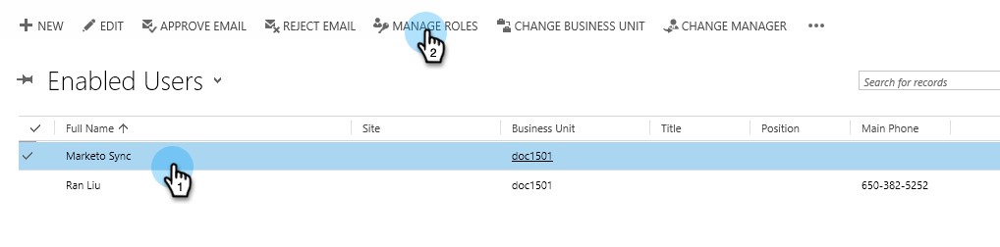
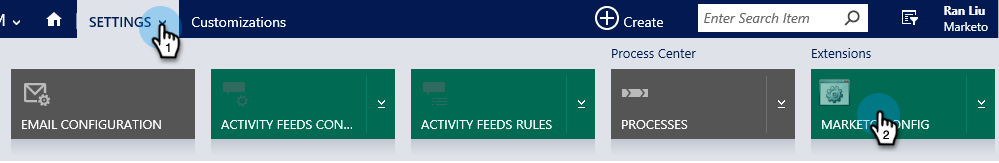
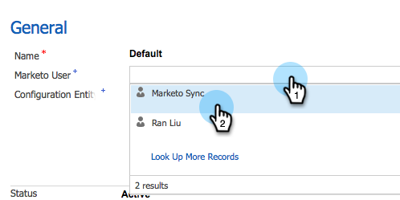

# Step 2 of 3: Set Up Marketo Sync User in Dynamics 2015 On-Premises / 2016 Dynamics 365 On-Premises {#step-of-set-up-marketo-sync-user-in-dynamics-on-premises-dynamics-on-premises}

Step 2 of 3: Set Up Marketo Sync User in Dynamics 2015 On-Premises / 2016 Dynamics 365 On-Premises - Marketo Docs - Product Documentation

Great job completing the previous steps. Let's keep moving through this.

>[!NOTE]
>
>**Prerequisites**
>
>* [Step 1 of 3: Install the Marketo Solution - 2015 On-Premises / 2016 Dynamics 365 On-Premises](step-1-of-3-install-the-marketo-solution-2015-on-premises-2016-dynamics-365-on-premises.md)
>

### What's in this article? {#whats-in-this-article}

[Assign Sync User Role](#assign-sync-user-role)  
[Configure Marketo Solution](#configure-marketo-solution)  
[Before Proceeding to Step 3](#before-proceeding-to-step)

#### Assign Sync User Role {#assign-sync-user-role}

Assign the Marketo Sync User role only to the Marketo sync user. You don't need to assign it to any other users.

>[!NOTE]
>
>This applies to Marketo version 4.0.0.14 and later. For earlier versions, all users must have the sync user role. To upgrade your Marketo, see [Upgrade the Marketo Solution for Microsoft Dynamics](../../../../../../product-docs/crm-sync/microsoft-dynamics-sync/sync-setup/download-the-marketo-lead-management-solution/upgrade-the-marketo-solution-for-microsoft-dynamics.md).

1. Under **Settings**, click **Security**.

   

1. Click **Users**.

   

1. You will see a list of users here. Select the dedicated Marketo Sync user or contact your [Active Directory Federation Services](https://msdn.microsoft.com/en-us/library/bb897402.aspx)(ADFS) administrator to create a dedicated user for Marketo.

   

1. Select the sync user. Click **Manage Roles**.

   

   ##### Check Marketo Sync User and click OK. {#check-marketo-sync-user-and-click-ok}

   

   >[!TIP]
   >
   >If you don't see the role, go back to [step 1 of 3](#) and import the solution.

   >[!NOTE]
   >
   >Any updates made in your CRM by the Sync User will **not** be synced back to Marketo.

#### Configure Marketo Solution {#configure-marketo-solution}

Almost done! We just have a few last pieces of configuration before moving onto the next article.

1. Under **Settings**, click **Marketo Config**.

   

   >[!NOTE]
   >
   >If Marketo Config is missing, try refreshing the page. If the issue persists, [publish the Marketo Solution](#) [again](https://docs.marketo.com/pages/viewpage.action?pageId=3571822#publish-customizations) or try logging out and back in.

1. Click **Default**.

   

1. Click the **Marketo User **field and select the sync user.

   

1. Click the save icon in the bottom right corner.

   

1. Click **Publish All Customizations**.

   

   #### Before Proceeding to Step 3 {#before-proceeding-to-step}

    * If you want to restrict the number of records you sync, [set up a custom sync filter](../../../../../../product-docs/crm-sync/microsoft-dynamics-sync/create-a-custom-dynamics-sync-filter.md) now.
    * Run the [Validate Microsoft Dynamics Sync](../../../../../../product-docs/crm-sync/microsoft-dynamics-sync/sync-setup/validate-microsoft-dynamics-sync.md) process. It verifies that your initial setups were done correctly.
    * Log into the Marketo Sync User in Microsoft Dynamics CRM.

   >[!NOTE]
   >
   >**Related Articles**
   >
   >
   >[Step 3 of 3: Connect Marketo and Dynamics 2015 On-Premises / 2016 Dynamics 365 On-Premises](step-3-of-3-connect-marketo-and-dynamics-2015-on-premises-2016-dynamics-365-on-premises.md)

