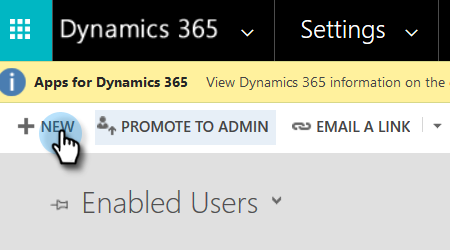
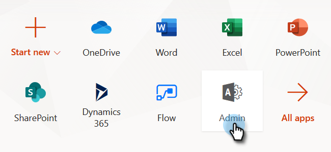

# Step 2 of 3 Set up Marketo for Dynamics (2016 On-Prem/Dynamics 365 On-Premises){#step-of-set-up-for-marketo-on-premises-2016}

Great job completing the previous steps. Let's keep moving through this.

>[!PREREQUISITES]
>
>[Install Marketo for Microsoft Dynamics 2016/Dynamics 365 On-Premises Step 1 of 3](/help/marketo/product-docs/crm-sync/microsoft-dynamics-sync/sync-setup/microsoft-dynamics-2016-dynamics-365-on-premises/step-1-of-3-install.md)

## Create a New User {#create-a-new-user}

1. Log-in to Dynamics. Click the Settings icon and select Advanced Settings.

   

1. Click **Settings** and select **Security**.

   

1. Click **Users**.

   

1. Click **New**.

   

1. Click **Add and License Users**. A new tab should open.

   

1. Click **Admin** at the top of the page. Another new tab should open.

   

1. Click **Add a user**.

   

1. Enter all of your information. When you’re done, click **Add**.

   

   >[!NOTE]
   >
   >This name must be a dedicated sync user and not an existing CRM user’s account. It does not need to be an actual email address.

1. Enter the email to receive the new user credentials and click Send email and close.

   

## Create a New Client Application {#create-a-new-client-application}

Follow the steps in [this Microsoft article](https://docs.microsoft.com/en-us/windows-server/identity/ad-fs/development/enabling-oauth-confidential-clients-with-ad-fs#create-an-application-group-in-ad-fs-2016-or-later) to create a new Client Application and grant permissions. Please make note of the Client ID/Secret of the Dynamics client application.

## Assign Sync User Role {#assign-sync-user-role}

Assign the Marketo Sync User role only to the Marketo sync user. You don't need to assign it to any other users.

>[!NOTE]
>
>This applies to Marketo version 4.0.0.14 and later. For earlier versions, all users must have the sync user role. To upgrade your Marketo, see [Upgrade the Marketo Solution for Microsoft Dynamics](/help/marketo/product-docs/crm-sync/microsoft-dynamics-sync/sync-setup/update-the-marketo-solution-for-microsoft-dynamics.md).

>[!IMPORTANT]
>
>The language setting of the Sync User [should be set to English](https://portal.dynamics365support.com/knowledgebase/article/KA-01201/en-us).

1. Under **Settings**, click **Security**.

   

1. Click **Users**.

   

1. You will see a list of users here. Select the dedicated Marketo Sync user or contact your [Active Directory Federation Services](https://msdn.microsoft.com/en-us/library/bb897402.aspx)(ADFS) administrator to create a dedicated user for Marketo.

   

1. Select the sync user. Click **Manage Roles**.

   

   Check Marketo Sync User and click OK.

   

   >[!TIP]
   >
   >If you don't see the role, go back to [step 1 of 3](/help/marketo/product-docs/crm-sync/microsoft-dynamics-sync/sync-setup/microsoft-dynamics-2016-dynamics-365-on-premises/step-1-of-3-install.md) and import the solution.

   >[!NOTE]
   >
   >Any updates made in your CRM by the Sync User will **not** be synced back to Marketo.

## Configure Marketo Solution {#configure-marketo-solution}

Almost done! We just have a few last pieces of configuration before moving onto the next article.

1. Under **Settings**, click **Marketo Config**.

   

   >[!NOTE]
   >
   >If Marketo Config is missing, try refreshing the page. If the issue persists, [publish the Marketo Solution](/help/marketo/product-docs/crm-sync/microsoft-dynamics-sync/sync-setup/microsoft-dynamics-2016-dynamics-365-on-premises/step-1-of-3-install.md) or try logging out and back in.

1. Click **Default**.

   

1. Click the **Marketo User** field and select the sync user.

   

1. Click the save icon in the bottom right corner.

   

1. Click **Publish All Customizations**.

   

## Before Proceeding to Step 3 {#before-proceeding-to-step}

* If you want to restrict the number of records you sync, [set up a custom sync filter](/help/marketo/product-docs/crm-sync/microsoft-dynamics-sync/create-a-custom-dynamics-sync-filter.md) now.
* Run the [Validate Microsoft Dynamics Sync](/help/marketo/product-docs/crm-sync/microsoft-dynamics-sync/sync-setup/validate-microsoft-dynamics-sync.md) process. It verifies that your initial setups were done correctly.
* Log in to the Marketo Sync User in Microsoft Dynamics CRM.

>[!MORELIKETHIS]
>
>[Install Marketo for Microsoft Dynamics 2016/Dynamics 365 On-Premises Step 3 of 3](/help/marketo/product-docs/crm-sync/microsoft-dynamics-sync/sync-setup/microsoft-dynamics-2016-dynamics-365-on-premises/step-3-of-3-connect.md)
