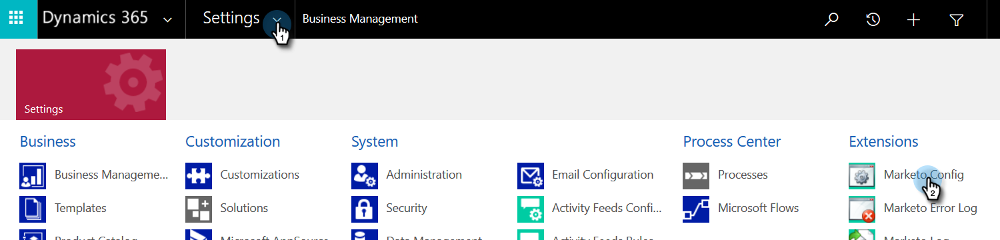

# Step 2 of 4: Set up the Marketo Solution with Resource Owner Password Control Connection {#step-2-of-4-set-up-the-marketo-solution-ropc}

Let's get started by creating a user account.

>[!PREREQUISITES]
>
>[Step 1 of 4: Install the Marketo Solution with Resource Owner Password Control Connection](/help/marketo/product-docs/crm-sync/microsoft-dynamics-sync/sync-setup/microsoft-dynamics-365-with-ropc-connection/step-1-of-4-install.md){target="_blank"}

## Create a new user {#create-a-new-user}

1. Log in to Dynamics. Click the Settings icon and select **[!UICONTROL Advanced Settings]**.

   

1. Click **[!UICONTROL Settings]** and select **[!UICONTROL Security]**.

   

1. Click **[!UICONTROL Users]**.

   

1. Click **[!UICONTROL New]**.

   

1. Click **[!UICONTROL Add and License Users]** in the new window.

   

1. A new tab opens. Click **[!UICONTROL Admin]** at the top of the page.

   

1. Another new tab opens. Click **[!UICONTROL Add a user]**.

   

   >[!IMPORTANT]
   >
   >The Sync User should have read permission to the Marketo Config.

1. Enter all of your information. When you're done, click **[!UICONTROL Add]**.

   

   >[!NOTE]
   >
   >This name must be a dedicated sync user and not an existing CRM user's account. It does not need to be an actual email address.

1. Enter the email to receive the new user credentials and click **[!UICONTROL Send email and close]**.

   

## Assign Sync User Role {#assign-sync-user-role}

Assign the Marketo Sync User role only to the Marketo sync user. You don't need to assign it to any other users.

>[!NOTE]
>
>This applies to Marketo version 4.0.0.14 and later. For earlier versions, all users must have the sync user role. To upgrade Marketo, see [Upgrade Marketo Solution for Microsoft Dynamics](/help/marketo/product-docs/crm-sync/microsoft-dynamics-sync/sync-setup/update-the-marketo-solution-for-microsoft-dynamics.md){target="_blank"}.

>[!IMPORTANT]
>
>The language setting of the Sync User [should be set to English](https://portal.dynamics365support.com/knowledgebase/article/KA-01201/en-us){target="_blank"}.

1. Go back to the **[!UICONTROL Enabled Users]** tab and refresh the users list.

   

1. Hover next to the newly created Marketo Sync user, and a checkbox will appear. Click to select it.

   

1. Click **[!UICONTROL Manage Roles]**.

   

1. Check **[!UICONTROL Marketo Sync User]** and click **[!UICONTROL OK]**.

   

   >[!NOTE]
   >
   >Any updates made in your CRM by the Sync User will _not_ be synced back to Marketo.

## Configure Marketo Solution {#configure-marketo-solution}

Almost there! All we have left is to inform Marketo Solution about the new user created.

1. Go back to the Advanced Settings section and click the  icon next to Settings, and select **[!UICONTROL Marketo Config]**.

   

   >[!NOTE]
   >
   >If you don't see **[!UICONTROL Marketo Config]** in the Settings menu, refresh the page. If that doesn't work, try to [publish the Marketo Solution](/help/marketo/product-docs/crm-sync/microsoft-dynamics-sync/sync-setup/microsoft-dynamics-365-with-ropc-connection/step-1-of-4-install.md){target="_blank"} again or log out and back in.

1. Click **[!UICONTROL Default]**.

   

1. Click the search button on the **[!UICONTROL Marketo User]** field and select the sync user you created.

   

1. Click the  icon in the bottom-right corner to save the changes.

   

1. Click the **X** in the upper-right to close the screen.

   

1. Click the  icon next to Settings, and select **[!UICONTROL Solutions]**.

   

1. Click the **[!UICONTROL Publish All Customizations]** button.

   

>[!MORELIKETHIS]
>
>[Step 3 of 4: Connect the Marketo Solution with Resource Owner Password Control Connection](/help/marketo/product-docs/crm-sync/microsoft-dynamics-sync/sync-setup/microsoft-dynamics-365-with-ropc-connection/step-3-of-4-set-up.md){target="_blank"}
