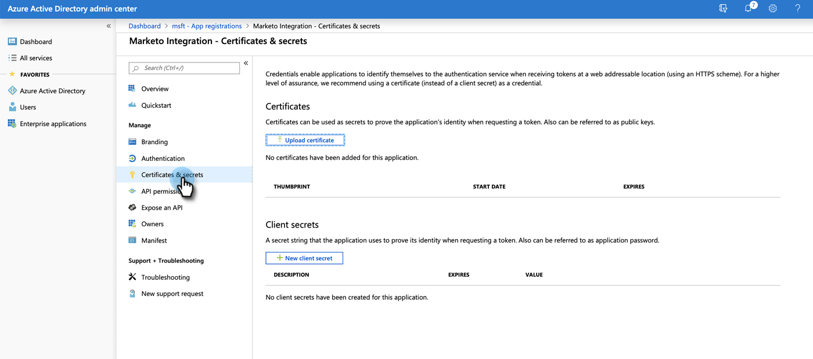

# Step 3 of 4: Set up Client App on MS [!DNL Dynamics] {#step-3-of-4-set-up-client-app-ms-dynamics-ropc}

>[!PREREQUISITES]
>
>* [Step 1 of 4: Install the Marketo Solution with Resource Owner Password Control Connection](/help/marketo/product-docs/crm-sync/microsoft-dynamics-sync/sync-setup/microsoft-dynamics-365-with-ropc-connection/step-1-of-4-install.md)
>* [Step 2 of 4: Set up the Marketo Solution with Resource Owner Password Control Connection](/help/marketo/product-docs/crm-sync/microsoft-dynamics-sync/sync-setup/microsoft-dynamics-365-with-ropc-connection/step-2-of-4-set-up.md)

1. Navigate to https://docs.microsoft.com/en-us/powerapps/developer/common-data-service/walkthrough-register-app-azure-active-directory#create-an-application-registration.

1. Follow all the steps. For Step 3, enter a relevant application name (e.g., "[!DNL Marketo Integration]"). Under the Supported Account Types, select Account in this organizational directory only.

1. Write down the Application ID (ClientId). You'll need to enter it in Marketo later.

1. Grant Admin consent by following the steps in [this article](/help/marketo/product-docs/crm-sync/microsoft-dynamics-sync/sync-setup/grant-consent-for-client-id-and-app-registration.md).

1. Generate a Client Secret in the Admin Center by clicking **[!UICONTROL Certificates & secrets]**.

   

1. Click **[!UICONTROL New client secret]**.

   

1. Add a Client Secret description and click **[!UICONTROL Add]**.

   

   >[!CAUTION]
   >
   >Make sure to make note of the Client Secret value (seen in the screenshot below), as you'll need it later. It is only shown once, and you won't be able to retrieve it again.

   

## [!DNL Azure AD] Federated with [!DNL AD FS On-prem] {#azure-ad-federated-with-ad-fs-on-prem}

Federated [!DNL Azure] AD to [!DNL ADFS Onprem] needs the creation of a Home Realm Discovery policy for the specific application. With this policy, [!DNL Azure] AD will redirect the authentication request to the federation service. Password hash synchronization has to be enabled in [!DNL AD Connect] for this. For more information, please see [[!DNL OAuth] with [!DNL ROPC]](https://docs.microsoft.com/en-us/azure/active-directory/develop/v2-oauth-ropc) and [Set an hrd policy for an application](https://docs.microsoft.com/en-us/azure/active-directory/manage-apps/configure-authentication-for-federated-users-portal#example-set-an-hrd-policy-for-an-application).

Additional references [can be found here](https://docs.microsoft.com/en-us/azure/active-directory/reports-monitoring/concept-all-sign-ins#:~:text=Interactive%20user%20sign%2Dins%20are,as%20the%20Microsoft%20Authenticator%20app.&text=This%20report%20also%20includes%20federated,are%20federated%20to%20Azure%20AD.).

## Before Proceeding to Step 4 {#before-proceeding-to-step-4}

* If you want to restrict the number of records you sync, [set up a custom sync filter](/help/marketo/product-docs/crm-sync/microsoft-dynamics-sync/create-a-custom-dynamics-sync-filter.md) now.
* Run the [Validate [!DNL Microsoft Dynamics] Sync](/help/marketo/product-docs/crm-sync/microsoft-dynamics-sync/sync-setup/validate-microsoft-dynamics-sync.md) process. It verifies that your initial setups were done correctly.
* Log in to the Marketo Sync User in [!DNL Microsoft Dynamics] CRM.

>[!MORELIKETHIS]
>
>* [Step 4 of 4: Connect the Marketo Solution with Resource Owner Password Control Connection](/help/marketo/product-docs/crm-sync/microsoft-dynamics-sync/sync-setup/microsoft-dynamics-365-with-ropc-connection/step-4-of-4-connect.md)
