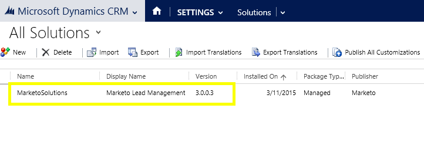

# Step 1 of 3: Install the Marketo Solution with Server to Server Connection {#step-1-of-3-install-the-marketo-solution-s2s}

Before you can sync [!DNL Microsoft Dynamics 365] and Marketo, you need to first install the Marketo solution in [!DNL Dynamics]. **[!DNL Dynamics] Admin Permissions are required.**

>[!CAUTION]
>
>* Do not enable custom entity sync before the initial sync is completed. You will be notified via email once the initial sync is completed.

>[!NOTE]
>
>After you sync Marketo to a CRM, you cannot perform a new sync without replacing the instance.

>[!PREREQUISITES]
>
>[Download the Marketo Lead Management Solution](/help/marketo/product-docs/crm-sync/microsoft-dynamics-sync/sync-setup/download-the-marketo-lead-management-solution.md)

1. Log in to **[[!DNL Microsoft Office 365]](https://login.microsoftonline.com/)**.

   

1. Click  menu and select **[!UICONTROL CRM]**.

   

1. Click  menu. In the dropdown menu select **[!UICONTROL Settings]** then select **[!UICONTROL Solutions]**.

   

1. Click **[!UICONTROL Import]**.

   

1. Click **[!UICONTROL Choose File]**. Select the Marketo Lead Management solution you [downloaded](/help/marketo/product-docs/crm-sync/microsoft-dynamics-sync/sync-setup/download-the-marketo-lead-management-solution.md). Click **[!UICONTROL Next]**.

   

1. View the Solution Information and click **[!UICONTROL View solution package details]**.

   

1. When you're done checking all the details, click **[!UICONTROL Close]**.

   

1. Now, back on the [!UICONTROL Solution Information] page, click **[!UICONTROL Next]**.

   

1. Make sure the SDK option checkbox is selected. Click **[!UICONTROL Import]**.

   

   >[!TIP]
   >
   >You will need to enable pop-ups on your browser to complete the installation process.

1. Now wait for the import to finish. Get up and do some stretches.

   

1. Click **[!UICONTROL Close]**.

   >[!NOTE]
   >
   >You may see a message saying "Marketo Lead Management completed with warning". This is fully expected.

   

1. [!UICONTROL Marketo Lead Management] will now show up in the list of solutions.

   

1. Select **[!UICONTROL Marketo Lead Management]** and click **[!UICONTROL Publish All Customizations]**.

   

   High five! The installation is finished.

   >[!MORELIKETHIS]
   >
   >[Step 2 of 3: Set up the Marketo Solution with S2S Connection](/help/marketo/product-docs/crm-sync/microsoft-dynamics-sync/sync-setup/microsoft-dynamics-365-with-s2s-connection/step-2-of-3-set-up.md)
