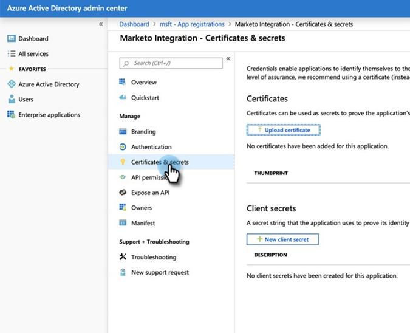
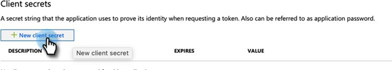
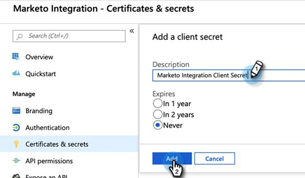
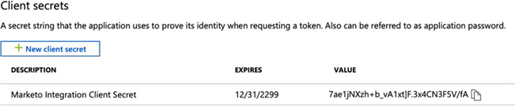
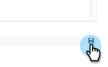

# Step 2 of 3: Set up Marketo Solution with Server to Server Connection {#step-2-of-3-set-up-marketo-sync-user-in-dynamics-s2s}

>[!PREREQUISITES]
>
>[Step 1 of 3: Install the Marketo Solution with Server to Server Connection](/help/marketo/product-docs/crm-sync/microsoft-dynamics-sync/sync-setup/microsoft-dynamics-365-with-s2s-connection/step-1-of-3-install.md)

## Create Client Application in [!DNL Azure AD] {#create-client-application-in-azure-ad}

1. Navigate to [this Microsoft article](https://docs.microsoft.com/en-us/powerapps/developer/common-data-service/walkthrough-register-app-azure-active-directory#create-an-application-registration).

1. Follow all the steps. For Step 3, enter a relevant application name (e.g., "[!DNL Marketo Integration]"). Under the Supported Account Types, select **Account in this Organizational Directory Only**.

1. Write down the Application ID (ClientId) and Tenant ID. You'll need to  enter it in Marketo later.

1. Grant Admin consent by following the steps [in this article](/help/marketo/product-docs/crm-sync/microsoft-dynamics-sync/sync-setup/grant-consent-for-client-id-and-app-registration.md).

1. Generate a Client Secret in the Admin Center by clicking **[!UICONTROL Certificates & secrets]**.

   

1. Click the **[!UICONTROL New client secret]** button.

   

1. Enter a client secret description and click **[!UICONTROL Add]**.

   

>[!CAUTION]
>
>Make sure to make note of the Client Secret value (seen in the screenshot below), as you'll need it later. It is only shown once, and you won't be able to retrieve it again.

   

## Create Application User in Microsoft {#create-application-user-in-microsoft}

1. Follow steps from the following link to [set up an application user in  Microsoft](https://docs.microsoft.com/en-us/powerapps/developer/common-data-service/use-single-tenant-server-server-authentication#application-user-creation).

   >[!IMPORTANT]
   >
   >* While giving permissions to the Application User, be sure to assign it to "Marketo Sync User Role."
   >* Note the email address of the Application User from the [view details option](https://docs.microsoft.com/en-us/power-platform/admin/manage-application-users#view-or-edit-the-details-of-an-application-user) on Power Platform. This email address will be used as the username when setting up the connection to MS [!DNL Dynamics] within Marketo.  

## [!DNL Azure AD] Federated with [!DNL AD FS On-prem] {#azure-ad-federated-with-ad-fs-on-prem}

Federated [!DNL Azure AD] to [!DNL ADFS Onprem] needs the creation of a Home Realm Discovery policy for the specific application. With this policy, [!DNL Azure AD] will redirect the authentication request to the federation service. Password hash synchronization has to be enabled in [!DNL AD Connect] for this. For more information, please see [[!DNL OAuth] with [!DNL ROPC]](https://docs.microsoft.com/en-us/azure/active-directory/develop/v2-oauth-ropc) and [Set an hrd policy for an application](https://docs.microsoft.com/en-us/azure/active-directory/manage-apps/configure-authentication-for-federated-users-portal#example-set-an-hrd-policy-for-an-application).

Additional references [can be found here](https://docs.microsoft.com/en-us/azure/active-directory/reports-monitoring/concept-all-sign-ins#:~:text=Interactive%20user%20sign%2Dins%20are,as%20the%20Microsoft%20Authenticator%20app.&text=This%20report%20also%20includes%20federated,are%20federated%20to%20Azure%20AD.).

## Configure Marketo Solution {#configure-marketo-solution}

Almost there! All we have left is to inform Marketo Solution about the new user created.

1. Go back to the [!UICONTROL Advanced Settings] section and click the  icon next to [!UICONTROL Settings], and select **[!UICONTROL Marketo Config]**.

   

   >[!NOTE]
   >
   >If you don't see **Marketo Config** in the Settings menu, refresh the page. If that doesn't work, try to [publish the Marketo Solution](/help/marketo/product-docs/crm-sync/microsoft-dynamics-sync/sync-setup/microsoft-dynamics-365-with-s2s-connection/step-1-of-3-install.md) again or log out and back in.

1. Click **[!UICONTROL Default]**.

   

1. Click the search button on the **[!UICONTROL Marketo User]** field and select the sync user you created.

   

1. Click the  icon in the bottom-right corner to save the changes.

   

1. Click the **X** in the upper-right to close the screen.

   

1. Click the  icon next to [!UICONTROL Settings], and select **[!UICONTROL Solutions]**.

   

1. Click the **[!UICONTROL Publish All Customizations]** button.

   

   >[!NOTE]
   >
   >If you’re upgrading from Basic Authentication to [!DNL OAuth], you can use [this article](/help/marketo/product-docs/crm-sync/microsoft-dynamics-sync/sync-setup/reconfigure-dynamics-authentication-method.md) to reconfigure your authentication.

## Before Proceeding to Step 3 {#before-proceeding-to-step}

* If you want to restrict the number of records you sync, [set up a custom sync filter](/help/marketo/product-docs/crm-sync/microsoft-dynamics-sync/create-a-custom-dynamics-sync-filter.md) now.
* Run the [Validate [!DNL Microsoft Dynamics] Sync](/help/marketo/product-docs/crm-sync/microsoft-dynamics-sync/sync-setup/validate-microsoft-dynamics-sync.md) process. It verifies that your initial setups were done correctly.
* Log in to the Marketo Sync User in [!DNL Microsoft Dynamics] CRM.

>[!MORELIKETHIS]
>
>* [Step 3 of 3: Connect the Marketo Solution with Server to Server Connection](/help/marketo/product-docs/crm-sync/microsoft-dynamics-sync/sync-setup/microsoft-dynamics-365-with-s2s-connection/step-3-of-3-connect.md)
>* [Reconfigure [!DNL Dynamics] Authentication Method](/help/marketo/product-docs/crm-sync/microsoft-dynamics-sync/sync-setup/reconfigure-dynamics-authentication-method.md)
