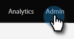
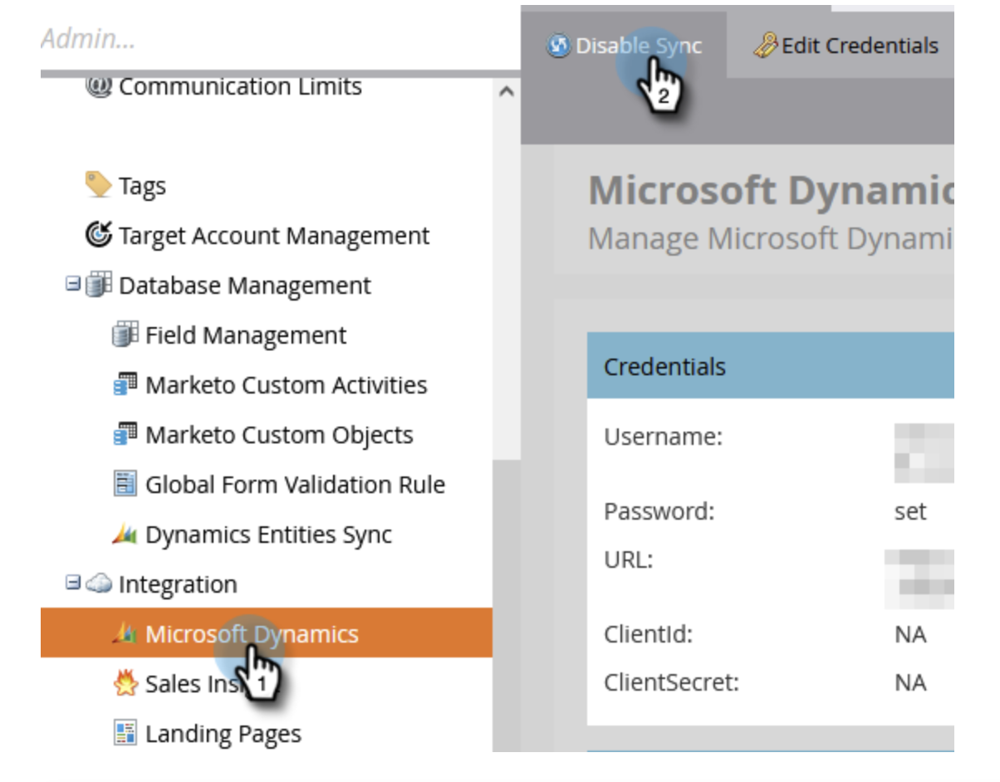
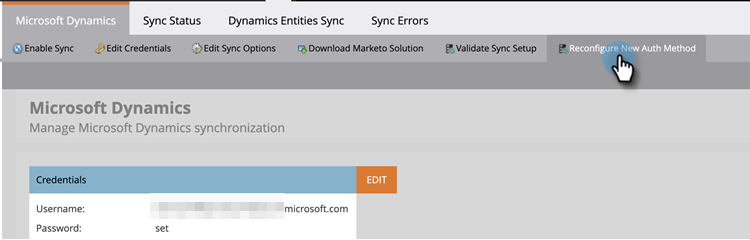
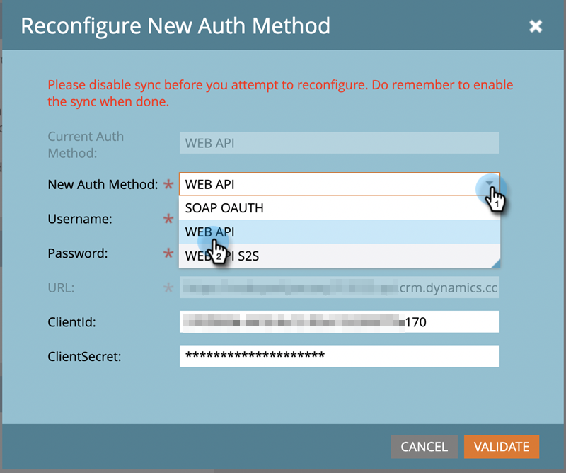
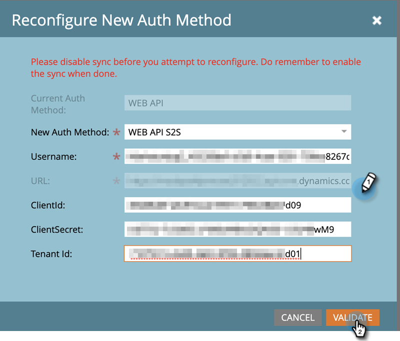
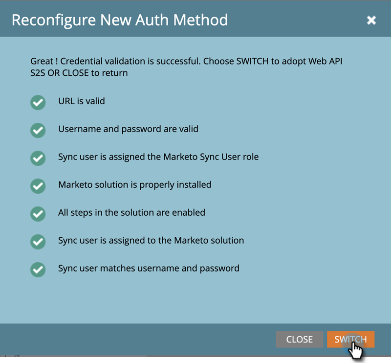
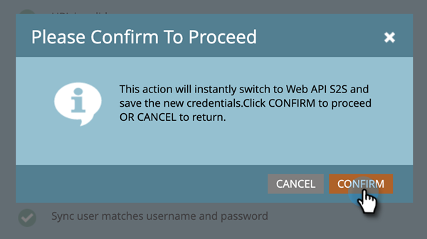
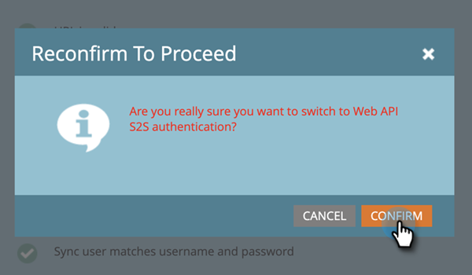

# Reconfigure Dynamics Authentication Method {#reconfigure-dynamics-authentication-method}

Follow the steps below to update your Dynamics Authentication Method.

>[!PREREQUISITES]
>
>Set up the application in Microsoft Dynamics and active directory (Azure AD/ADFS) using the desired authentication method from either of the following articles:
>
>* [Step 2 of 3: Set up Marketo Solution with Server to Server Connection](/help/marketo/product-docs/crm-sync/microsoft-dynamics-sync/sync-setup/microsoft-dynamics-365-with-s2s-connection/step-2-of-3-set-up.md){target="_blank"}
>* [Step 2 of 4: Set up the Marketo Solution with Resource Owner Password Control Connection](/help/marketo/product-docs/crm-sync/microsoft-dynamics-sync/sync-setup/microsoft-dynamics-365-with-ropc-connection/step-2-of-4-set-up.md){target="_blank"}

1. In Marketo Engage, click **[!UICONTROL Admin]**.

   

1. Click **[!DNL Microsoft Dynamics]**, then **[!UICONTROL Disable Sync]**.

   

   >[!NOTE]
   >
   >You must disable the global sync temporarily in order to update the Authentication Method.

1. Click the **[!UICONTROL Reconfigure New Auth Method]** tab.

   

1. Select the desired new Authentication Method (in this example we're choosing Web API).

   

1. Enter the credentials required for the new Authentication Method and click **[!UICONTROL Validate]**.

   

   >[!NOTE]
   >
   >* The specific fields will vary by the chosen authentication method and the form will be automatically updated depending on previous authentication method.
   >* If you've synced before, the data in the above form may be pre-populated. Please re-enter all credentials to ensure the correct values.

1. If everything is fine, the Validate Sync will generate all green checkmarks . Review the message and click **[!UICONTROL Switch]** to update the Authentication Method.

   

   >[!NOTE]
   >
   >If you see a , that step has an issue. See [Fix Dynamics Validation Sync Issues](/help/marketo/product-docs/crm-sync/microsoft-dynamics-sync/sync-setup/validate-microsoft-dynamics-sync/fix-dynamics-validation-sync-issues.md){target="_blank"} to identify and fix the problem(s). Then rerun the sync validation steps until the result looks like the image above.

1. Click **[!UICONTROL Confirm]** to proceed.

   

1. Click **[!UICONTROL Confirm]** again.

   

1. Click **[!UICONTROL OK]**.

   >[!IMPORTANT]
   >
   >The system takes 15 minutes to accept the new authentication mode. Please wait 15 minutes from the time of the switch before re-enabling the sync.
