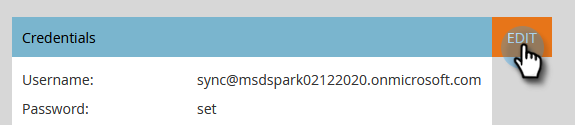
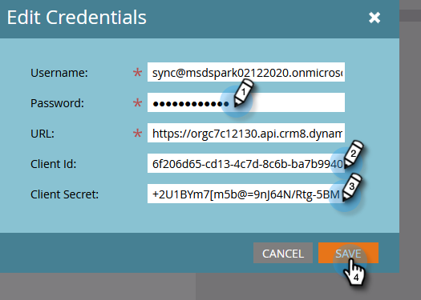
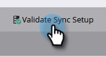
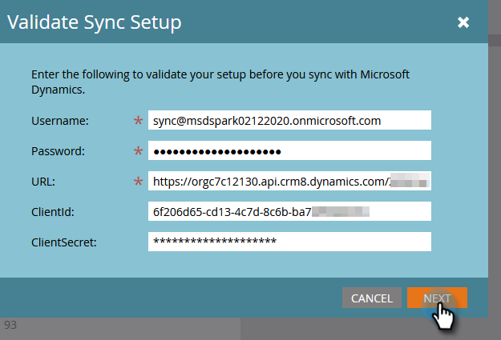

# Set up Microsoft Dynamics CRM App for On-prem {#set-up-microsoft-dynamics-crm-app-for-on-prem}

The Client ID/Client Secret-based setup in Marketo can be done for On-prem with AD FS (ver. 2016 or later). For older versions of On-prem, please reach out to [Marketo Support](https://nation.marketo.com/t5/Support/ct-p/Support) to get the authentication method changed to be based only on User ID and Password.

## Set up Microsoft Dynamics CRM App {#set-up-microsoft-dynamics-crm-app}

Follow the steps in [this Microsoft article](https://docs.microsoft.com/en-us/windows-server/identity/ad-fs/development/enabling-oauth-confidential-clients-with-ad-fs#create-an-application-group-in-ad-fs-2016-or-later).

When you're done, the next step is to **Enter the Dynamics CRM Generated Client Id And Secret into Marketo**.

## Enter the Dynamics CRM Generated Client Id And Secret into Marketo {#enter-the-dynamics-crm-generated-client-id-and-secret-into-marketo}

The following steps are applicable to Online and On-prem versions.

1. In Marketo, click **Admin**.

   

1. Click **Microsoft Dynamics**.

   

1. Click **Disable Sync**.

   

1. Next to credentials, click **Edit**.

   

1. Enter the **Client Id** and **Client Secret** you retrieved previously and press **Save**.

   

1. Click **Validate Sync Setup**.

   

1. Click **Next**.

   

1. You should see all green checkmarks. Click **Close**.

   

   >[!NOTE]
   >
   >If you see a red X among your green checkmarks, see [this article](/help/marketo/product-docs/crm-sync/microsoft-dynamics-sync/sync-setup/validate-microsoft-dynamics-sync/fix-dynamics-validation-sync-issues.md) for fix options.

1. Click **Enable Sync**.

   

And that's it!
