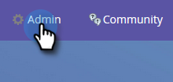
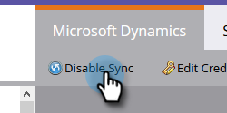
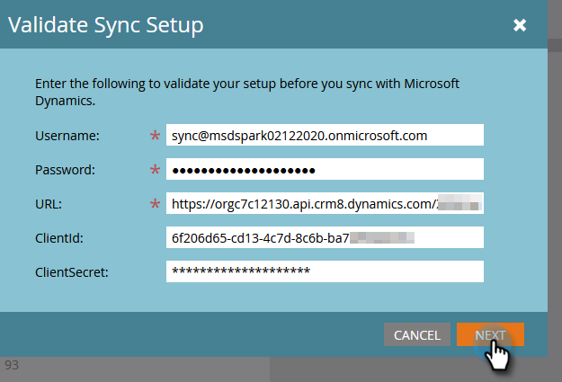
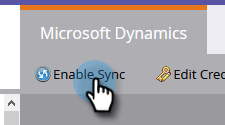

# Set up Microsoft Dynamics CRM App for Online {#set-up-microsoft-dynamics-crm-app-for-online}

## Set up {#set-up}

1. Navigate to https://docs.microsoft.com/en-us/powerapps/developer/common-data-service/walkthrough-register-app-azure-active-directory#create-an-application-registration.

1. Follow all the steps. For Step 3, enter a relevant application name (e.g., "Marketo Integration"). Under the Supported Account Types, select Account in this organizational directory only.

1. Write down the Application ID (ClientId). You'll need to enter it in Marketo later.

1. Grant Admin consent by following the steps in [this article](/help/marketo/product-docs/crm-sync/microsoft-dynamics-sync/sync-setup/set-up-oauth-authentication-for-dynamics/grant-consent-for-client-id-and-app-registration.md).

1. Generate a Client Secret in the Admin Center by clicking **Certificates & secrets**.

   

1. Click **New client secret**.

   

1. Add a Client Secret description and click **Add**.

   

   >[!CAUTION]
   >
   >Make sure to make note of the Client Secret value (seen in the screenshot below), as you'll need it later. It is only shown once, and you won't be able to retrieve it again.

   

Marketo authenticates to Azure AD with OAuth using grant_type Resource Owner Password Credentials( ROPC). This scenario needs the creation of a Home Realm Discovery policy for the specific application. With this policy, Azure AD will redirect the authentication request to the federation service. Password hash synchronization has to be enabled in AD Connect for this. For more information, please see [OAuth with ROPC](https://docs.microsoft.com/en-us/azure/active-directory/develop/v2-oauth-ropc) and [Set an hrd policy for an application](https://docs.microsoft.com/en-us/azure/active-directory/manage-apps/configure-authentication-for-federated-users-portal#example-set-an-hrd-policy-for-an-application).

Additional references [can be found here](https://docs.microsoft.com/en-us/azure/active-directory/reports-monitoring/concept-all-sign-ins#:~:text=Interactive%20user%20sign%2Dins%20are,as%20the%20Microsoft%20Authenticator%20app.&text=This%20report%20also%20includes%20federated,are%20federated%20to%20Azure%20AD.).

When you're done, it's time to **Enter the Dynamics CRM Generated Client Id And Secret into Marketo**.

## Enter the Dynamics CRM Generated Client Id And Secret into Marketo {#enter-the-dynamics-crm-generated-client-id-and-secret-into-marketo}

The following steps are applicable to Online _and_ On-prem versions.

1. In Marketo, click **Admin**.

   

1. Click **Microsoft Dynamics**.

   

1. Click **Disable Sync**.

   

1. Next to credentials, click **Edit**.

   

1. Enter the **Client Id** and **Client Secret** you retrieved previously and press **Save**.

   

1. Click **Validate Sync Setup**.

   

1. Click **Next**.

   

1. You should see all green checkmarks. Click **Close**.

   

   >[!NOTE]
   >
   >If you see a red X among your green checkmarks, see [this article](/help/marketo/product-docs/crm-sync/microsoft-dynamics-sync/sync-setup/validate-microsoft-dynamics-sync/fix-dynamics-validation-sync-issues.md) for fix options.

1. Click **Enable Sync**.

   

And that's it!
