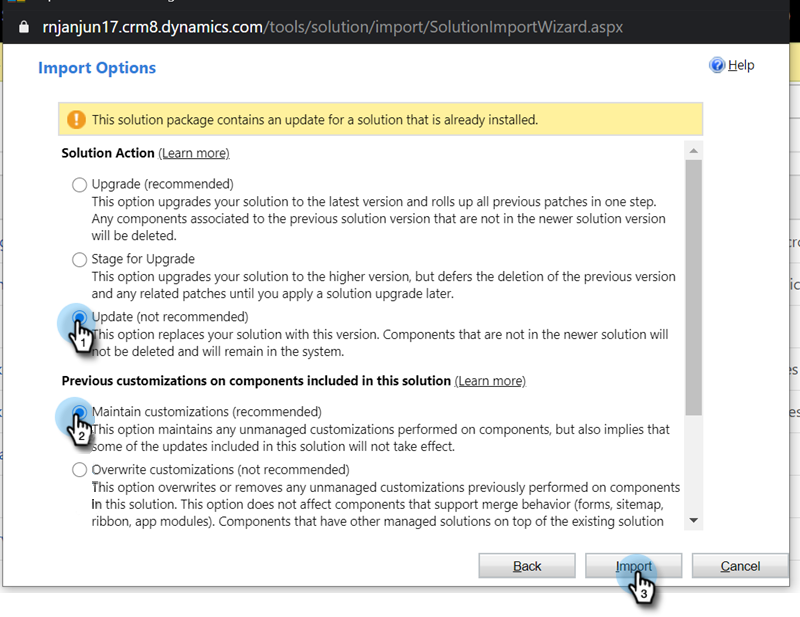

# Update the Marketo Solution for Microsoft Dynamics {#update-the-marketo-solution-for-microsoft-dynamics}

When a new Microsoft Dynamics solutions is released, you can download the update from the Admin area in your account.

>[!NOTE]
>
>**Admin Permissions Required**

>[!CAUTION]
>
>It's imperative you download the latest Marketo Solution _before_ performing any update.

1. Go to the **Admin** area.

   

1. Click **Microsoft Dynamics**.

   

1. Select **Download Marketo Solution**.

   

1. Select the appropriate solution for your Microsoft Dynamics version.

   

   Awesome! A zip file of the solution will now be downloaded to your device. If you are unfamiliar with the install steps, please contact your Dynamics Admin.

## Performing the Update {#performing-the-update}

1. Import the latest version of the solution over the existing version of your Dynamics CRM (ex: if your Dynamics CRM has version 1.4 and the latest version is 1.5, you would import _over_ version 1.4).

1. You will see the following pop-up. Select **Update** and **Maintain customizations**, then click **Import**.

   

>[!CAUTION]
>
>Selecting Upgrade instead of Update could result in data corruption in your Dynamics environment. **Be sure to choose Update** under Import Options.
