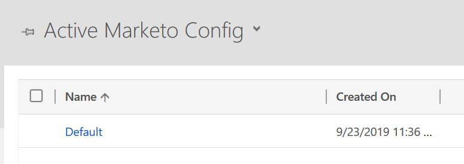

# Fix Dynamics Validation Sync Issues {#fix-dynamics-validation-sync-issues}

## Validate Sync Tool Results {#validate-sync-tool-results}

When you run the Dynamics Validate Sync, it generates a report. If there's an  next to a step, see the options below to identify and fix the problem. Then, rerun the sync validation steps until the result shows nothing but green checkmarks.

## URL is valid {#url-is-valid}

If you have an  here, verify that the URL is valid. Find it here in Developer Resources and look at Organization Service. The URL could be invalid for a number of reasons.

1. Log-in to Dynamics. Click the Settings icon and select **Advanced Settings**.

   

1. Click Settings and select **Customizations**.

   

1. Click **Developer Resources**.

   

1. The Organization Service URL can be found under Service Endpoints.

   

## Username and password are valid {#username-and-password-are-valid}

If you have an  here, verify that your Microsoft Dynamics credentials are valid. For Web API S2S authentication, the username in Marketo must match the [email address](https://docs.microsoft.com/en-us/power-platform/admin/manage-application-users#view-or-edit-the-details-of-an-application-user) of the Application User in the CRM. For other types, it should match the username for the Sync User.

## Sync user is assigned to the Marketo Sync User role {#sync-user-is-assigned-to-the-marketo-sync-user-role}

If you have an  here, it could be one of the three issues below.

**Option One - Verify That the Marketo Sync User Role Is Checked in Microsoft Dynamics**:

1. In Dynamics, click the Settings icon and select **Advanced Settings**.

   

1. Click **Settings** and select **Security**.

   

1. Click **Users.**

   

1. Click the link for the sync user.

   

1. Click **Manage Roles**.

   

1. Verify that the Marketo Sync User role is checked. If not, check it and click **OK.**

   

**Option Two - Confirm Grant Consent**:

1. Review the [Grant Consent for Client Id and App Registration](/help/marketo/product-docs/crm-sync/microsoft-dynamics-sync/sync-setup/grant-consent-for-client-id-and-app-registration.md) to confirm the app has admin consent to call APIs.

**Option Three - Sync User**:

1. Verify the Sync User is added to Marketo Config.

## Marketo solution is properly installed {#marketo-solution-is-properly-installed}

If you have an  here, Go to Microsoft Dynamics to verify the Marketo installation is there. See Step 1 of the MIcrosoft Dynamics setup documentation.

1. In Dynamics, click the Settings icon and select **Advanced Settings**.

   

1. Click **Settings** and select **Solutions.**

   

1. Verify the solution is listed.

   

## All steps in the solution are enabled {#all-steps-in-the-solution-are-enabled}

If you have an  here, verify that none of the default steps have been deactivated. All steps are automatically enabled at installation, but they could be deactivated during a customization.

## Sync user is assigned to the Marketo solution {#sync-user-is-assigned-to-the-marketo-solution}

If you have an  here, make sure the Sync user is assigned on the Marketo Default page in Microsoft Dynamics.

1. In Dynamics, click the Settings icon and select **Advanced Settings**.

   

1. Click **Settings** and select **Marketo Config**.

   

1. Verify that the sync user is assigned as the default.

   

## Sync user matches username and password {#sync-user-matches-username-and-password}

If you have an  here, be sure to assign the proper sync user in the Marketo User field in the Marketo Config Default setup step in Microsoft Dynamics.

>[!MORELIKETHIS]
>
>[Validate Microsoft Dynamics Sync](/help/marketo/product-docs/crm-sync/microsoft-dynamics-sync/sync-setup/validate-microsoft-dynamics-sync.md)
