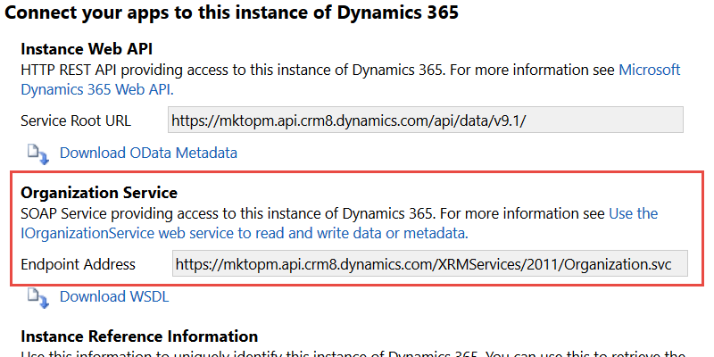

# View the Organization Service URL {#view-the-organization-service-url}

View the Organization Service URL - Marketo Docs - Product Documentation

Marketo needs the Organization Service URL to sync with Dynamics On-Premises instances. Here is how to find it in Dynamics.

1. Log in to Dynamics. Click the Settings icon and select **Advanced Settings**.

   

1. Click** Settings** and select **Customizations**.

   

1. Click **Developer Resources**.

   

1. The Organization Service URL can be found under** Service Endpoints**.

   

1. Copy and paste this URL to Marketo, and enjoy the rest of the sync.

