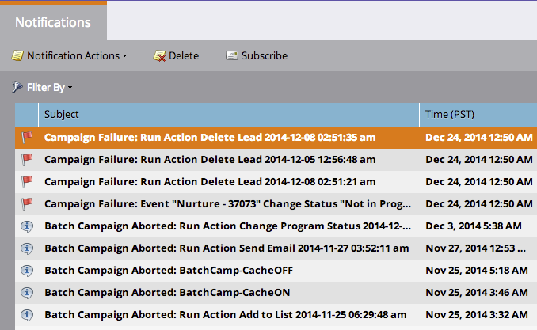

# Add/Remove Picklist Values {#add-remove-picklist-values}

Here are a few things to know about adding and removing picklist values in Salesforce.

#### Adding Picklist Values {#adding-picklist-values}

1. If an additional value is added in Salesforce to a picklist field type, you will receive a [notification](../../../product-docs/core-marketo-concepts/miscellaneous/understanding-notifications.md) identifying which forms this will affect.

   

1. Go to the form editor and [add the additional value](../../../product-docs/demand-generation/forms/form-actions/add-a-country-picklist-to-your-form.md) to your list of suggestions.

#### Remove Picklist Values {#remove-picklist-values}

When a picklist value is removed from a field in Salesforce, you will have to manually remove this value from all the forms hosting this field.

>[!NOTE]
>
>If a lead field and a contact field in Salesforce have different values, the values in common will be available for use in Marketo.

If a lead field and a contact field in Salesforce have different values:

1. Adding an additional value in SFDC to a picklist will get a notification. 
1. The notification will tell you where it's used. You can now add this new value as an option on the form if you want.

If a picklist of an SFDC lead has different values than a picklist for an SFDC contact, the common values will be used as default value options in the form.

If you remove a value from a picklist, you will have to manually remove it as an option from your forms.
