# Log in Using OAuth 2.0 {#log-in-using-oauth-2-0}

Salesforce uses the OAuth protocol to allow users of applications to securely access (authenticate the application using OAuth 2.0) data without having to reveal login credentials. Below are the steps to be performed to securely connect and sync Marketo with Salesforce.

>[!IMPORTANT]
>
>To connect Marketo and Salesforce using OAuth, log in to Marketo via private (incognito) browser as to avoid connecting to Salesforce with the wrong username.

## Set Up Connected App {#set-up-connected-app}

1. In Salesforce, under Setup, within the Platform Tools, navigate to Apps, App Manager, and click **New Connected App**.

   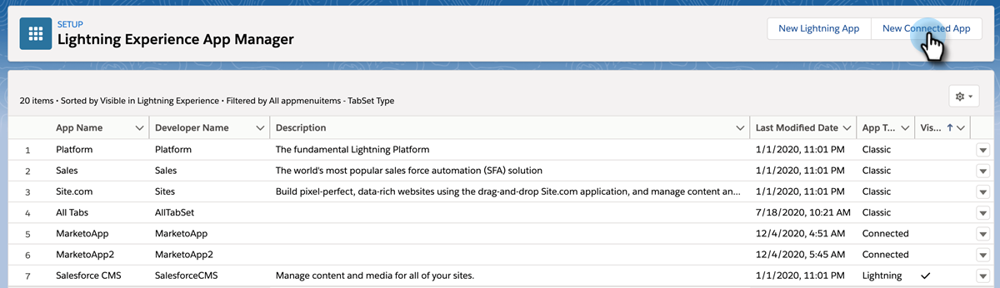

1. Fill in the details and click **Save**.

   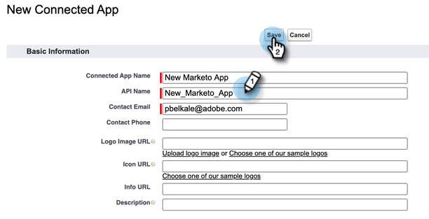

1. Click the **Enable OAuth Settings** checkbox. For Callback URL, enter `https://app.marketo.com/salesforce/getSfdcOAuthTokensRedirect`. Select all the available OAuth Scopes and click **Add**.

   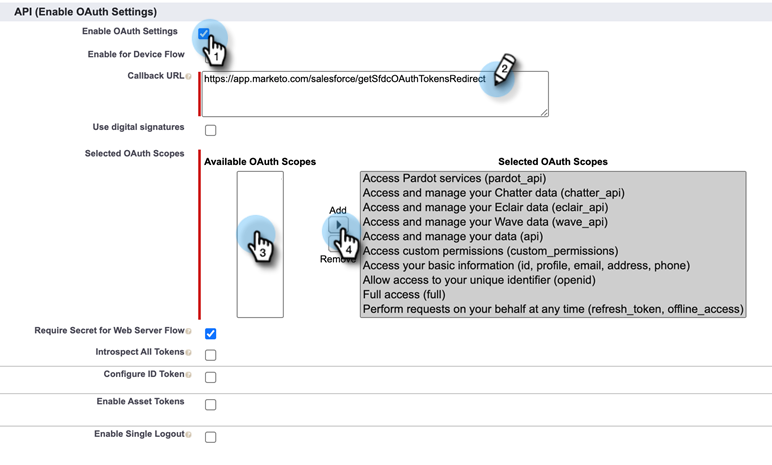

1. Click **Save**.

   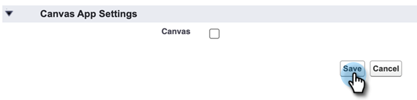

1. Click **Continue**.

   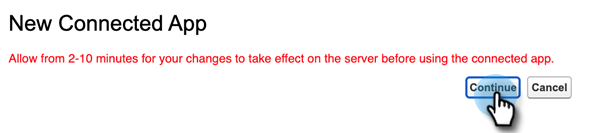

1. Copy the Consumer Key and Consumer Secret (you'll need them later for use in Marketo Engage).

   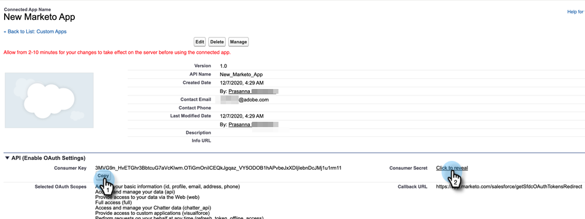

>[!CAUTION]
>
>While still on the New Connected App page, scroll down and make sure the "Require Proof Key for Code Exchange (PKCE)" checkbox is _NOT_ checked, as it would impede the setup.

## Set Up Marketo {#set-up-marketo}

>[!PREREQUISITES]
>
>* API access must be enabled for the Salesforce Sync User (if you're a Salesforce Professional Edition user, that access is not available by default&#8212;please contact your Salesforce Account Executive).
>* Marketo Sync user has to be created in Salesforce.
>* For existing customers, Feature to "Enable OAuth for SFDC sync" is enabled on the customer's subscription.
>* Pop-up blockers are disabled.
>* Connected App is created and we have the Consumer Key and Consumer Secret are available for use.

>[!CAUTION]
>
>Be sure to hide all fields you don't need in Marketo from the sync user before clicking **Sync Fields**. Once you click Sync Fields, all fields the user can see in SFDC will be created in Marketo permanently and cannot be deleted.

1. In the Marketo Admin section, click **CRM**, then **Sync with Salesforce**.

   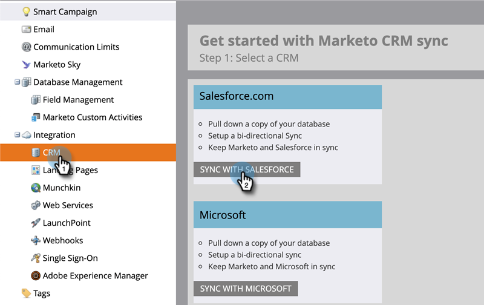

1. Add the Consumer Key and Consumer Secret info you previously recorded and click and **Save**.

   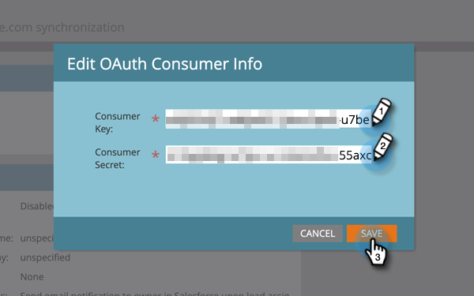

1. On the Marketo Salesforce sync page, click the **Login with Salesforce** button.

   

   >[!CAUTION]
   >
   >If you're seeing Username/Password/Token fields and not a "Login with Salesforce" Button, your Marketo Subscription is enabled for Basic Authentication. Please refer to [Set up Marketo with Basic Authentication](/help/marketo/product-docs/crm-sync/salesforce-sync/setup/enterprise-unlimited-edition/step-3-of-3-connect-marketo-and-salesforce-enterprise-unlimited.md). Once the sync begins using a set of Credentials, there is no switching of Salesforce credentials or subscription. If you want to use Oauth 2.0, reach out to the Adobe Account Team (your Account Manager).

1. A pop-up with the salesforce login page will show up. Key in your "Marketo Sync User" credentials and log in.

   

1. Enter the verification code you received via email (sent by Salesforce) and click **Verify**.

   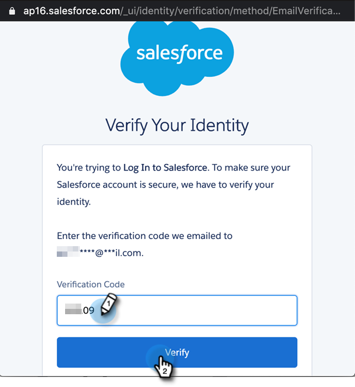

1. Upon successful verification, the access page will show up requesting access. Click **Allow**.

   

1. In a few minutes, a pop-up will appear in Marketo. Click **Confirm Credentials**.

   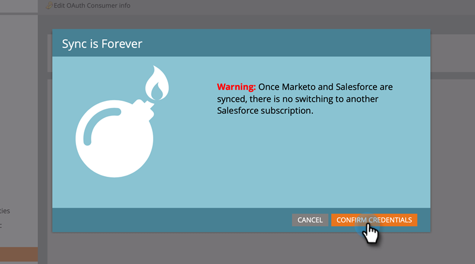

1. Upon completion of Field Syncing, click **Start Salesforce Sync**.

   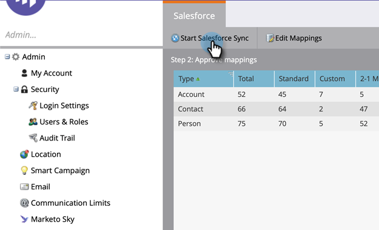

1. Click **Start Sync**.

   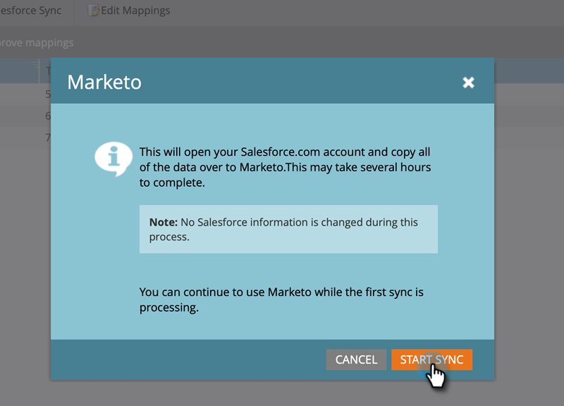

Your Sync between Marketo and Salesforce is now in progress.

   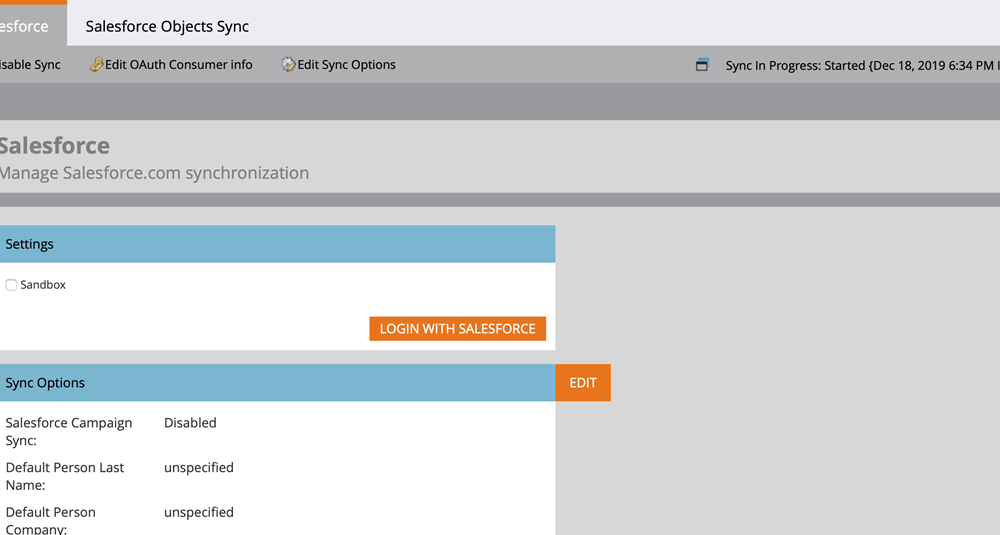

>[!MORELIKETHIS]
>
>* [Step 1 of 3: Add Marketo Fields to Salesforce (Enterprise/Unlimited)](/help/marketo/product-docs/crm-sync/salesforce-sync/setup/enterprise-unlimited-edition/step-1-of-3-add-marketo-fields-to-salesforce-enterprise-unlimited.md)
>* [Step 2 of 3: Create a Salesforce User for Marketo (Enterprise/Unlimited)](/help/marketo/product-docs/crm-sync/salesforce-sync/setup/enterprise-unlimited-edition/step-2-of-3-create-a-salesforce-user-for-marketo-enterprise-unlimited.md)
>* [Install Marketo Sales Insight Package in Salesforce AppExchange](/help/marketo/product-docs/marketo-sales-insight/msi-for-salesforce/installation/install-marketo-sales-insight-package-in-salesforce-appexchange.md)
>* [Configure Marketo Sales Insight in Salesforce Enterprise/Unlimited](/help/marketo/product-docs/marketo-sales-insight/msi-for-salesforce/configuration/configure-marketo-sales-insight-in-salesforce-enterprise-unlimited.md)
