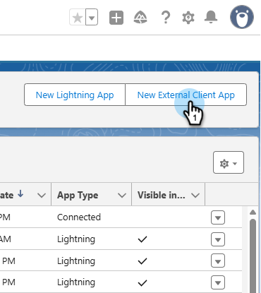

# Log in Using OAuth 2.0 {#log-in-using-oauth-2-0}

Salesforce uses the OAuth protocol to allow users of applications to securely access (authenticate the application using OAuth 2.0) data without having to reveal login credentials. Below are the steps to be performed to securely connect and sync Marketo Engage with Salesforce.

>[!IMPORTANT]
>
>To connect Marketo and [!DNL Salesforce] using OAuth, log in to Marketo via private (incognito) browser as to avoid connecting to [!DNL Salesforce] with the wrong username.

## Set Up External Client App {#set-up-external-client-app}

>[!NOTE]
>
>As of September 2025, Salesforce began restricting usage of [Connected Apps](https://help.salesforce.com/s/articleView?id=005132365&type=1){target="_blank"}. For existing users that have set up a Connected App based on our documentation, you can either add the "Approve Uninstalled Connected Apps" permission to the profile of the Marketo Sync user, or create a new External Client App using the instructions below.

1. In Salesforce, click the gear icon and select **Setup**.

   

1. In the Quick Find box, type `App Manager`, then select **App Manager**.

   

1. Click **New External Client App**.

   

1. Fill in the details under _Basic Information_. Set _Distribution State_ to **Local**.

   

1. Expand the **API (Enable OAuth Settings)** section and select the **[!UICONTROL Enable OAuth]** checkbox. For _Callback URL_, enter `https://app.marketo.com/salesforce/getSfdcOAuthTokensRedirect`. Select all the available OAuth Scopes and click the right arrow to add them.

   

1. Under _Flow Enablement_, make sure no boxes are selected.

   

1. Under _Security_, make sure only **Require secret for Web Server Flow** and **Require secret for Refresh Token Flow** are selected.

   

1. Skip the last four sections and click **Create**.

   

1. After the new External Client App is created, click the **Settings** tab and expand the **OAuth Settings** section.

   

1. Click the **Consumer Key and Consumer Secret** button, prompting a new tab to open. Copy and save both numbers (you'll need them later for use in Marketo Engage).

   

## Set Up Marketo {#set-up-marketo}

>[!PREREQUISITES]
>
>* API access must be enabled for the Salesforce Sync User (if you're a Salesforce Professional Edition user, that access is not available by default&#8212;please contact your Salesforce Account Executive).
>* Marketo Sync user has to be created in Salesforce.
>* For existing customers, Feature to "Enable OAuth for SFDC sync" is enabled on the customer's subscription.
>* Pop-up blockers are disabled.
>* Connected App is created and we have the [!UICONTROL Consumer Key] and [!UICONTROL Consumer Secret] are available for use.

>[!CAUTION]
>
>Be sure to hide all fields you don't need in Marketo from the sync user before clicking **[!UICONTROL Sync Fields]**. Once you click Sync Fields, all fields the user can see in SFDC will be created in Marketo permanently and cannot be deleted.

1. In the Marketo Admin section, click **[!UICONTROL CRM]**, then **[!UICONTROL Sync with Salesforce]**.

   

1. Add the Consumer Key and Consumer Secret info you previously recorded and click and **[!UICONTROL Save]**.

   

1. On the Marketo Salesforce sync page, click the **[!UICONTROL Login with Salesforce]** button.

   

   >[!CAUTION]
   >
   >If you're seeing Username/Password/Token fields and not a "Login with Salesforce" Button, your Marketo Subscription is enabled for Basic Authentication. Please refer to [Set up Marketo with Basic Authentication](/help/marketo/product-docs/crm-sync/salesforce-sync/setup/enterprise-unlimited-edition/step-3-of-3-connect-marketo-and-salesforce-enterprise-unlimited.md){target="_blank"}. Once the sync begins using a set of Credentials, there is no switching of Salesforce credentials or subscription. To have Oauth 2.0 set up for your Salesforce authentication, contact [Marketo Support](https://nation.marketo.com/t5/support/ct-p/Support){target="_blank"}.

1. A pop-up with the salesforce login page will show up. Key in your "Marketo Sync User" credentials and log in.

   

1. Enter the verification code you received via email (sent by Salesforce) and click **[!UICONTROL Verify]**.

   

1. Upon successful verification, the access page will show up requesting access. Click **[!UICONTROL Allow]**.

   

1. In a few minutes, a pop-up will appear in Marketo. Click **[!UICONTROL Confirm Credentials]**.

   

1. Upon completion of Field Syncing, click **[!UICONTROL Start Salesforce Sync]**.

   

1. Click **[!UICONTROL Start Sync]**.

   

Your Sync between Marketo and [!DNL Salesforce] is now in progress.

   

>[!MORELIKETHIS]
>
>* [Step 1 of 3: Add Marketo Fields to Salesforce (Enterprise/Unlimited)](/help/marketo/product-docs/crm-sync/salesforce-sync/setup/enterprise-unlimited-edition/step-1-of-3-add-marketo-fields-to-salesforce-enterprise-unlimited.md){target="_blank"}
>* [Step 2 of 3: Create a Salesforce User for Marketo (Enterprise/Unlimited)](/help/marketo/product-docs/crm-sync/salesforce-sync/setup/enterprise-unlimited-edition/step-2-of-3-create-a-salesforce-user-for-marketo-enterprise-unlimited.md){target="_blank"}
>* [Install Marketo Sales Insight Package in Salesforce AppExchange](/help/marketo/product-docs/marketo-sales-insight/msi-for-salesforce/installation/install-marketo-sales-insight-package-in-salesforce-appexchange.md){target="_blank"}
>* [Configure Marketo Sales Insight in Salesforce Enterprise/Unlimited](/help/marketo/product-docs/marketo-sales-insight/msi-for-salesforce/configuration/configure-marketo-sales-insight-in-salesforce-enterprise-unlimited.md){target="_blank"}
