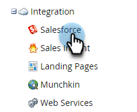
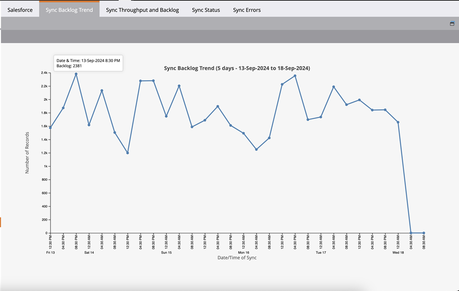
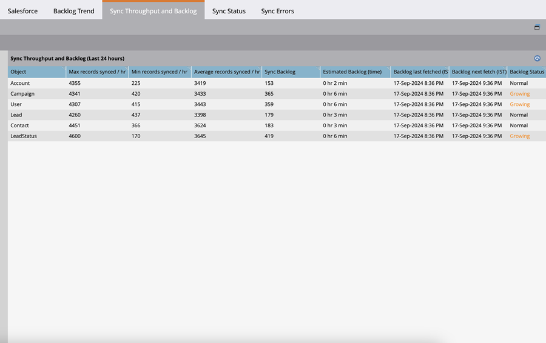

# Salesforce Sync Backlog Metrics  {#salesforce-sync-backlog-metrics}

The sync backlog is the name used for the records pending sync. It accounts for records pending sync from Salesforce to Marketo Engage, and vice versa. Ensuring the backlog remains under control will lead to smooth and time syncs. The backlog covers the numbers pending sync post updates on either side, and not those that are undertaken by sync flow steps like the Sync Lead to SFDC flow steps.

## How to access {#how-to-access}

1. In Marketo Engage, go to the **Admin** area.

   

1. Select **Salesforce**.

   

## Sync Backlog Trend {#sync-backlog-trend}

The backlog trend reflects changes in the backlogs recorded over the last 5 days. The backlog is shown in a 4-hour time interval spread over 5 days. Therefore, the graph will show 6 intervals per day times 5 days, which equals 30 intervals.

Backlog is observed at a particular 4-hour time interval on the x-axis. This value is for all the objects under sync. This is the total of the backlog in Salesforce and Marketo Engage waiting to sync over.

   

## Sync Throughput and Backlog {#sync-throughput-and-backlog}

The statistics reflect the throughput and backlog status for every object type under sync for the last 24 hours. The object types include all objects under sync, including: Lead, Contact, Account, Opportunity, Campaign, User and Custom Objects. The throughput statistics is auto refreshed every 15 minutes, but you can refresh manually using the refresh icon. The backlog is fetched every hour.

   >[!NOTE]
   >
   >Statistics are updated on a rolling basis, not by calendar day.

   

<table><thead>
  <tr>
    <th>Field</th>
    <th>Description</th>
  </tr></thead>
<tbody>
  <tr>
    <td>Max records synced / hr</td>
    <td>The maximum number of records synced per hour (maximum throughput) observed in the last 24 hours for the object type. The 24-hour period rolls with time, not the calendar day.</td>
  </tr>
  <tr>
    <td>Min records synced / hr</td>
    <td>The minimum number of records synced per hour (minimum throughput) observed in the last 24 hours for the object type. The 24-hour period rolls with time, not the calendar day.</td>
  </tr>
  <tr>
    <td>Average records synced / hr</td>
    <td>The average number of records synced per hour (minimum throughput) observed in the last 24 hours for the object type. The 24-hour period rolls with time, not the calendar day. This is calculated as total number of records synced in the last 24 hours.</td>
  </tr>
  <tr>
    <td>Sync Backlog</td>
    <td>The backlog of records pending sync for the object type. It is the sum total of backlog pending sync in both directions (from Salesforce to Marketo Engage, and vice versa). The backlog from Salesforce is obtained using an API call to Salesforce, and the backlog from Marketo Engage is calculated using the statistics obtained from the change data log. This is calculated every hour. The next two fields in this table inform when the backlog was last calculated and the next schedule for calculation, respectively.</td>
  </tr>
  <tr>
    <td>Estimated Backlog (time)</td>
    <td>Estimate of the time required to sync the backlog per object type. Calculated as 'Sync Backlog/Average records synced per hour.'</td>
  </tr>
  <tr>
    <td>Backlog last fetched</td>
    <td>The time of the last backlog calculation.</td>
  </tr>
  <tr>
    <td>Backlog next fetch</td>
    <td>The time of the next backlog calculation.</td>
  </tr>
  <tr>
    <td>Backlog Status</td>
    <td>This shows whether the backlog has grown in the last 6 hours. It is inferred as 'Growing' if the current backlog is greater than the backlog recorded 6 hours ago. Otherwise, it is shown as 'Normal.' This is aimed at showing if the sync throughput is catching up with the backlog.</td>
  </tr>
</tbody></table>

## What causes sync backlogs {#what-causes-sync-backlogs}

Whether the update is made on the Marketo Engage side or the CRM side, it will trigger the record to be resynced to update the information on the other end through the regular Marketo Engage to CRM sync cycle. Whenever an update is made to a record on Salesforce, it generates a System Modification Time Stamp, referred to as 'SysModStamp.' This queues a change to sync.

When a large amount of updates are made (like from a field value changing), many records are altered, causing new SysModStamps. A large number of person record updates then need to be resynced between Marketo Engage and your CRM, sometimes creating a momentary backlog.

## Best practices for managing sync backlogs {#best-practices}

**Fields visible to Sync User**: Ensure that the fields visible to sync are only those that need to be synced and have value to marketing efforts. Any update to a record in Salesforce that updates the last modified timestamp will queue a record to the sync backlog, and unnecessary fields syncing may slow more important fields under sync. If the unnecessary fields are hidden from the sync user, updates to those fields will result in a skip which is much quicker than an update. Work with your Salesforce Admin to review best practices [here](https://nation.marketo.com/t5/marketo-whisperer-blogs/best-practices-for-determining-which-fields-to-sync-with-marketo/ba-p/247449){target="_blank"} and update which fields are visible to the Marketo Sync User.

**Hide or filter unnecessary records**: If a record is not marketable, it may be wasting sync resources. If the sync user cannot see it, then it won't waste resources trying to sync it. [Marketo Engage Support](https://nation.marketo.com/t5/support/ct-p/Support#_blank){target="_blank"} can assist setting up a sync filter to inhibit records from syncing based on additional criteria. More information about setting up a Custom Sync Filter [can be found here](https://nation.marketo.com/t5/product-blogs/instructions-for-creating-a-custom-sync-rule/ba-p/242758){target="_blank"}. It is strongly recommended to use index fields within Salesforce (contact salesforce for further information).

**Schedule bulk updates during non-critical hours**: Review your data sync patterns to identify non-critical periods. Review if bulk updates can be scheduled in these non-critical periods if possible.

**Frequently Updated fields**: Some fields are prone to frequent updates. For example, currency fields that are subject to currency changes. Review if these need to be synced, or if the fields should be designed differently. If you have other fields that are updated frequently and are not needed, hide them from the sync user. Be sure to discuss with your SFDC admin integrations that might be updating fields.

**Custom objects**: Periodically review [custom objects](https://experienceleague.adobe.com/en/docs/marketo/using/product-docs/crm-sync/salesforce-sync/sfdc-sync-details/sfdc-sync-custom-object-sync){target="_blank"} enabled to sync and disable those that no longer need to be synced.

**Activities**: [Review if any activities](https://experienceleague.adobe.com/en/docs/marketo/using/product-docs/crm-sync/salesforce-sync/setup/optional-steps/customize-activities-sync){target="_blank"} enabled sync that may be removed from sync.  These activities only sync once per day per lead.

**Review Sync errors**: Exception handling may slow down the sync. Reviewing user notifications and resolving errors can improve sync health.

**Contact Support**: If you're following all of the above best practices and are still experiencing significant backlogs, contact [Marketo Engage Support](https://nation.marketo.com/t5/support/ct-p/Support#_blank){target="_blank"}.
