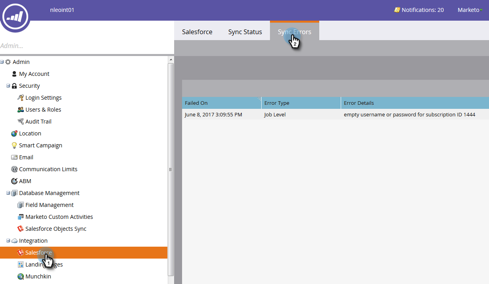
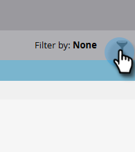

# Salesforce Sync Errors {#salesforce-sync-errors}

View a summary of the errors faced during the sync process. This includes errors caused by failures to sync incompatible data.

>[!NOTE]
>
>**Admin Permissions Required**

## View Sync Errors {#view-sync-errors}

1. Click **Admin**.

   

1. Under Integration, click **Salesforce**, then the **Sync Errors** tab.

   

>[!NOTE]
>
>Errors listed range from the current time to five days prior to the current sync.

| Field | Description |
|---|---|
| Failed On | Record Level _or_ Job Level |
| Date/Time of the failure | Error Details |
| Error Type | SFDC Return message |

>[!TIP]
>
>Clicking on the record level record shows the Marketo and Salesforce IDs of the related object. In some cases, the message on the record and job level errors are directly from Salesforce. Searching for them online may provide additional details.

## Filter Sync Errors {#filter-sync-errors}

1. To filter the data, click the filter icon to the far right of the page.

   

1. Select your date and time range, then filter by Error Type (Job Level or Record Level). Click **Apply** when done.

   

**OPTIONAL STEP**: To export sync errors, click **Export**. The data will be exported as a CSV.

   
