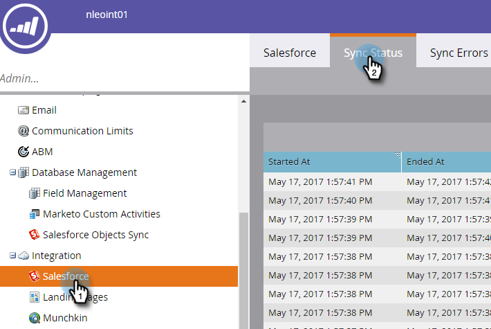
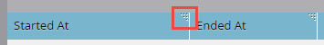
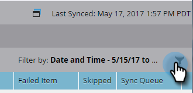
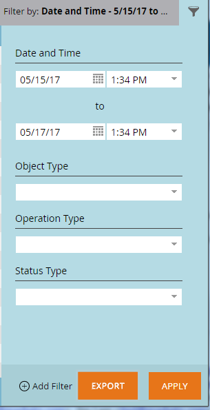
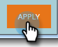

# Salesforce Sync Status {#salesforce-sync-status}

Use the Sync Status Dashboard to view sync stats as part of the sync steps and its success status.

The Sync steps reflect operations of push or pull by each object type for object schema and data itself. Stats cover new records, updates, deletes, and failed counts during sync. Users can filter by date, operation type or object type. Sync Status Dashboard shows status of sync cycles for the past five days.

>[!NOTE]
>
>Admin Permissions Required

## View Sync Status {#view-sync-status}

1. Click **Admin**.

   

1. Under Integration, click Salesforce, then the Sync Status tab.

   

By default, stats will be sorted by most recently started. You can sort by Started At or Ended At—from most recent to oldest—by clicking the sort icon.

   

## Filter Sync Status {#filter-sync-status}

1. To filter the data, click the filter icon to the far right of the page.

   

1. Select your date and time range, then click the drop-down(s) to filter by Object Type, Operation Type, and/or Status Type.

   

1. Click **Apply**.

   

**Optional Step**: To export sync errors, click **Export**. The data will be exported as a CSV.

   

## Sync Status Fields {#sync-status-fields}

<table> 
 <colgroup> 
  <col> 
  <col> 
  <col> 
 </colgroup> 
 <tbody> 
  <tr> 
   <th>Field</th> 
   <th>Description</th> 
   <th>Enum Values</th> 
  </tr> 
  <tr> 
   <td colspan="1">Started At</td> 
   <td colspan="1">The sync cycle start date/time (User's timezone)</td> 
   <td colspan="1"></td> 
  </tr>  
  <tr> 
   <td colspan="1">Ended At</td> 
   <td colspan="1">The sync cycle end date/time (User's timezone)</td> 
   <td colspan="1"></td> 
  </tr> 
  <tr> 
   <td colspan="1">Object</td> 
   <td colspan="1">Object type</td> 
   <td colspan="1">Contact, Person, Task, Opportunity, Lead, Others as below</td> 
  </tr>  
  <tr> 
   <td colspan="1">Operation</td> 
   <td colspan="1">Operation Type</td> 
   <td colspan="1">Operation types as below</td> 
  </tr>  
  <tr> 
   <td colspan="1">Status</td> 
   <td colspan="1">Status of the batch</td> 
   <td colspan="1">Succeeded, Failed, Incomplete, In Process, Cleaned up&#42;</td> 
  </tr>
  <tr> 
   <td colspan="1">New</td> 
   <td colspan="1">Count of new records</td> 
   <td colspan="1"></td> 
  </tr>  
  <tr> 
   <td colspan="1">Updated</td> 
   <td colspan="1">Count of updated records</td> 
   <td colspan="1"></td> 
  </tr>  
  <tr> 
   <td colspan="1">Deleted</td> 
   <td colspan="1">Count of deleted records</td> 
   <td colspan="1"></td> 
  </tr> 
  <tr> 
   <td colspan="1">Failed Item</td> 
   <td colspan="1">Number of records whose sync failed</td> 
   <td colspan="1"> </td> 
  </tr>  
  <tr> 
   <td colspan="1">Skipped</td> 
   <td colspan="1">Count of records skipped because there were no changes to fields of interest for the Sync</td> 
   <td colspan="1"></td> 
  </tr>  
 </tbody> 
</table>

&#42;Data reverted to previous state of integrity after sync step failure.

## Object Type {#object-type}

<table> 
 <colgroup> 
  <col> 
 </colgroup> 
 <tbody> 
  <tr> 
   <td colspan="1">Account</td> 
  </tr>  
  <tr> 
   <td colspan="1">Account Type</td> 
  </tr> 
  <tr> 
   <td colspan="1">Custom Objects</td> 
  </tr>  
  <tr> 
   <td colspan="1">Campaign</td> 
  </tr>  
  <tr> 
   <td colspan="1">Campaign Member Status</td> 
  </tr>
  <tr> 
   <td colspan="1">Contact</td> 
  </tr>  
  <tr> 
   <td colspan="1">Email Template</td> 
  </tr>  
  <tr> 
   <td colspan="1">Event</td> 
  </tr> 
  <tr> 
   <td colspan="1">Person (Lead)</td> 
  </tr>  
  <tr> 
   <td colspan="1">Opportunity</td> 
  </tr>  
  <tr> 
   <td colspan="1">Opportunity Contact Role</td> 
  </tr>  
  <tr> 
   <td colspan="1">Task</td> 
  </tr>  
  <tr> 
   <td colspan="1">User</td> 
  </tr>  
 </tbody> 
</table>

## Operation Type {#operation-type}

<table> 
 <colgroup> 
  <col> 
  <col> 
  <col>
  <col> 
 </colgroup> 
 <tbody> 
  <tr> 
   <th>Operation Type</th> 
   <th>Found against these Objects</th> 
   <th>Remarks</th> 
   <th>Operation type</th>
  </tr> 
  <tr> 
   <td colspan="1">Init link with Program</td> 
   <td colspan="1">Campaign</td> 
   <td colspan="1">Linking Campaigns to Programs</td> 
   <td colspan="1">Update</td>
  </tr>  
  <tr> 
   <td colspan="1">Pull conversions</td> 
   <td colspan="1">Person (Lead)&#42;</td> 
   <td colspan="1">Pull convert actions from SFDC to Marketo. Units(numbers) are Leads converting to Contacts</td> 
   <td colspan="1">Update, Failed Item or Skipped</td>
  </tr> 
  <tr> 
   <td colspan="1">Pull deletes</td> 
   <td colspan="1">Contact, Person (Lead), Opportunity, Campaign, Campaign Members, Opportunity Contact, Custom Objects, Campaigns, Campaign Member Status, Opportunity Contact Role</td> 
   <td colspan="1">Deleted records of SFDC being synced to Marketo</td> 
   <td colspan="1">Deleted, Failed Item or Skipped</td>
  </tr>  
  <tr> 
   <td colspan="1">Pull updates</td> 
   <td colspan="1">Task, Person (Lead), Person (Lead) Queue, Contact, Event, Opportunity, Account, Account Type, Campaign Members, Custom Objects, Campaigns, Campaign Member Status, Events, Person Status, Opportunity, Opportunity Contact Role</td> 
   <td colspan="1">Updates or New records in SFDC synced to Marketo, Pull Events as Activities</td> 
   <td colspan="1">New, Updated, Failed Item or Skipped</td>
  </tr>  
  <tr> 
   <td colspan="1">Push new</td> 
   <td colspan="1">Tasks, Email Templates</td> 
   <td colspan="1">Push Tasks (activities)</td> 
   <td colspan="1"></td>
  </tr>
  <tr> 
   <td colspan="1">Push updates</td> 
   <td colspan="1">Tasks, Email Templates, Person, Contact, Campaigns</td> 
   <td colspan="1">Pushing updates to SFDC and also deletes</td> 
   <td colspan="1">Update, Failed Item or Skipped</td>
  </tr>  
  <tr> 
   <td colspan="1">Sync schema</td> 
   <td colspan="1">Campaign Members, Custom Objects, Campaigns, Campaign Member Status, Tasks, Person, Opportunity, Opportunity Contact Role, Users</td> 
   <td colspan="1">Syncs Metadata for different objects, to decide what new fields to sync in the next cycle</td> 
   <td colspan="1"></td>
  </tr>  
  <tr> 
   <td colspan="1">Sync with program</td> 
   <td colspan="1">Campaigns</td> 
   <td colspan="1">Syncs Marketo program with SFDC Campaigns</td> 
   <td colspan="1">New, Updates, Failed or Skipped</td>
  </tr> 
  <tr> 
   <td colspan="1">Update activities</td> 
   <td colspan="1">Tasks</td> 
   <td colspan="1">Pull Activities from Salesforce</td> 
   <td colspan="1"></td>
  </tr>  
  <tr> 
   <td colspan="1">Update FKS</td> 
   <td colspan="1">All</td> 
   <td colspan="1">Update foreign key of all objects</td> 
   <td colspan="1">N/A</td>
  </tr>  
 </tbody> 
</table>

&#42;Branding configuration at the subscription level decides the label – “Lead” or “Person” in the report.
