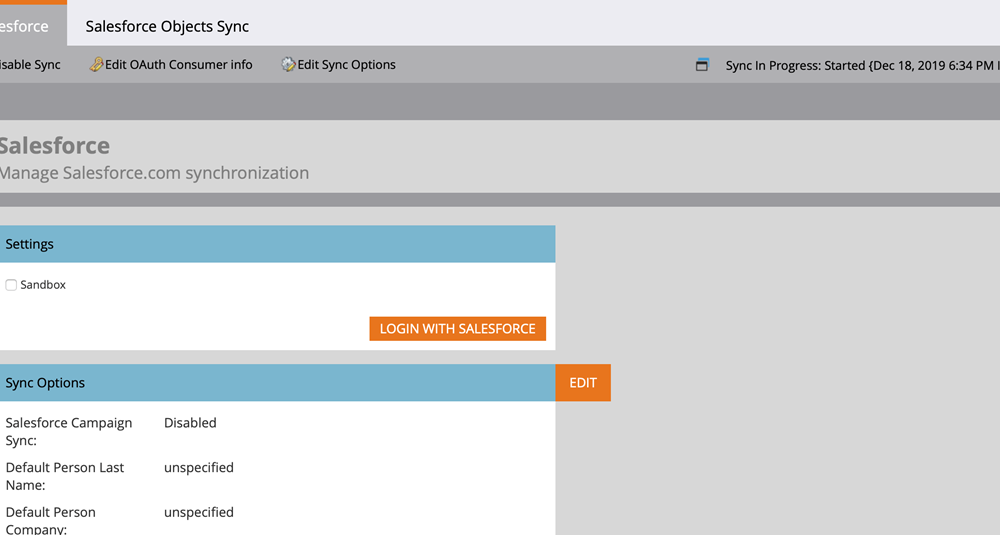

# Setting up OAuth 2.0 {#setting-up-oauth-2-0}

Salesforce uses the OAuth protocol to allow users of applications to securely access (authenticate the application using OAuth 2.0) data via REST API calls without having to reveal login credentials. Below are the steps to be performed to securely connect and sync Marketo with Salesforce.

## Set Up Connected App {#set-up-connected-app}

1. In Salesforce, under Setup, within the Platform Tools, navigate to Apps, App Manager, and click **New Connected App**.

   

1. Fill in the details and click **Save**.

   

1. Click the **Enable OAuth Settings** checkbox. For Callback URL, enter `https://app.marketo.com/salesforce/getSfdcOAuthTokensRedirect`. Select all the available OAuth Scopes and click **Add**.

   

1. Click **Save**.

   

1. Click **Continue**.

   

1. Copy the Consumer Key and Consumer Secret.

   

>[!NOTE]
>
>Save the Consumer Key and Consumer Secret info for later use in Marketo.

## Set Up Marketo {#set-up-marketo}

>[!PREREQUISITES]
>
>* API access must be enabled for the Salesforce Sync User (if you're a Salesforce Professional Edition user, that access is not available by default–please contact your Salesforce Account Executive).
>* Marketo Sync user has to be created in Salesforce.
>* For existing customers, Feature to “Enable OAuth for SFDC sync” is enabled on the customer’s subscription.
>* Pop-up blockers are disabled.
>* Connected App is created and we have the Consumer Key and Consumer Secret are available for use.

1. In the Marketo Admin section, click **CRM**, then **Sync with Salesforce**.

   

1. Add the Consumer Key and Consumer Secret info you previously recorded and click and **Save**.

   

1. On the Marketo Salesforce sync page, click the **Login with Salesforce** button.

   

1. A pop-up with the salesforce login page will show up. Key in your “Marketo Sync User” credentials and log in.

   

1. Enter the verification code you received via email (sent by Salesforce) and click **Verify**.

   

1. Upon successful verification, the access page will show up requesting access. Click **Allow**.

   

1. In a few minutes, a pop-up will appear in Marketo. Click **Confirm Credentials**.

   

1. Upon completion of Field Syncing, click **Start Salesforce Sync**.

   

1. Click **Start Sync**.

   

Your Sync between Marketo and Salesforce is now in progress.

   
