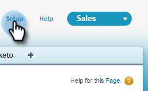
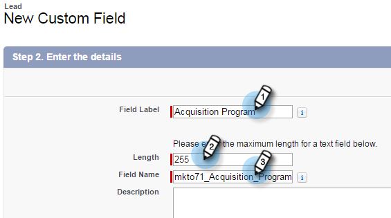
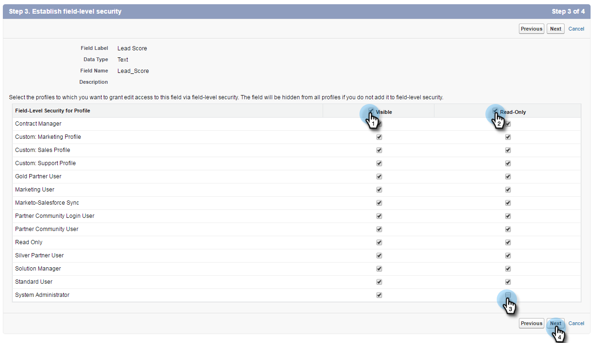
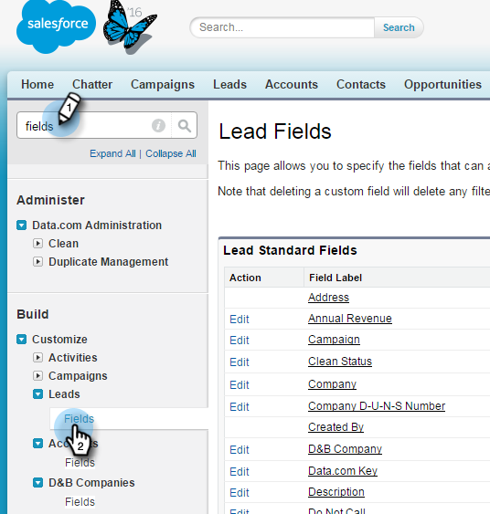

# Step 1 of 3: Add Marketo Fields to Salesforce (Enterprise/Unlimited) {#step-of-add-marketo-fields-to-salesforce-enterprise-unlimited}

>[!PREREQUISITES]
>
>You must have access to Salesforce API's to sync between Marketo and Salesforce.

Marketo uses a set of fields to capture certain kinds of marketing related information. If you would like this data in Salesforce, please follow the instructions below.

1. Create three custom fields in Salesforce on the lead and contact objects: Score, Acquisition Program, and Acquisition Date. 
1. Map these custom fields between leads and contacts so that on conversion in Salesforce, the values carry over.
1. You can create other additional fields, if necessary (see the table below).

All of these custom fields are optional and are not required to sync Marketo and Salesforce. As a best practice, we recommend that you do create fields for Score, Acquisition Program, and Acquisition Date.

## Add Marketo Fields to Salesforce {#add-marketo-fields-to-salesforce}

Add three custom fields on the lead and contact objects in Salesforce listed above. If you want to add more, see the table of available fields at the end of this section.

Perform the following steps for each of the three custom fields to add them. Start with Score.

1. Log in to Salesforce and click **Setup**.

   

1. In the Build menu on the left, click **Customize** and select **Leads**. Click **Fields**.

   

1. Click **New** in the Custom Fields & Relationships section at the bottom of the page.

   

1. Choose the appropriate field type (for Score — number; Acquisition Program — text; Acquisition Date — Date/Time).

   

1. Click **Next**.

   

1. Enter the Field Label, Length, and Field Name for the field, as shown in the table below.

<table> 
 <thead> 
  <tr> 
   <th> 
    

      Field Label 
    
</th> 
   <th> 
    

      Field Name 
    
</th> 
   <th> 
    

      Data Type 
    
</th> 
   <th> 
    

      Field Attributes 
    
</th> 
  </tr> 
 </thead> 
 <tbody> 
  <tr> 
   <td>Score</td> 
   <td>mkto71_Lead_Score</td> 
   <td>Number</td> 
   <td>Length 10 Decimal Places 0 </td> 
  </tr> 
  <tr> 
   <td>Acquisition Date</td> 
   <td>mkto71_Acquisition_Date</td> 
   <td>Date/Time</td> 
   <td> </td> 
  </tr> 
  <tr> 
   <td>Acquisition Program</td> 
   <td>mkto71_Acquisition_Program</td> 
   <td>Text</td> 
   <td>Length 255</td> 
  </tr> 
 </tbody> 
</table>

>[!NOTE]
>
>Salesforce appends __c to Field Names when it uses them to create API Names.

>[!NOTE]
>
>Text and number fields require a length, but Date/Time fields don't. A description is optional.

1. Click **Next**.

   

1. Specify the access settings and click **Next**:

   * Set all roles to **Visible** and **Read-Only**

   * Clear the **Read-Only** checkbox for the profile of your sync user:

      * If you have a user with the profile of a _System Administrator_ as the sync user, clear the **Read-Only** checkbox for the System Administrator profile (as shown below)
      * If you created a _custom profile_ for the sync user, clear the **Read-Only** checkbox for that custom profile

   

1. Choose the page layouts that should display the field.

   

1. Click **Save & New** to go back and create each of the other two custom fields. Click **Save** with you're done with all three.

   

1. In the Build menu on the left, click **Customize** and select Contacts. Click Fields.
1. Perform steps 3 through 10 for the Score, Acquisition Date, and Acquisition Program fields on the contact object, just as you did for the lead object.
1. Optionally, use the above procedure for any additional custom fields from this table.

<table> 
 <thead> 
  <tr> 
   <th> 
    

      Field Label 
    
</th> 
   <th> 
    

      Field Name 
    
</th> 
   <th> 
    

      Data Type 
    
</th> 
   <th> 
    

      Field Attributes 
    
</th> 
  </tr> 
 </thead> 
 <tbody> 
  <tr> 
   <td>Acquisition Program Id</td> 
   <td>mkto71_Acquisition_Program_Id</td> 
   <td>Number</td> 
   <td>Length 18 Decimal Places 0 </td> 
  </tr> 
  <tr> 
   <td>Original Referrer</td> 
   <td>mkto71_Original_Referrer</td> 
   <td>Text</td> 
   <td>Length 255</td> 
  </tr> 
  <tr> 
   <td>Original Search Engine</td> 
   <td>mkto71_Original_Search_Engine</td> 
   <td>Text</td> 
   <td>Length 255</td> 
  </tr> 
  <tr> 
   <td>Original Search Phrase</td> 
   <td>mkto71_Original_Search_Phrase</td> 
   <td>Text</td> 
   <td>Length 255</td> 
  </tr> 
  <tr> 
   <td>Original Source Info</td> 
   <td>mkto71_Original_Source_Info</td> 
   <td>Text</td> 
   <td>Length 255</td> 
  </tr> 
  <tr> 
   <td>Original Source Type</td> 
   <td>mkto71_Original_Source_Type</td> 
   <td>Text</td> 
   <td>Length 255</td> 
  </tr> 
  <tr> 
   <td>Inferred City</td> 
   <td>mkto71_Inferred_City</td> 
   <td>Text</td> 
   <td>Length 255</td> 
  </tr> 
  <tr> 
   <td>Inferred Company</td> 
   <td>mkto71_Inferred_Company</td> 
   <td>Text</td> 
   <td>Length 255</td> 
  </tr> 
  <tr> 
   <td>Inferred Country</td> 
   <td>mkto71_Inferred_Country</td> 
   <td>Text</td> 
   <td>Length 255</td> 
  </tr> 
  <tr> 
   <td>Inferred Metropolitan Area</td> 
   <td>mkto71_Inferred_Metropolitan_Area</td> 
   <td>Text</td> 
   <td>Length 255</td> 
  </tr> 
  <tr> 
   <td>Inferred Phone Area Code</td> 
   <td>mkto71_Inferred_Phone_Area_Code</td> 
   <td>Text</td> 
   <td>Length 255</td> 
  </tr> 
  <tr> 
   <td>Inferred Postal Code</td> 
   <td>mkto71_Inferred_Postal_Code</td> 
   <td>Text</td> 
   <td>Length 255</td> 
  </tr> 
  <tr> 
   <td>Inferred State Region</td> 
   <td>mkto71_Inferred_State_Region</td> 
   <td>Text</td> 
   <td>Length 255</td> 
  </tr> 
 </tbody> 
</table>

## Map Custom Fields for Conversions {#map-custom-fields-for-conversions}

A custom field on the lead object in Salesforce should be mapped to a contact field on the contact object so that data is carried over when a conversion occurs.  

1. In the top right corner, click **Setup**.

   

1. Type "Fields" into the Nav Search without pressing Enter. Fields appears under different objects; Click **Fields** under Leads.

   

1. Go to the Lead Custom Fields & Relationships section and click **Map Lead Fields**.

   

1. Click the drop-down next to the field you want to map.

   

1. Select the corresponding contact custom field.

   

1. Repeat the above steps for any other fields you've created.

1. Click **Save** when you're done.

   Easy enough, right?

>[!MORELIKETHIS]
>
>[Step 2 of 3: Create a Salesforce User for Marketo (Enterprise/Unlimited)](/help/marketo/product-docs/crm-sync/salesforce-sync/setup/enterprise-unlimited-edition/step-2-of-3-create-a-salesforce-user-for-marketo-enterprise-unlimited.md)
