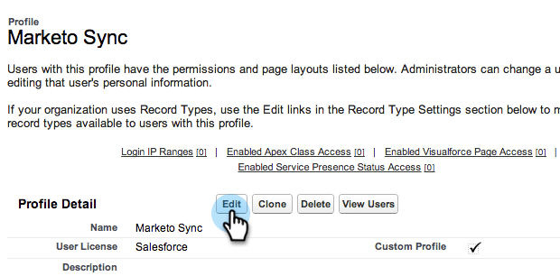
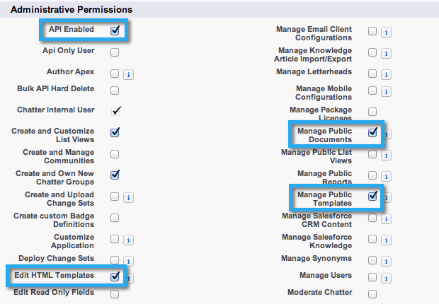
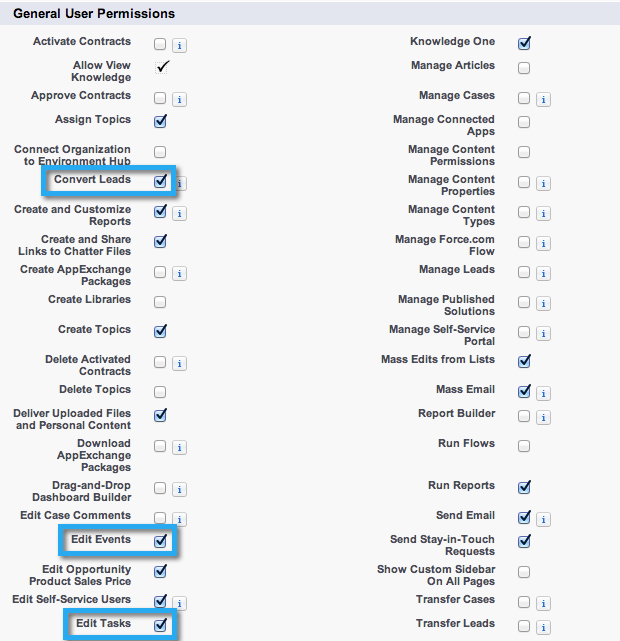
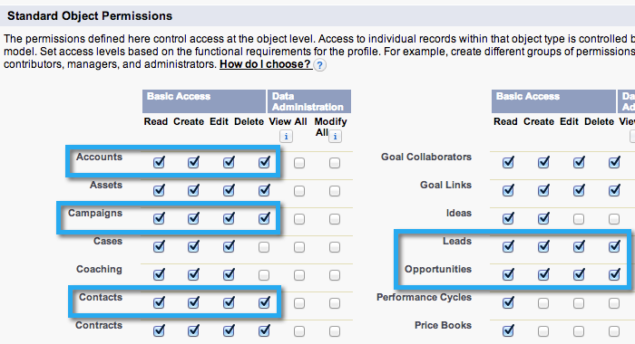
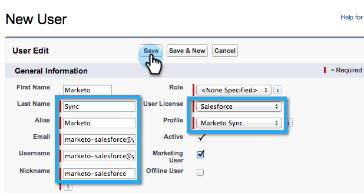

# Step 2 of 3: Create a Salesforce User for Marketo (Enterprise/Unlimited) {#step-of-create-a-salesforce-user-for-marketo-enterprise-unlimited}

>[!NOTE]
>
>These steps must be completed by a Salesforce administrator

>[!NOTE]
>
>**Prerequisites**
>
>* [Step 1 of 3: Add Marketo Fields to Salesforce (Enterprise/Unlimited)](step-1-of-3-add-marketo-fields-to-salesforce-enterprise-unlimited.md)
>

In this article, you will set up user permissions in Salesforce profile, and create a Marketo-Salesforce integration account.

### What's in this article? {#whats-in-this-article}

[Create a Profile](#create-a-profile)  
[Set Profile Permissions](#set-profile-permissions)  
[Set Field Permissions](#set-field-permissions)  
[Create Marketo-Salesforce Sync Account](#create-marketo-salesforce-sync-account)

#### Create a Profile {#create-a-profile}

1. Click **Setup**.

   

1. Type "profiles" into the Nav search bar and click on the **Profiles** link.

   

1. Click on **New**.

   

1. Select **Standard User**, name the profile “Marketo-Salesforce Sync” and click **Save**.

   

#### Set Profile Permissions {#set-profile-permissions}

1. Click **Edit** to set the security permissions.

   

1. Under the **Administrative Permissions** section, make sure the following boxes are checked:

    * API Enabled
    * Edit HTML Templates
    * Manage Public Documents
    * Manage Public Templates

   

   >[!TIP]
   >
   >Be sure to check the **Password Never Expires** box.

1. Under the General User Permissions section, make sure the following boxes are checked:

    * Convert Leads
    * Edit Events
    * Edit Tasks

   

1. Under the Standard Object Permissions section, make sure that Read, Create, Edit, and Delete permissions are checked for:

    * Accounts
    * Campaigns
    * Contacts
    * Leads
    * Opportunities

   >[!NOTE]
   >
   >Grant permissions to the Campaigns, if you plan to use Campaign Sync.

   

1. When finished, click **Save** at the bottom of the page.

   

#### Set Field Permissions {#set-field-permissions}

1. Discuss with your marketers to find out what custom fields are necessary to sync.

   >[!NOTE]
   >
   >This step will prevent fields you don't need from showing up in Marketo, which will reduce clutter and speed up sync.

1. In the profile detail page, go to **Field-Level Security** section. Click **View** to edit the accessibility for the objects:

    * `Lead`
    * `Contact`
    * `Account`
    * `Opportunity`

   >[!TIP]
   >
   >You may configure other objects according to your organization's needs.

   

1. For each object, click **Edit**.

   

1. Locate the unneeded fields, make sure that **Read Access **and** Edit Access **are unchecked. Click **Save** when you’re done.

   >[!NOTE]
   >
   >**Reminder**
   >
   >
   >Only edit the accessibility for the custom fields.

   

1. After you finish disabling all unneeded fields, you must check **Read Access and Edit Access **for the following object fields. Click **Save** when you’re done.

<table> 
 <tbody> 
  <tr> 
   <th colspan="1" rowspan="1">
Object
</th> 
   <th colspan="1" rowspan="1">
Fields
</th> 
  </tr> 
  <tr> 
   <td colspan="1" rowspan="1">
Account
</td> 
   <td colspan="1" rowspan="1">
Type field
</td> 
  </tr> 
  <tr> 
   <td colspan="1" rowspan="1">
Event
</td> 
   <td colspan="1" rowspan="1">
All fields
</td> 
  </tr> 
  <tr> 
   <td colspan="1" rowspan="1">
Task
</td> 
   <td colspan="1" rowspan="1">
All fields
</td> 
  </tr> 
 </tbody> 
</table>

   

#### Create Marketo-Salesforce Sync Account {#create-marketo-salesforce-sync-account}

>[!TIP]
>
>Create a dedicated Salesforce account (e.g. [`[email protected]`](http://docs.marketo.com/cdn-cgi/l/email-protection#fe939f8c959b8a91be87918b8c9d91938e9f9087d09d9193)) to distinguish the changes made by Marketo versus other Salesforce users.

1. Type "Manage users" into the Nav search bar, then click on **Users**. Click on **New User**.

   

1. Fill out the required fields. Then, select the **User License: Salesforce** and the Profile that you previously created. Click **Save** when you’re done.

   

Step 2 of 2 is completed.

>[!NOTE]
>
>**Related Articles**
>
>* [Step 3 of 3: Connect Marketo and Salesforce (Enterprise/Unlimited)](step-3-of-3-connect-marketo-and-salesforce-enterprise-unlimited.md)
>

