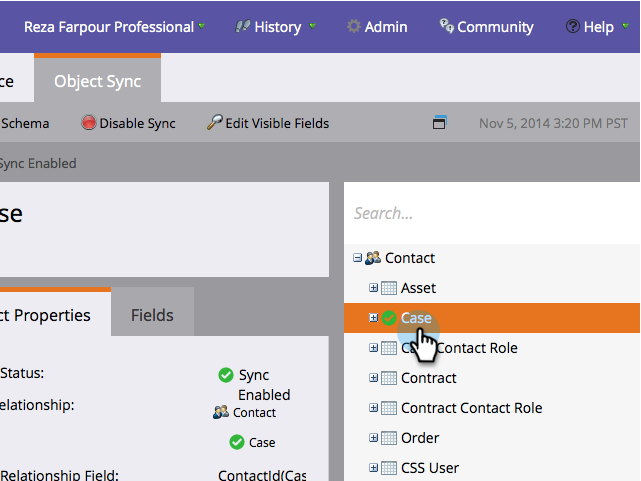
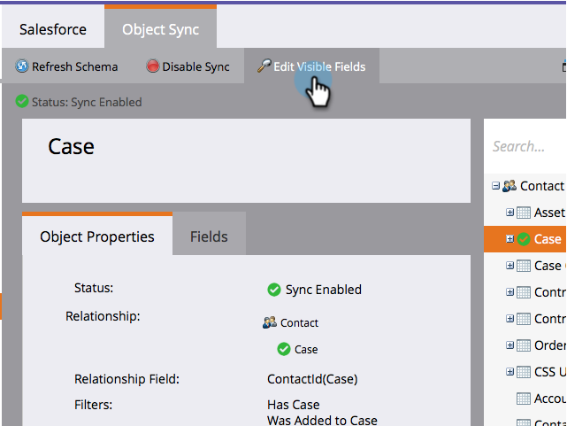
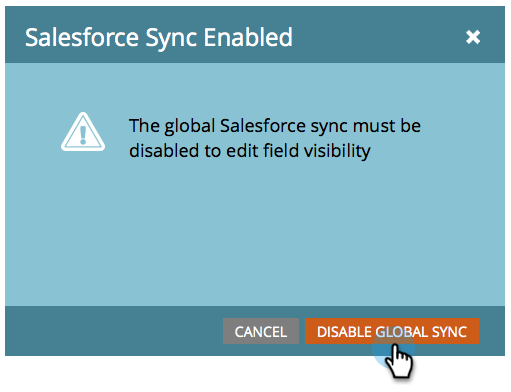

# Add/Remove Custom Object Field as Smart List/Trigger Constraints {#add-remove-custom-object-field-as-smart-list-trigger-constraints}

Marketo provides fine-grain control over the Salesforce custom object sync. This allows you to select the fields available as constraints in custom object filters and to use them as triggers in smart campaigns.

>[!NOTE]
>
>**Admin Permissions Required**

1. Click **Admin.**

   

1. Click **Admin** and then **Salesforce Objects Sync.**

   

1. **Salesforce Objects Sync** appears in the left column.

   

1. Select the object you wish to modify.

   

1. Click **Edit Visible Fields**.

   >[!TIP]
   >
   >If the **Edit Visible Fields** button is greyed out, the object is currently in use in a smart list or smart campaign. Remove all associations to proceed.

   

1. If your global sync is enabled, click **Disable Global Sync**.

   

1. Check the boxes next to the filter/trigger constraints needed and click **Save**.

   

   >[!NOTE]
   >
   >All fields are selected by default to be constraints on filters.

1. Click on the **Fields** tab to confirm your changes.

   

   >[!NOTE]
   >
   >**Reminder**
   >
   >
   >Don't forget to re-enable your global sync!

Wow! Now your smart lists and smart campaigns have even more power.

>[!NOTE]
>
>**Related Articles**
>
>* [Enable/Disable Custom Object Sync](enable-disable-custom-object-sync.md)
>

